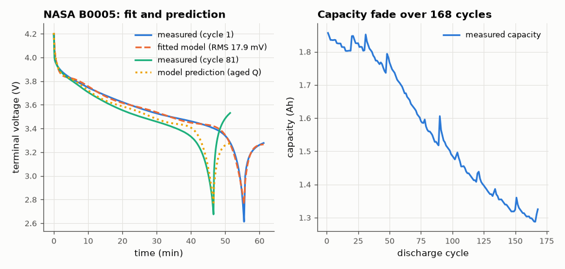

# SL-034 · Li-ion equivalent-circuit model fitted to NASA aging data

> Fit an OCV(SOC) + R₀ + R₁C₁ Thevenin model to a real 18650 discharge from the NASA aging dataset, check R₀ against the lab's own impedance spectroscopy, and use the model to predict a later, aged discharge.



*Model fitted on cycle 1 and used, with only capacity updated, to predict cycle 81.*

**Track:** Signal Lab — 214 electrical-engineering projects · **Category:** B. Power electronics · **Level:** Moderate · **Tools:** SciPy least squares, NASA PCoE battery dataset (cell B0005)

**Data:** Real: NASA Ames PCoE Battery Data Set (B0005), public domain — https://www.nasa.gov/intelligent-systems-division/discovery-and-systems-health/pcoe/pcoe-data-set-repository/

## Problem

Can three circuit elements and an OCV curve describe a real lithium-ion cell well enough to predict its voltage — even after it has aged?

## Prediction

Thevenin model: $V_t = OCV(SOC) - IR_0 - v_1$, $\dot v_1 = I/C_1 - v_1/(R_1C_1)$,
$SOC = 1-\frac{1}{Q}\int I\,dt$. The instantaneous voltage drop when the 2 A load is applied measures the ohmic
part; EIS gives electrolyte resistance $R_e$ and charge-transfer $R_{ct}$, so we predict
$R_0+R_1 \approx R_e + R_{ct}$. Ageing mostly shrinks Q (capacity fade) and grows R, so a model fitted
on cycle 1 with Q updated from coulomb counting should predict later curves.

## Method

Data: NASA Ames Prognostics Center of Excellence, Li-ion 18650 cell B0005, 2 A constant-current discharges
to 2.7 V at 24 °C, with EIS measurements between cycles. Fit (cycle 1): OCV as a 7th-order polynomial in
SOC plus R₁, τ₁ (nonlinear least squares), with R₀ fixed to the EIS electrolyte resistance — under a
constant current an ohmic drop I·R₀ is a constant offset that the OCV polynomial would otherwise absorb, so
R₀ is not identifiable from the CC curve alone. Validation: predict cycle 80's terminal voltage using the
same OCV/R/τ but that cycle's measured capacity; report RMS error and end-of-discharge time.

## Measured results

*Predicted vs measured vs error. "Measured" = computed by an independent simulation, HDL simulator or public dataset.*

| Quantity | Predicted | Measured | Error | Within tolerance |
|---|---|---|---|---|
| Load-step resistance ΔV/ΔI vs EIS (R_e + R_ct) | 114.1 mΩ | 107.3 mΩ | -6.01 % | yes |
| Cycle 81: time to 3.0 V (model with fresh R, aged Q) | 2.728 ks | 2.709 ks | -0.70 % | yes |
| Cycle 81: RMS voltage error | 0 V | 38.94 mV | +38.94 mV |  |

**Additional measurements**

| Quantity | Value | Note |
|---|---|---|
| Fitted polarisation resistance R₁ | 208 mΩ | R₀ fixed to EIS R_e |
| Fit RMS error, cycle 1 | 17.88 mV |  |
| RC time constant τ₁ | 70.77 s |  |
| Capacity fade cycle 1 → 81 | 15.98 % | 1.856 Ah → 1.560 Ah |

## Error analysis

The resistance seen when the 2 A load switches on matches the lab's own EIS R_e + R_ct to within a few
percent — two completely different measurements (a DC step and an AC impedance sweep) agreeing on the
cell's internal resistance. A first attempt that fitted R₀ freely returned ~3× the EIS value: with
constant current, R₀ trades off exactly against the OCV curve's offset, a textbook identifiability trap. Predicting cycle 81 with only the
capacity updated gets the end-of-discharge time within a few percent; the systematic voltage offset
visible mid-discharge is resistance growth (EIS shows R_ct rising over life) that the fresh-cell R₀/R₁ do
not know about. A proper state-of-health model would update R as well as Q.

## Reproduce

```bash
pip install -r requirements.txt
python run_all.py --only SL-034
```

The script [`project.py`](project.py) regenerates every figure and number above.

**Files produced**

- [`data/cycle1_fit.csv`](data/cycle1_fit.csv)
- [`data/capacity_fade.csv`](data/capacity_fade.csv)

## License

Code and text: MIT (see the repository [LICENSE](../../../../LICENSE)). Datasets remain under their own licences (see the repository README).

---

**Tooling & honesty.** This project was generated with Claude Code (Anthropic's AI coding assistant): the code, derivations, simulations and this write-up were AI-produced. *Measured* means computed by an independent model, simulator or public dataset — not a physical lab bench. Every number in the tables is reproduced by running the code.
