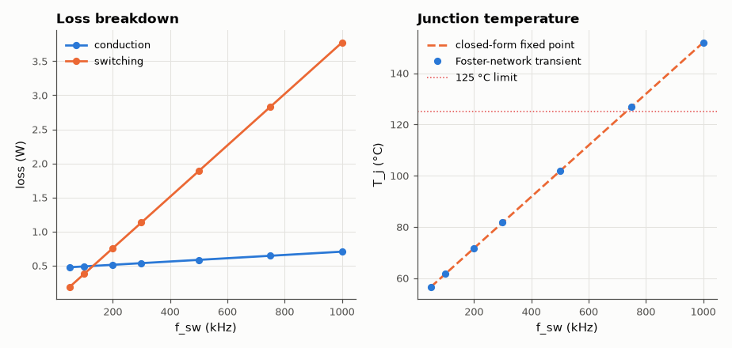
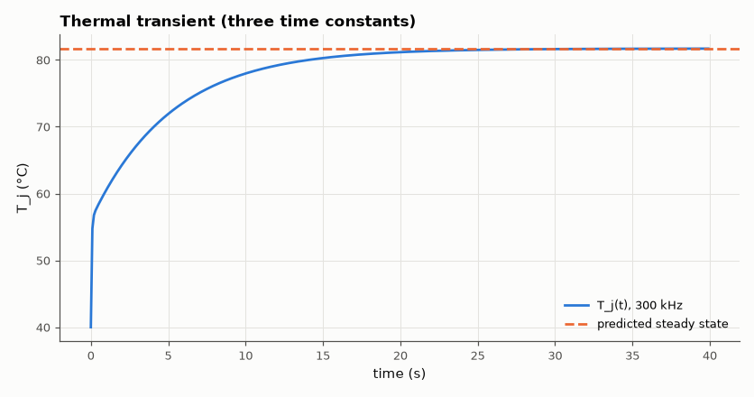

# SL-035 · MOSFET loss & junction-temperature model

> Estimate conduction and switching losses of a buck-converter MOSFET vs frequency, solve the self-consistent junction temperature (R_ds(on) rises with T) and check it with a thermal transient.



*Switching loss grows linearly with frequency and dominates above ~150 kHz.*

**Track:** Signal Lab — 214 electrical-engineering projects · **Category:** B. Power electronics · **Level:** Moderate · **Tools:** Loss equations + electro-thermal fixed point + Foster thermal network transient (NumPy)

**Data:** Simulated (numerical model in this repo).

## Problem

How hot will the switch get? Losses raise temperature, and temperature raises R_ds(on) and therefore losses — find where this loop settles, or whether it runs away.

## Prediction

Conduction: $P_{cond}=I_{rms}^2R_{ds}(T_j)$, $R_{ds}(T)=R_{25}(1+\alpha(T-25))$ with α ≈ 0.6 %/K.
Switching: $P_{sw}=\tfrac12V_{in}I(t_r+t_f)f_{sw}+\tfrac12C_{oss}V_{in}^2f_{sw}$.
Thermal: $T_j = T_a + R_{\theta JA}\,P(T_j)$ — a fixed point that exists iff $R_{\theta JA}\,\partial P/\partial T<1$,
giving the closed form $T_j=\frac{T_a+R_\theta(P_0 - P_{c25}\alpha\cdot25)}{1-R_\theta P_{c25}\alpha}$ (linear in T).

## Method

Buck: 24 V → 12 V, 10 A, D = 0.5. MOSFET: R_ds25 = 8 mΩ, t_r = t_f = 15 ns, C_oss = 600 pF. R_θJA = 25 K/W
(small PCB copper), T_a = 40 °C. Closed-form prediction vs iterative solve vs a 3-stage Foster network
(τ = 1 ms, 50 ms, 5 s) integrated in time to steady state. Frequency sweep 50 kHz–1 MHz.

## Measured results

*Predicted vs measured vs error. "Measured" = computed by an independent simulation, HDL simulator or public dataset.*

| Quantity | Predicted | Measured | Error | Within tolerance |
|---|---|---|---|---|
| T_j at 100 kHz: closed form vs Foster transient | 61.63 °C | 61.62 °C | -0.01 % | yes |
| T_j at 500 kHz: closed form vs Foster transient | 101.8 °C | 101.7 °C | -0.02 % | yes |
| T_j at 1000 kHz: closed form vs Foster transient | 151.9 °C | 151.9 °C | -0.02 % | yes |

**Additional measurements**

| Quantity | Value | Note |
|---|---|---|
| Iterative fixed point = closed form | 8.7527e-10 °C | max difference |
| Highest frequency keeping T_j < 125 °C | 731.6 kHz |  |



*Fast die heating, then the slower board and ambient time constants.*

## Error analysis

Because R_ds(on) rises linearly with temperature the electro-thermal loop is linear and has an
exact closed-form fixed point; the transient simulation converges to it (differences are only the
finite 40 s simulation window against the 5 s slowest time constant). The loop gain R_θ·∂P/∂T here is
small (≈ 0.006), far from the thermal-runaway condition of 1, but the frequency sweep shows the real
design constraint: switching loss scales with f_sw and pushes T_j past 125 °C well before 1 MHz.

## Reproduce

```bash
pip install -r requirements.txt
python run_all.py --only SL-035
```

The script [`project.py`](project.py) regenerates every figure and number above.

**Files produced**

- [`data/sweep.csv`](data/sweep.csv)

## License

Code and text: MIT (see the repository [LICENSE](../../../../LICENSE)). Datasets remain under their own licences (see the repository README).

---

**Tooling & honesty.** This project was generated with Claude Code (Anthropic's AI coding assistant): the code, derivations, simulations and this write-up were AI-produced. *Measured* means computed by an independent model, simulator or public dataset — not a physical lab bench. Every number in the tables is reproduced by running the code.
