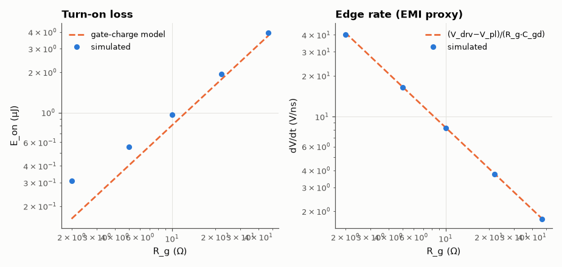
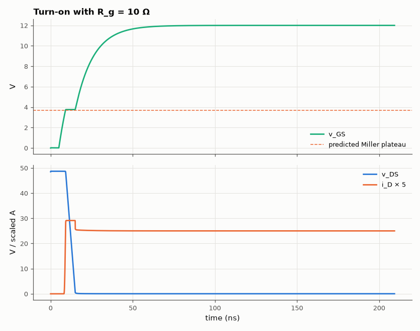

# SL-036 · Gate resistance vs switching loss and EMI

> Turn on a MOSFET into a 5 A clamped inductive load with gate resistors from 2 Ω to 47 Ω; measure turn-on energy and drain dV/dt, and predict both from the Miller plateau.



*Loss rises ∝ R_g while dV/dt falls ∝ 1/R_g — the gate resistor sets the EMI/efficiency trade.*

**Track:** Signal Lab — 214 electrical-engineering projects · **Category:** B. Power electronics · **Level:** Hard · **Tools:** eelab mini-SPICE (square-law MOSFET with C_gs and Miller C_gd, clamped inductive load)

**Data:** Simulated (numerical model in this repo).

## Problem

A bigger gate resistor slows switching edges (less EMI) but costs energy. Quantify the trade-off with the gate-charge model.

## Prediction

During the current rise the gate charges C_gs from $V_{th}$ to the Miller plateau
$V_{pl}=V_{th}+\sqrt{2I_L/K}$; during the voltage fall the gate is stuck at $V_{pl}$ and the drive current
$(V_{drv}-V_{pl})/R_g$ discharges $C_{gd}$:
$$t_{fv}=\frac{R_gC_{gd}V_{DD}}{V_{drv}-V_{pl}},\qquad \frac{dV}{dt}=\frac{V_{drv}-V_{pl}}{R_gC_{gd}}$$
$E_{on}\approx\tfrac12V_{DD}I_L(t_{ri}+t_{fv})$ with $t_{ri}\approx R_g(C_{gs}+C_{gd})\ln\frac{V_{drv}-V_{th}}{V_{drv}-V_{pl}}$.

## Method

V_DD = 48 V, I_L = 5 A (ideal current source through a freewheeling diode to V_DD), gate drive 0→12 V step.
MOSFET: K = 20 A/V², V_th = 3 V, C_gs = 1 nF, C_gd = 100 pF. R_g ∈ {2, 5, 10, 22, 47} Ω. 400 ns transient at
20 ps steps; E_on = ∫v_DS·i_D dt over the edge, dV/dt = max slope of v_DS.

## Measured results

*Predicted vs measured vs error. "Measured" = computed by an independent simulation, HDL simulator or public dataset.*

| Quantity | Predicted | Measured | Error | Within tolerance |
|---|---|---|---|---|
| R_g = 2 Ω: drain dV/dt | 41.46 GV/s | 40.25 GV/s | -2.93 % | yes |
| R_g = 2 Ω: turn-on energy E_on | 160.5 nJ | 309 nJ | +92.49 % | **no** |
| R_g = 5 Ω: drain dV/dt | 16.59 GV/s | 16.37 GV/s | -1.30 % | yes |
| R_g = 5 Ω: turn-on energy E_on | 401.3 nJ | 554 nJ | +38.06 % | **no** |
| R_g = 10 Ω: drain dV/dt | 8.293 GV/s | 8.237 GV/s | -0.68 % | yes |
| R_g = 10 Ω: turn-on energy E_on | 802.6 nJ | 960.7 nJ | +19.70 % | yes |
| R_g = 22 Ω: drain dV/dt | 3.769 GV/s | 3.758 GV/s | -0.31 % | yes |
| R_g = 22 Ω: turn-on energy E_on | 1.766 µJ | 1.935 µJ | +9.62 % | yes |
| R_g = 47 Ω: drain dV/dt | 1.764 GV/s | 1.762 GV/s | -0.15 % | yes |
| R_g = 47 Ω: turn-on energy E_on | 3.772 µJ | 3.966 µJ | +5.13 % | yes |

**Additional measurements**

| Quantity | Value | Note |
|---|---|---|
| Miller plateau voltage | 3.707 V | V_th + √(2I/K) |



*Gate voltage stalls on the Miller plateau while the drain voltage falls.*

## Error analysis

The Miller plateau is clearly visible and sits at the predicted V_th + √(2I/K). dV/dt follows the
gate-charge formula closely because C_gd is constant in this model; in a real MOSFET C_gd rises sharply
at low V_DS, so the last part of the voltage fall slows down (the 'tail' in datasheet curves). The
energy estimate uses straight-line current and voltage transitions and ignores the diode's reverse
recovery (not modelled), so it is a lower bound; real E_on is often 1.5–2× larger. The gap is largest at R_g = 2 Ω, where the
predicted edges last only a few ns and second-order effects the model ignores — the gate-drive
loop's own RC delay before V_th and the finite time the freewheel diode needs to hand over current —
become comparable to the edges themselves.

## Reproduce

```bash
pip install -r requirements.txt
python run_all.py --only SL-036
```

The script [`project.py`](project.py) regenerates every figure and number above.

**Files produced**

- [`simulation/gate_drive.cir`](simulation/gate_drive.cir) — SPICE netlist (R_g = 10 Ω)
- [`data/sweep.csv`](data/sweep.csv)

## License

Code and text: MIT (see the repository [LICENSE](../../../../LICENSE)). Datasets remain under their own licences (see the repository README).

---

**Tooling & honesty.** This project was generated with Claude Code (Anthropic's AI coding assistant): the code, derivations, simulations and this write-up were AI-produced. *Measured* means computed by an independent model, simulator or public dataset — not a physical lab bench. Every number in the tables is reproduced by running the code.
