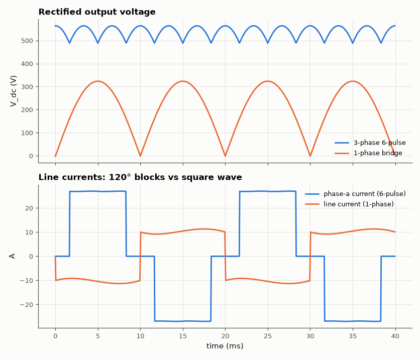
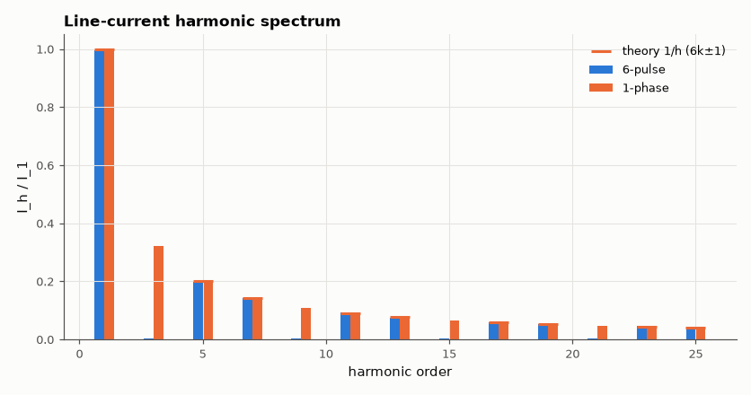

# SL-037 · Three-phase vs single-phase bridge rectifier

> Compare output ripple and line-current harmonics of a 6-pulse three-phase bridge and a single-phase bridge feeding a highly inductive load.



*Six pulses per cycle give a far smoother DC bus.*

**Track:** Signal Lab — 214 electrical-engineering projects · **Category:** B. Power electronics · **Level:** Moderate · **Tools:** eelab mini-SPICE (6-diode bridge, RL load), FFT harmonic analysis

**Data:** Simulated (numerical model in this repo).

## Problem

Why do industrial drives rectify three phases instead of one, and what harmonics do they still inject into the grid?

## Prediction

Six-pulse bridge: $V_{dc}=\frac{3\sqrt2}{\pi}V_{LL,rms}=1.35V_{LL}$, ripple at 6f with
pk-pk $=\sqrt2V_{LL}(1-\cos30°)$ = 13.4 % of peak. With a constant DC current the line current is a
120° quasi-square wave: harmonics $h=6k\pm1$ with $I_h=I_1/h$, THD = 31.1 %.
Single-phase bridge: $V_{dc}=\frac{2\sqrt2}{\pi}V_{rms}$, ripple 100 % at 2f, square-wave line current, THD = 48.3 %.

## Method

400 V line-to-line, 50 Hz (230 V phase). Load: 20 Ω + 200 mH (L/R ≫ 1/300 Hz). Diodes Is = 1e-9, N = 1.5.
100 ms transients (50 µs steps), last 40 ms analysed.

## Measured results

*Predicted vs measured vs error. "Measured" = computed by an independent simulation, HDL simulator or public dataset.*

| Quantity | Predicted | Measured | Error | Within tolerance |
|---|---|---|---|---|
| 6-pulse DC voltage | 540.2 V | 538.3 V | -0.35 % | yes |
| 6-pulse ripple (pk-pk) | 75.79 V | 75.76 V | -0.04 % | yes |
| 6-pulse line-current THD | 31.08 % | 30.16 % | -0.922 pp |  |
| 6-pulse I_5/I_1 | 0.2 | 0.202 | +0.001995 |  |
| 6-pulse I_7/I_1 | 0.1429 | 0.1415 | -0.001405 |  |
| 1-phase DC voltage | 207.1 V | 205.3 V | -0.87 % | yes |
| 1-phase line-current THD | 48.34 % | 45.69 % | -2.65 pp |  |



*The 6-pulse bridge cancels triplen and even harmonics; 5th and 7th remain.*

## Error analysis

DC levels come out a couple of volts under the ideal formulas: the ideal assumes instant commutation
and zero diode drop, whereas each current path crosses two diodes (≈ 2 V). With 200 mH the DC current is
nearly flat so the harmonic ratios approach the classic 1/h law; the residual difference is because the
current still carries a small 300 Hz ripple. The 5th and 7th harmonics (20 % and 14 %) are why large drives
use 12-pulse rectifiers or active front ends.

## Reproduce

```bash
pip install -r requirements.txt
python run_all.py --only SL-037
```

The script [`project.py`](project.py) regenerates every figure and number above.

**Files produced**

- [`simulation/six_pulse.cir`](simulation/six_pulse.cir) — SPICE netlist
- [`data/waveforms.csv`](data/waveforms.csv)

## License

Code and text: MIT (see the repository [LICENSE](../../../../LICENSE)). Datasets remain under their own licences (see the repository README).

---

**Tooling & honesty.** This project was generated with Claude Code (Anthropic's AI coding assistant): the code, derivations, simulations and this write-up were AI-produced. *Measured* means computed by an independent model, simulator or public dataset — not a physical lab bench. Every number in the tables is reproduced by running the code.
