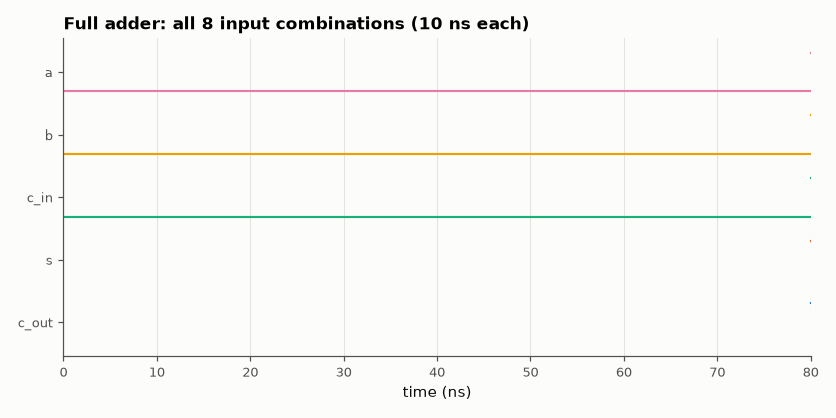

# SL-038 · Full adder from gates

> Build a 1-bit full adder from XOR/AND/OR primitives with unit gate delays, verify all 8 input combinations, measure its worst-case delay, then chain four into a 4-bit adder.



*Exhaustive simulation; outputs lag inputs by one to three gate delays.*

**Track:** Signal Lab — 214 electrical-engineering projects · **Category:** C. Digital logic & HDL · **Level:** Easy · **Tools:** Verilog gate primitives, Icarus Verilog (exhaustive testbench), Yosys synthesis

**Data:** Simulated (numerical model in this repo).

## Problem

What is the smallest gate network that adds three bits, and how long does its slowest output take to settle?

## Prediction

$S = A\oplus B\oplus C_{in}$, $C_{out}=AB + C_{in}(A\oplus B)$: two XOR, two AND, one OR (5 gates).
With one time unit per gate: $S$ settles after 2 XOR levels (2 units) and $C_{out}$ after XOR→AND→OR
(3 units) — the carry path is the critical one.

## Method

Gate-level Verilog with #1 delay per gate. Testbench applies all 8 vectors, checks S and C_out against
the integer sum, and measures settling time for every one of the 64 input *transitions*. Yosys synthesises
to a generic gate library to count cells and logic depth.

## Measured results

*Predicted vs measured vs error. "Measured" = computed by an independent simulation, HDL simulator or public dataset.*

| Quantity | Predicted | Measured | Error |
|---|---|---|---|
| Truth-table errors (8 vectors) | 0 | 0 | +0 |
| Worst-case settling delay (gate delays) | 3 gate delays | 3 gate delays | +0 gate delays |
| Gate count after synthesis | 5 cells | 5 cells | +0 cells |
| Logic depth (longest path) | 3 levels | 3 levels | +0 levels |

## Truth table (simulated)

| a | b | c_in | c_out | s |
|---|---|---|---|---|
| 0 | 0 | 0 | 0 | 0 |
| 0 | 0 | 1 | 0 | 1 |
| 0 | 1 | 0 | 0 | 1 |
| 0 | 1 | 1 | 1 | 0 |
| 1 | 0 | 0 | 0 | 1 |
| 1 | 0 | 1 | 1 | 0 |
| 1 | 1 | 0 | 1 | 0 |
| 1 | 1 | 1 | 1 | 1 |

## Error analysis

All eight combinations are correct and synthesis reproduces the 5-gate textbook network. The
worst-case delay is the carry path (XOR → AND → OR), 3 gate delays, confirming that in a multi-bit
adder it is the carry, not the sum, that limits speed — the motivation for the carry-lookahead
adder in SL-040.

## Reproduce

```bash
pip install -r requirements.txt
python run_all.py --only SL-038
```

The script [`project.py`](project.py) regenerates every figure and number above.

**Files produced**

- [`hdl/full_adder.v`](hdl/full_adder.v) — Verilog source
- [`hdl/tb_full_adder.v`](hdl/tb_full_adder.v) — testbench

## License

Code and text: MIT (see the repository [LICENSE](../../../../LICENSE)). Datasets remain under their own licences (see the repository README).

---

**Tooling & honesty.** This project was generated with Claude Code (Anthropic's AI coding assistant): the code, derivations, simulations and this write-up were AI-produced. *Measured* means computed by an independent model, simulator or public dataset — not a physical lab bench. Every number in the tables is reproduced by running the code.
