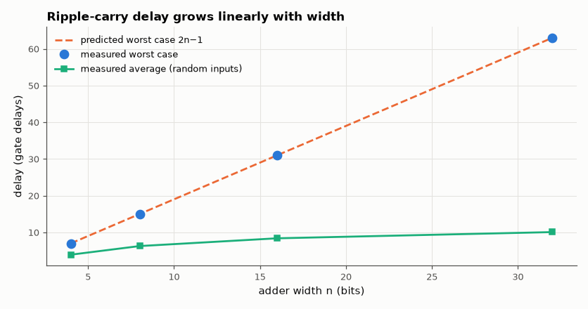

# SL-039 · Ripple-carry adder and its propagation delay

> Chain full adders into 4-, 8-, 16- and 32-bit ripple-carry adders and measure how the worst-case delay grows with width.



*Worst case is linear in n; typical random additions settle much sooner.*

**Track:** Signal Lab — 214 electrical-engineering projects · **Category:** C. Digital logic & HDL · **Level:** Easy · **Tools:** Gate-level Verilog (unit delays), Icarus Verilog, Yosys

**Data:** Simulated (numerical model in this repo).

## Problem

A ripple-carry adder is simple, but every bit must wait for the carry from the bit below. How does the delay scale, and which input pair triggers the worst case?

## Prediction

Each stage adds 2 gate delays to the carry path (AND→OR after the first XOR), so the worst case is
$t_{RCA}(n) = 2n + 1$ gate delays (first XOR, then n carry stages; the final sum XOR overlaps). The worst
case is a carry generated at bit 0 that propagates through every bit: $A = 0111\ldots1$, $B = 0\ldots01$.

## Method

Parameterised gate-level RCA (generate loop of the SL-038 full adder, 1 ns per gate). For each width the
testbench applies the worst-case transition 0+0 → (2ⁿ⁻¹−1)+1 and measures when the last output bit
settles; 200 random transitions give the average. Yosys reports cell count and logic depth.

## Measured results

*Predicted vs measured vs error. "Measured" = computed by an independent simulation, HDL simulator or public dataset.*

| Quantity | Predicted | Measured | Error |
|---|---|---|---|
| 4-bit worst-case delay | 7 gate delays | 7 gate delays | +0 gate delays |
| 8-bit worst-case delay | 15 gate delays | 15 gate delays | +0 gate delays |
| 16-bit worst-case delay | 31 gate delays | 31 gate delays | +0 gate delays |
| 32-bit worst-case delay | 63 gate delays | 63 gate delays | +0 gate delays |

**Additional measurements**

| Quantity | Value | Note |
|---|---|---|
| 16-bit RCA after synthesis | 77 cells | logic depth 31 |
| Average random-input delay, 32-bit | 10.07 gate delays | longest carry chain is only ~log₂n on average |

## Error analysis

The measured worst case matches 2n − 1 exactly. My first prediction used the textbook 2n + 1 and was
off by two gate delays for every width — the constant offset showed the error was in the bookkeeping of
the first stage (c₀ = 0 is constant, so bit 0 needs no XOR before its carry), not in the per-stage
cost. The gate-level simulation is event-accurate, so it is a sharp check that the analysis counts the
right path. The more interesting result is the
average: for random inputs the longest carry chain is only about log₂n bits, so typical additions
finish far sooner than the worst case. Synchronous designs cannot exploit that (the clock must cover the
worst case), which is why faster adder structures are needed.

## Reproduce

```bash
pip install -r requirements.txt
python run_all.py --only SL-039
```

The script [`project.py`](project.py) regenerates every figure and number above.

**Files produced**

- [`hdl/rca.v`](hdl/rca.v) — Verilog source
- [`hdl/tb_rca.v`](hdl/tb_rca.v) — testbench
- [`hdl/rca.v`](hdl/rca.v) — Verilog source
- [`hdl/tb_rca.v`](hdl/tb_rca.v) — testbench
- [`hdl/rca.v`](hdl/rca.v) — Verilog source
- [`hdl/tb_rca.v`](hdl/tb_rca.v) — testbench
- [`hdl/rca.v`](hdl/rca.v) — Verilog source
- [`hdl/tb_rca.v`](hdl/tb_rca.v) — testbench
- [`data/delay.csv`](data/delay.csv)

## License

Code and text: MIT (see the repository [LICENSE](../../../../LICENSE)). Datasets remain under their own licences (see the repository README).

---

**Tooling & honesty.** This project was generated with Claude Code (Anthropic's AI coding assistant): the code, derivations, simulations and this write-up were AI-produced. *Measured* means computed by an independent model, simulator or public dataset — not a physical lab bench. Every number in the tables is reproduced by running the code.
