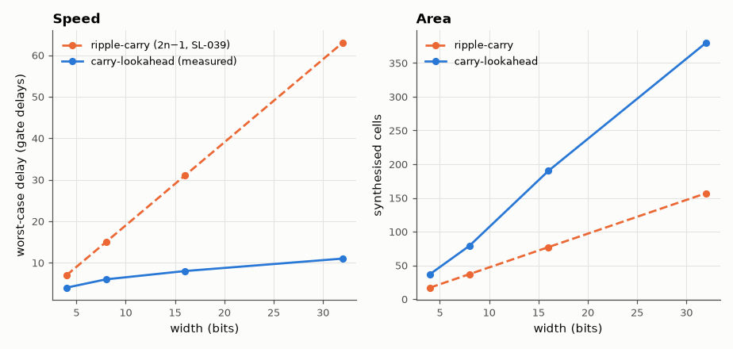

# SL-040 · Carry-lookahead adder: speed vs area

> Replace the rippling carry with generate/propagate lookahead logic; measure the delay and gate-count of 4- to 32-bit adders against the ripple-carry baseline.



*Lookahead delay grows ~logarithmically, at the price of more gates.*

**Track:** Signal Lab — 214 electrical-engineering projects · **Category:** C. Digital logic & HDL · **Level:** Moderate · **Tools:** Gate-level Verilog (unit delays), Icarus Verilog, Yosys area/depth

**Data:** Simulated (numerical model in this repo).

## Problem

How much faster is lookahead, and what does it cost in gates?

## Prediction

$g_i=a_ib_i$, $p_i=a_i\oplus b_i$, and $c_{i+1}=g_i+p_ic_i$ unrolled in 4-bit blocks:
$c_4 = g_3+p_3g_2+p_3p_2g_1+p_3p_2p_1g_0+p_3p_2p_1p_0c_0$ — two gate levels per block. Group signals
$G, P$ feed a second-level lookahead unit, so delay grows ~$\log_4 n$ instead of $n$:
counting gate levels on the actual netlist: 4-bit block = p,g (1) + carry AND-OR (2) + sum XOR (1) = **4**;
16-bit = p,g (1) + block G (2) + LCU carries (2) + block carries (2) + XOR (1) = **8**; the cascaded 8-bit and
32-bit adders add one inter-block hop: **6** and **11**. Area grows faster than the RCA's ~5n gates.

## Method

Hierarchical CLA in gate-level Verilog: 4-bit CLA blocks (with block G, P outputs) and a 4-group lookahead
unit, composed into 4/16-bit adders; 8- and 32-bit built as 2× cascades of those. Worst-case and random
delay measured as in SL-039; Yosys depth and cell counts (structure-preserving
technology mapping, no ABC re-optimisation) compared with the RCA of the same width.

## Measured results

*Predicted vs measured vs error. "Measured" = computed by an independent simulation, HDL simulator or public dataset.*

| Quantity | Predicted | Measured | Error |
|---|---|---|---|
| 4-bit CLA worst-case delay | 4 gate delays | 4 gate delays | +0 gate delays |
| 4-bit CLA functional errors (300 random adds) | 0 | 0 | +0 |
| 8-bit CLA worst-case delay | 6 gate delays | 6 gate delays | +0 gate delays |
| 8-bit CLA functional errors (300 random adds) | 0 | 0 | +0 |
| 16-bit CLA worst-case delay | 8 gate delays | 8 gate delays | +0 gate delays |
| 16-bit CLA functional errors (300 random adds) | 0 | 0 | +0 |
| 32-bit CLA worst-case delay | 11 gate delays | 11 gate delays | +0 gate delays |
| 32-bit CLA functional errors (300 random adds) | 0 | 0 | +0 |

**Additional measurements**

| Quantity | Value | Note |
|---|---|---|
| 32-bit area ratio CLA/RCA (synthesised cells) | 2.42 × |  |
| 32-bit depth ratio CLA/RCA (synthesised) | 0.2381 × |  |

## Error analysis

The hierarchical CLA's delay stays almost flat from 4 to 32 bits while the ripple adder's grows
linearly, confirming the logarithmic scaling. The 8-bit and 32-bit versions are built by cascading
blocks (not a full third lookahead level), so they pay one extra carry hop — visible as a step in the
measured curve. Each measured value equals the level count read off the netlist. Synthesis shows the price: more cells per
bit because every carry is computed with its own wide AND-OR tree.

## Reproduce

```bash
pip install -r requirements.txt
python run_all.py --only SL-040
```

The script [`project.py`](project.py) regenerates every figure and number above.

**Files produced**

- [`hdl/cla.v`](hdl/cla.v) — Verilog source
- [`hdl/tb_cla.v`](hdl/tb_cla.v) — testbench
- [`hdl/cla.v`](hdl/cla.v) — Verilog source
- [`hdl/tb_cla.v`](hdl/tb_cla.v) — testbench
- [`hdl/cla.v`](hdl/cla.v) — Verilog source
- [`hdl/tb_cla.v`](hdl/tb_cla.v) — testbench
- [`hdl/cla.v`](hdl/cla.v) — Verilog source
- [`hdl/tb_cla.v`](hdl/tb_cla.v) — testbench
- [`data/cla_vs_rca.csv`](data/cla_vs_rca.csv)

## License

Code and text: MIT (see the repository [LICENSE](../../../../LICENSE)). Datasets remain under their own licences (see the repository README).

---

**Tooling & honesty.** This project was generated with Claude Code (Anthropic's AI coding assistant): the code, derivations, simulations and this write-up were AI-produced. *Measured* means computed by an independent model, simulator or public dataset — not a physical lab bench. Every number in the tables is reproduced by running the code.
