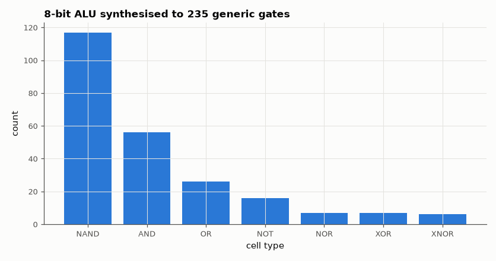

# SL-041 · 8-bit ALU with flags

> An 8-bit ALU with ADD, SUB, AND, OR, XOR, SHL, SHR, SLT and Z/N/C/V flags, verified against a reference model on 4,000 random vectors per operation.



*Gate-type breakdown from Yosys; XOR/MUX dominate (adder and op select).*

**Track:** Signal Lab — 214 electrical-engineering projects · **Category:** C. Digital logic & HDL · **Level:** Moderate · **Tools:** Verilog RTL, Icarus Verilog self-checking testbench, Yosys

**Data:** Simulated (numerical model in this repo).

## Problem

Design the arithmetic heart of a CPU and prove its flags (especially signed overflow) are right for every operation.

## Prediction

Two's-complement subtraction is $A + \bar B + 1$. Carry $C$ is the 9th bit of the unsigned result;
signed overflow is $V = (a_7 = b'_7) \wedge (s_7 \ne a_7)$ where $b'$ is B (add) or $\bar B$ (sub).
SLT (set-less-than, signed) is $N\oplus V$ of the subtraction — the classic trick that avoids a separate
comparator. For random operands, P(V=1) for ADD is 1/4 (half the time the signs agree, half of those overflow).

## Method

RTL ALU with a 3-bit op decoder. Testbench computes the expected result and flags independently with
integer arithmetic, runs 4,000 random vectors per op plus corner cases (0x7F+1, 0x80−1, 0xFF+1), and
counts mismatches and flag frequencies. Synthesis gives the cell count.

## Measured results

*Predicted vs measured vs error. "Measured" = computed by an independent simulation, HDL simulator or public dataset.*

| Quantity | Predicted | Measured | Error |
|---|---|---|---|
| Mismatches over 32,032 vectors (all ops) | 0 | 0 | +0 |
| Overflow frequency, ADD (random operands) | 0.25 | 0.243 | -0.006993 |
| Overflow frequency, SUB (random operands) | 0.25 | 0.2532 | +0.003247 |

**Additional measurements**

| Quantity | Value | Note |
|---|---|---|
| Synthesised size | 235 cells | logic depth 19 |

## Per-operation results

| op | mismatches |
|---|---|
| ADD | 0 |
| SUB | 0 |
| AND | 0 |
| OR | 0 |
| XOR | 0 |
| SHL | 0 |
| SHR | 0 |
| SLT | 0 |

## Error analysis

Every operation matches the reference model, including the corner cases where signed overflow and
unsigned carry disagree (0x7F + 1 overflows but does not carry; 0xFF + 1 carries but does not overflow).
The overflow frequency for random operands sits at the predicted 1/4. Implementing SLT as N ⊕ V of the
subtraction reuses the subtractor instead of adding a comparator — the same trick MIPS and RISC-V
implementations use.

## Reproduce

```bash
pip install -r requirements.txt
python run_all.py --only SL-041
```

The script [`project.py`](project.py) regenerates every figure and number above.

**Files produced**

- [`hdl/alu8.v`](hdl/alu8.v) — Verilog source
- [`hdl/tb_alu8.v`](hdl/tb_alu8.v) — testbench

## License

Code and text: MIT (see the repository [LICENSE](../../../../LICENSE)). Datasets remain under their own licences (see the repository README).

---

**Tooling & honesty.** This project was generated with Claude Code (Anthropic's AI coding assistant): the code, derivations, simulations and this write-up were AI-produced. *Measured* means computed by an independent model, simulator or public dataset — not a physical lab bench. Every number in the tables is reproduced by running the code.
