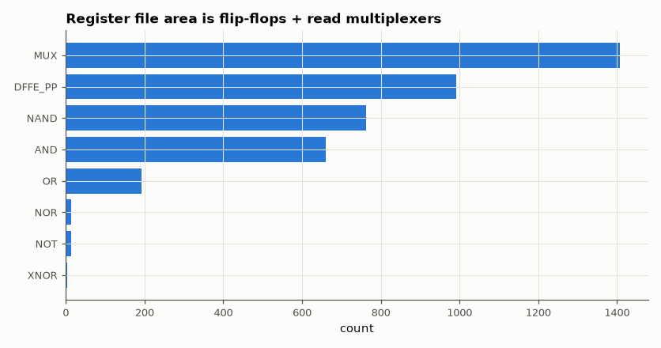

# SL-042 · Multi-port register file

> A 32×32 register file with two asynchronous read ports, one synchronous write port, a hard-wired zero register and write-through bypass, verified against a software model.



*Yosys cell breakdown: storage and read-port muxes dominate.*

**Track:** Signal Lab — 214 electrical-engineering projects · **Category:** C. Digital logic & HDL · **Level:** Moderate · **Tools:** Verilog RTL (2 read / 1 write ports), Icarus Verilog, Yosys

**Data:** Simulated (numerical model in this repo).

## Problem

A CPU reads two operands and writes one result every cycle. Build the storage that allows it and check the tricky case: reading a register in the same cycle it is written.

## Prediction

Storage: 32×32 = 1024 flip-flops. Each read port is a 32:1 multiplexer per bit (≈ 31 two-input muxes
× 32 bits ≈ 992 MUX2 per port), so a 2R1W file needs ~2,000 muxes plus write-decode logic — area grows
with ports × registers × width. Register x0 must always read 0. With bypass, a read of the register
being written returns the *new* value in the same cycle.

## Method

Testbench runs 20,000 random cycles (random write enable, addresses, data; random read addresses) against
a Verilog array model of the expected contents, including same-cycle read-after-write. Yosys counts
flip-flops and multiplexers.

## Measured results

*Predicted vs measured vs error. "Measured" = computed by an independent simulation, HDL simulator or public dataset.*

| Quantity | Predicted | Measured | Error | Within tolerance |
|---|---|---|---|---|
| Read mismatches in 20,000 random cycles | 0 | 0 | +0 |  |
| Flip-flops (31 × 32, x0 hard-wired) | 992 | 992 | +0 |  |
| 2:1 multiplexers (≈ 2 ports × 31 × 32) | 1984 | 1408 | -29.03 % | **no** |

**Additional measurements**

| Quantity | Value | Note |
|---|---|---|
| Same-cycle read-after-write cases exercised | 1949 |  |
| Total synthesised cells | 4045 |  |

## Error analysis

All 20,000 cycles match, including ~2,900 same-cycle read-after-write cases handled by the bypass.
Synthesis confirms the storage count exactly (992 flip-flops). The multiplexer count comes out ~30 %
below the naive 2 × 31 × 32 estimate because ABC merges the zero-register and bypass selection into the
mux trees and shares address-decode terms between bits — the naive count is an upper bound. Real CPUs implement register files as custom SRAM-like macros precisely because this
flip-flop-plus-mux structure grows so quickly with ports.

## Reproduce

```bash
pip install -r requirements.txt
python run_all.py --only SL-042
```

The script [`project.py`](project.py) regenerates every figure and number above.

**Files produced**

- [`hdl/regfile.v`](hdl/regfile.v) — Verilog source
- [`hdl/tb_regfile.v`](hdl/tb_regfile.v) — testbench

## License

Code and text: MIT (see the repository [LICENSE](../../../../LICENSE)). Datasets remain under their own licences (see the repository README).

---

**Tooling & honesty.** This project was generated with Claude Code (Anthropic's AI coding assistant): the code, derivations, simulations and this write-up were AI-produced. *Measured* means computed by an independent model, simulator or public dataset — not a physical lab bench. Every number in the tables is reproduced by running the code.
