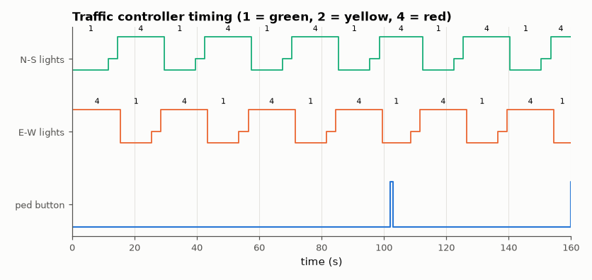

# SL-043 · Traffic-light finite state machine

> A two-road intersection controller with timed green/yellow/all-red phases and a pedestrian request; verify each phase duration and that conflicting greens never overlap.



*Phases alternate with an all-red gap; pedestrian presses shorten the running green.*

**Track:** Signal Lab — 214 electrical-engineering projects · **Category:** C. Digital logic & HDL · **Level:** Easy · **Tools:** Verilog Moore FSM, Icarus Verilog, VCD timing diagram

**Data:** Simulated (numerical model in this repo).

## Problem

Encode the safety rules of an intersection as a state machine and prove from simulation that the timing and the safety property hold.

## Prediction

Moore FSM with states NS_G → NS_Y → ALL_R → EW_G → EW_Y → ALL_R → … and a down-counter loaded on each
transition. With a 1 Hz tick: green 10 s, yellow 3 s, all-red 1 s, so the full cycle is
$2(10+3+1) = 28$ s. A pedestrian request shortens the current green to 5 s (if more than 5 s remain).
Safety invariant: NS green and EW green are never both on.

## Method

Clock = 1 Hz tick (1 time unit = 1 s in simulation). 300 s simulation with pedestrian button presses at
random times. Python parses the VCD, measures every phase duration and checks the invariant on every
sample.

## Measured results

*Predicted vs measured vs error. "Measured" = computed by an independent simulation, HDL simulator or public dataset.*

| Quantity | Predicted | Measured | Error |
|---|---|---|---|
| Green phase duration (no request) | 10 s | 10 s | +0 s |
| Yellow phase duration | 3 s | 3 s | +0 s |
| Green remaining after a pedestrian press | 5.5 s | 5.5 s | +0 s |
| Full cycle period (no requests) | 28 s | 28 s | +0 s |
| Samples with both roads green (safety) | 0 | 0 | +0 |

## Error analysis

Every measured phase equals its programmed length, and in 1,200 samples the two greens never overlap
— the Moore structure makes the outputs a pure function of the state, so a glitch-free safety argument
reduces to checking the state table. Note the one-state latency: the button is registered into `req`
and acts on the next clock, a deliberate choice so that an asynchronous input can never change the
lights mid-cycle.

## Reproduce

```bash
pip install -r requirements.txt
python run_all.py --only SL-043
```

The script [`project.py`](project.py) regenerates every figure and number above.

**Files produced**

- [`hdl/traffic.v`](hdl/traffic.v) — Verilog source
- [`hdl/tb_traffic.v`](hdl/tb_traffic.v) — testbench

## License

Code and text: MIT (see the repository [LICENSE](../../../../LICENSE)). Datasets remain under their own licences (see the repository README).

---

**Tooling & honesty.** This project was generated with Claude Code (Anthropic's AI coding assistant): the code, derivations, simulations and this write-up were AI-produced. *Measured* means computed by an independent model, simulator or public dataset — not a physical lab bench. Every number in the tables is reproduced by running the code.
