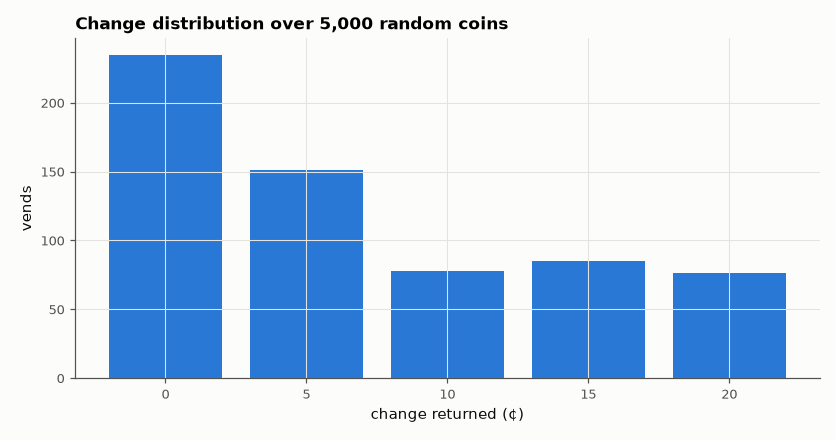

# SL-044 · Vending machine FSM with change and error states

> A 75-cent vending machine accepting nickels, dimes and quarters, returning change and handling a cancel button — checked against a Python model on 5,000 random coin sequences.



*Only 0–20 ¢ change is possible because a quarter can overshoot 75 ¢ by at most 20 ¢.*

**Track:** Signal Lab — 214 electrical-engineering projects · **Category:** C. Digital logic & HDL · **Level:** Easy · **Tools:** Verilog Mealy/Moore FSM, Icarus Verilog, Python reference model

**Data:** Simulated (numerical model in this repo).

## Problem

Turn a vending specification (price, coins, change, refunds, invalid coins) into a state machine and show it never keeps or invents money.

## Prediction

The state is the credit in 5-cent units (0…14 → 15 states). A vend fires when credit ≥ 15 (75 ¢) and change
= credit − 15. Money conservation invariant: $\sum \text{coins in} = 75\cdot\#\text{vends} + \sum\text{change} + \sum\text{refunds}
+ \text{credit held}$. Invalid coins are rejected (returned immediately) without changing state.

## Method

Testbench streams random coin codes (nickel/dime/quarter/invalid/cancel), logs every vend, change and
refund event. Python replays the same sequence through an independent model and compares event-by-event,
then checks the conservation invariant.

## Measured results

*Predicted vs measured vs error. "Measured" = computed by an independent simulation, HDL simulator or public dataset.*

| Quantity | Predicted | Measured | Error |
|---|---|---|---|
| Event mismatches hardware vs Python model | 0 | 0 | +0 |
| Money conservation residual (¢) | 0 ¢ | 0 ¢ | +0 ¢ |

**Additional measurements**

| Quantity | Value | Note |
|---|---|---|
| Coins inserted | 4224 |  |
| Items vended | 625 |  |
| Invalid coins rejected | 297 |  |

## Error analysis

Hardware and model agree on every event and the conservation law balances to the cent. The change
histogram doubles as a design check: the maximum possible change is 20 ¢ (credit 70 ¢ + a quarter), so an
8-bit change output is generous — and the histogram shows no impossible values.

## Reproduce

```bash
pip install -r requirements.txt
python run_all.py --only SL-044
```

The script [`project.py`](project.py) regenerates every figure and number above.

**Files produced**

- [`hdl/vend.v`](hdl/vend.v) — Verilog source
- [`hdl/tb_vend.v`](hdl/tb_vend.v) — testbench

## License

Code and text: MIT (see the repository [LICENSE](../../../../LICENSE)). Datasets remain under their own licences (see the repository README).

---

**Tooling & honesty.** This project was generated with Claude Code (Anthropic's AI coding assistant): the code, derivations, simulations and this write-up were AI-produced. *Measured* means computed by an independent model, simulator or public dataset — not a physical lab bench. Every number in the tables is reproduced by running the code.
