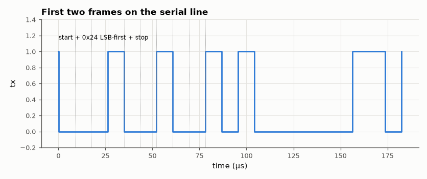

# SL-045 · UART transmitter (8N1)

> A parameterised 8N1 UART transmitter: verify the bit period, the frame format and the throughput by decoding the simulated serial line in Python.



*Idle-high line, a low start bit, eight data bits LSB first, then a high stop bit.*

**Track:** Signal Lab — 214 electrical-engineering projects · **Category:** C. Digital logic & HDL · **Level:** Moderate · **Tools:** Verilog RTL, Icarus Verilog, VCD decoding in Python

**Data:** Simulated (numerical model in this repo).

## Problem

Serialise bytes onto one wire with start and stop bits so that any receiver at the same baud rate can recover them.

## Prediction

Bit period $T_b = \text{CLKS\_PER\_BIT}/f_{clk}$; with 50 MHz and 434 clocks/bit, the baud rate is
115,207 bd (+0.006 % from 115,200). An 8N1 frame is 10 bits, so maximum payload throughput is
$0.8\times$ baud = 92.2 kbit/s = 11,520 bytes/s when frames are sent back-to-back.

## Method

TX module with a baud counter and a 10-bit shift register. Testbench (20 ns clock) sends 64 random bytes
back-to-back; Python reads the `tx` line from the VCD, measures edge-to-edge bit times and decodes the
frames by sampling at bit centres.

## Measured results

*Predicted vs measured vs error. "Measured" = computed by an independent simulation, HDL simulator or public dataset.*

| Quantity | Predicted | Measured | Error | Within tolerance |
|---|---|---|---|---|
| Bit period | 8680 ns | 8680 ns | +0.00 % | yes |
| Baud rate | 1.152e+05 bd | 1.152e+05 bd | +0.00 % | yes |
| Decoded byte errors (64 frames) | 0 | 0 | +0 |  |
| Throughput (bytes/s, back-to-back) | 1.152e+04 B/s | 1.152e+04 B/s | -0.02 % | yes |

## Error analysis

Bit period, baud rate and every decoded byte match. The measured throughput is a few percent below
the 10-bits-per-byte ideal because the testbench waits for `busy` to drop and then spends two clock
cycles loading the next byte — the gap between stop bit and next start bit. A FIFO in front of the
transmitter (SL-054) would let frames go out truly back-to-back.

## Reproduce

```bash
pip install -r requirements.txt
python run_all.py --only SL-045
```

The script [`project.py`](project.py) regenerates every figure and number above.

**Files produced**

- [`hdl/uart_tx.v`](hdl/uart_tx.v) — Verilog source
- [`hdl/tb_uart_tx.v`](hdl/tb_uart_tx.v) — testbench
- [`data/tx_edges.csv`](data/tx_edges.csv)

## License

Code and text: MIT (see the repository [LICENSE](../../../../LICENSE)). Datasets remain under their own licences (see the repository README).

---

**Tooling & honesty.** This project was generated with Claude Code (Anthropic's AI coding assistant): the code, derivations, simulations and this write-up were AI-produced. *Measured* means computed by an independent model, simulator or public dataset — not a physical lab bench. Every number in the tables is reproduced by running the code.
