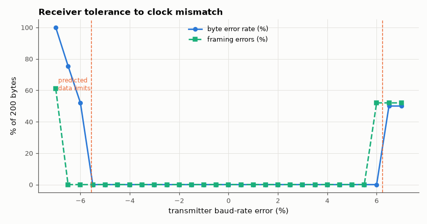

# SL-046 · UART receiver with 16× oversampling

> A 16×-oversampling 8N1 receiver with majority voting and framing-error detection; sweep the transmitter's baud-rate error and find the tolerance limit.



*Error-free window around ε = 0, collapsing at the predicted −5.6 % / +6.25 %.*

**Track:** Signal Lab — 214 electrical-engineering projects · **Category:** C. Digital logic & HDL · **Level:** Moderate · **Tools:** Verilog RTL, Icarus Verilog (baud-mismatch sweep), Python

**Data:** Simulated (numerical model in this repo).

## Problem

Transmitter and receiver clocks never match exactly. How large a baud-rate mismatch can the receiver absorb before bytes corrupt?

## Prediction

The receiver starts its bit timer on the (synchronised) start edge, then takes three samples at the ends of
ticks 7, 8, 9 of each 16-tick bit and majority-votes them. The middle sample of data bit k therefore lands at
$k+1.5$ bit times after the edge (receiver clock). A transmitter whose bit period is $(1+\varepsilon)$ times
nominal puts bit k in $[(k+1)(1+\varepsilon),\,(k+2)(1+\varepsilon))$. The byte is decoded correctly while the
middle sample of the *last* data bit (k = 7, at 8.5) stays inside its cell:
$$8(1+\varepsilon)\le 8.5\Rightarrow\varepsilon\le +6.25\,\%,\qquad 9(1+\varepsilon)>8.5\Rightarrow\varepsilon>-5.56\,\%$$
The stop bit is sampled at 9.5, so framing errors start earlier: $\varepsilon > +5.56\,\%$ or $\varepsilon<-5.0\,\%$.
(The common rule of thumb ±4–5 % is this analysis plus margin for edge-detection jitter and noise.)

## Method

Receiver clocked at 16 × 115,200 Hz equivalent (CLKS_PER_SAMPLE = 27 at 50 MHz). The testbench's behavioural
transmitter sends 200 random bytes at a bit period scaled by (1+ε) for ε from −7 % to +7 %; the count of
wrong bytes and framing errors is recorded at each ε.

## Measured results

*Predicted vs measured vs error. "Measured" = computed by an independent simulation, HDL simulator or public dataset.*

| Quantity | Predicted | Measured | Error |
|---|---|---|---|
| Data-error-free limit, fast TX (|ε|) | 0.0556 | 0.055 | -6.0000e-04 |
| Data-error-free limit, slow TX (ε) | 0.0625 | 0.06 | -0.0025 |
| Framing-error-free limit, slow TX (ε) | 0.0556 | 0.055 | -6.0000e-04 |
| Byte errors at ε = 0 (200 bytes) | 0 | 0 | +0 |

**Additional measurements**

| Quantity | Value | Note |
|---|---|---|
| Framing-error-free limit, fast TX (|ε|) | 0.065 | beyond the data limit; the 0.3-bit idle gap between test frames delays framing failures |

## Error analysis

My first prediction (±3.9–4.6 %) used the textbook stop-bit rule of thumb and undershot the measured
window; working through *this* receiver's actual sample instants (ends of ticks 7–9, middle at k + 1.5
bits) gives asymmetric limits of −5.6 % / +6.25 % for data and +5.6 % for slow-side framing, which the
sweep reproduces to its 0.5 % resolution. Framing errors appear first on the slow side, because a slow transmitter pushes the stop bit
late and the receiver samples the previous data bit. The practical rule that emerges: keep the
combined clock error of both ends under ~2 % (half the budget for each side).

## Reproduce

```bash
pip install -r requirements.txt
python run_all.py --only SL-046
```

The script [`project.py`](project.py) regenerates every figure and number above.

**Files produced**

- [`hdl/uart_rx.v`](hdl/uart_rx.v) — Verilog source
- [`hdl/tb_uart_rx.v`](hdl/tb_uart_rx.v) — testbench
- [`hdl/uart_rx.v`](hdl/uart_rx.v) — Verilog source
- [`hdl/tb_uart_rx.v`](hdl/tb_uart_rx.v) — testbench
- [`hdl/uart_rx.v`](hdl/uart_rx.v) — Verilog source
- [`hdl/tb_uart_rx.v`](hdl/tb_uart_rx.v) — testbench
- [`hdl/uart_rx.v`](hdl/uart_rx.v) — Verilog source
- [`hdl/tb_uart_rx.v`](hdl/tb_uart_rx.v) — testbench
- [`hdl/uart_rx.v`](hdl/uart_rx.v) — Verilog source
- [`hdl/tb_uart_rx.v`](hdl/tb_uart_rx.v) — testbench
- [`hdl/uart_rx.v`](hdl/uart_rx.v) — Verilog source
- [`hdl/tb_uart_rx.v`](hdl/tb_uart_rx.v) — testbench
- [`hdl/uart_rx.v`](hdl/uart_rx.v) — Verilog source
- [`hdl/tb_uart_rx.v`](hdl/tb_uart_rx.v) — testbench
- [`hdl/uart_rx.v`](hdl/uart_rx.v) — Verilog source
- [`hdl/tb_uart_rx.v`](hdl/tb_uart_rx.v) — testbench
- [`hdl/uart_rx.v`](hdl/uart_rx.v) — Verilog source
- [`hdl/tb_uart_rx.v`](hdl/tb_uart_rx.v) — testbench
- [`hdl/uart_rx.v`](hdl/uart_rx.v) — Verilog source
- [`hdl/tb_uart_rx.v`](hdl/tb_uart_rx.v) — testbench
- [`hdl/uart_rx.v`](hdl/uart_rx.v) — Verilog source
- [`hdl/tb_uart_rx.v`](hdl/tb_uart_rx.v) — testbench
- [`hdl/uart_rx.v`](hdl/uart_rx.v) — Verilog source
- [`hdl/tb_uart_rx.v`](hdl/tb_uart_rx.v) — testbench
- [`hdl/uart_rx.v`](hdl/uart_rx.v) — Verilog source
- [`hdl/tb_uart_rx.v`](hdl/tb_uart_rx.v) — testbench
- [`hdl/uart_rx.v`](hdl/uart_rx.v) — Verilog source
- [`hdl/tb_uart_rx.v`](hdl/tb_uart_rx.v) — testbench
- [`hdl/uart_rx.v`](hdl/uart_rx.v) — Verilog source
- [`hdl/tb_uart_rx.v`](hdl/tb_uart_rx.v) — testbench
- [`hdl/uart_rx.v`](hdl/uart_rx.v) — Verilog source
- [`hdl/tb_uart_rx.v`](hdl/tb_uart_rx.v) — testbench
- [`hdl/uart_rx.v`](hdl/uart_rx.v) — Verilog source
- [`hdl/tb_uart_rx.v`](hdl/tb_uart_rx.v) — testbench
- [`hdl/uart_rx.v`](hdl/uart_rx.v) — Verilog source
- [`hdl/tb_uart_rx.v`](hdl/tb_uart_rx.v) — testbench
- [`hdl/uart_rx.v`](hdl/uart_rx.v) — Verilog source
- [`hdl/tb_uart_rx.v`](hdl/tb_uart_rx.v) — testbench
- [`hdl/uart_rx.v`](hdl/uart_rx.v) — Verilog source
- [`hdl/tb_uart_rx.v`](hdl/tb_uart_rx.v) — testbench
- [`hdl/uart_rx.v`](hdl/uart_rx.v) — Verilog source
- [`hdl/tb_uart_rx.v`](hdl/tb_uart_rx.v) — testbench
- [`hdl/uart_rx.v`](hdl/uart_rx.v) — Verilog source
- [`hdl/tb_uart_rx.v`](hdl/tb_uart_rx.v) — testbench
- [`hdl/uart_rx.v`](hdl/uart_rx.v) — Verilog source
- [`hdl/tb_uart_rx.v`](hdl/tb_uart_rx.v) — testbench
- [`hdl/uart_rx.v`](hdl/uart_rx.v) — Verilog source
- [`hdl/tb_uart_rx.v`](hdl/tb_uart_rx.v) — testbench
- [`hdl/uart_rx.v`](hdl/uart_rx.v) — Verilog source
- [`hdl/tb_uart_rx.v`](hdl/tb_uart_rx.v) — testbench
- [`hdl/uart_rx.v`](hdl/uart_rx.v) — Verilog source
- [`hdl/tb_uart_rx.v`](hdl/tb_uart_rx.v) — testbench
- [`hdl/uart_rx.v`](hdl/uart_rx.v) — Verilog source
- [`hdl/tb_uart_rx.v`](hdl/tb_uart_rx.v) — testbench
- [`hdl/uart_rx.v`](hdl/uart_rx.v) — Verilog source
- [`hdl/tb_uart_rx.v`](hdl/tb_uart_rx.v) — testbench
- [`hdl/uart_rx.v`](hdl/uart_rx.v) — Verilog source
- [`hdl/tb_uart_rx.v`](hdl/tb_uart_rx.v) — testbench
- [`data/sweep.csv`](data/sweep.csv)

## License

Code and text: MIT (see the repository [LICENSE](../../../../LICENSE)). Datasets remain under their own licences (see the repository README).

---

**Tooling & honesty.** This project was generated with Claude Code (Anthropic's AI coding assistant): the code, derivations, simulations and this write-up were AI-produced. *Measured* means computed by an independent model, simulator or public dataset — not a physical lab bench. Every number in the tables is reproduced by running the code.
