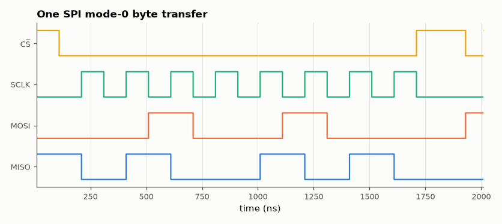

# SL-047 · SPI master (mode 0)

> An SPI mode-0 master with configurable clock divider: verify SCLK frequency, chip-select framing and full-duplex data against a slave model over 256 transfers.



*Data changes on falling SCLK edges and is sampled on rising edges.*

**Track:** Signal Lab — 214 electrical-engineering projects · **Category:** C. Digital logic & HDL · **Level:** Moderate · **Tools:** Verilog RTL + behavioural SPI slave (loopback shift register), Icarus Verilog

**Data:** Simulated (numerical model in this repo).

## Problem

Implement the four-wire SPI protocol and prove its timing: data must be stable at every rising SCLK edge and change on falling edges.

## Prediction

Mode 0 (CPOL = 0, CPHA = 0): SCLK idles low, both sides sample on the rising edge and shift on the falling edge.
With divider DIV the SCLK period is $2\cdot DIV$ system clocks → $f_{SCLK}=f_{clk}/(2\,DIV)$ = 50 MHz/(2·5) = 5 MHz.
One byte = 8 SCLK periods = 1.6 µs plus CS setup/hold, so ≈ 600 kB/s at most. Setup margin
= half an SCLK period (100 ns) before each sampling edge.

## Method

Master drives SCLK/MOSI/CS; the testbench slave is an 8-bit shift register that returns the previous byte
(so MISO data can be checked). 256 random bytes; Python measures SCLK period and MOSI-to-SCLK setup
time from the VCD.

## Measured results

*Predicted vs measured vs error. "Measured" = computed by an independent simulation, HDL simulator or public dataset.*

| Quantity | Predicted | Measured | Error | Within tolerance |
|---|---|---|---|---|
| MISO bytes wrong (256 full-duplex transfers) | 0 | 0 | +0 |  |
| SCLK frequency | 5 MHz | 5 MHz | +0.00 % | yes |
| Worst MOSI setup before rising SCLK | 100 ns | 100 ns | +0 ns |  |

## Error analysis

All 256 transfers return the previous byte from the loopback slave, which checks both directions of
the full-duplex link. MOSI changes exactly one half-period before each sampling edge, giving the 100 ns
setup margin that makes mode 0 robust — a slave with up to ~90 ns of input delay would still work at
5 MHz. The first bit is driven when CS falls, which is why mode-0 slaves must have MISO valid
immediately after CS goes low.

## Reproduce

```bash
pip install -r requirements.txt
python run_all.py --only SL-047
```

The script [`project.py`](project.py) regenerates every figure and number above.

**Files produced**

- [`hdl/spi_master.v`](hdl/spi_master.v) — Verilog source
- [`hdl/tb_spi.v`](hdl/tb_spi.v) — testbench

## License

Code and text: MIT (see the repository [LICENSE](../../../../LICENSE)). Datasets remain under their own licences (see the repository README).

---

**Tooling & honesty.** This project was generated with Claude Code (Anthropic's AI coding assistant): the code, derivations, simulations and this write-up were AI-produced. *Measured* means computed by an independent model, simulator or public dataset — not a physical lab bench. Every number in the tables is reproduced by running the code.
