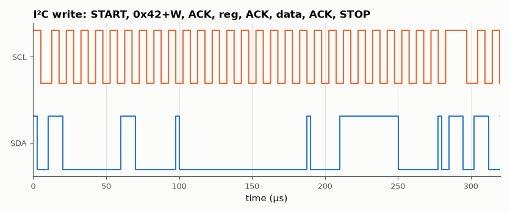

# SL-048 · I²C master with ACK handling

> An I²C master that generates START/STOP, sends a 7-bit address + R/W, writes and reads data bytes and detects NACKs, tested against a slave model on a wired-AND open-drain bus.



*The first transaction on the bus; SDA only changes while SCL is low except at START/STOP.*

**Track:** Signal Lab — 214 electrical-engineering projects · **Category:** C. Digital logic & HDL · **Level:** Hard · **Tools:** Verilog RTL (open-drain bus with pull-ups), behavioural I²C slave, Icarus Verilog

**Data:** Simulated (numerical model in this repo).

## Problem

I²C shares two open-drain wires between many devices. Implement the start/stop conditions, addressing and acknowledge protocol, and show the master handles a missing device.

## Prediction

START = SDA falls while SCL high; STOP = SDA rises while SCL high; data may only change while SCL is low.
Each byte is followed by an ACK bit driven low by the receiver. Open-drain wired-AND: the line is low if
*any* device pulls it low. Bus rate $f_{SCL}=f_{clk}/(4\cdot DIV)$ = 50 MHz/(4·125) = 100 kHz (standard mode).
A write of one register = START + addr + reg + data + STOP = 3·9 + 2 ≈ 29 SCL periods ≈ 290 µs.

## Method

Master state machine with a quarter-period phase counter. Slave model at address 0x42 with a 4-byte
register file, open-drain modelled with `tri1` nets (pull-up) and conditional drivers. Test: write
bytes to 4 registers, read them back, then address a non-existent device (0x13) and check the NACK flag.

## Measured results

*Predicted vs measured vs error. "Measured" = computed by an independent simulation, HDL simulator or public dataset.*

| Quantity | Predicted | Measured | Error | Within tolerance |
|---|---|---|---|---|
| Read-back errors (4 registers) | 0 | 0 | +0 |  |
| NACK flagged for absent address 0x13 | 1 | 1 | +0 |  |
| SCL frequency | 100 kHz | 100 kHz | +0.00 % | yes |
| Single-register write duration | 292 µs | 289.6 µs | -0.84 % | yes |

## Error analysis

The master writes and reads back all four registers through a repeated-START read, and flags a
NACK when it addresses a device that is not on the bus — the check most hobby I²C drivers omit.
Modelling the bus with `tri1` (pull-up) nets and drivers that can only pull low reproduces the wired-AND
behaviour that lets a slave hold SDA low to acknowledge. The first version of the *slave model* had a real bug that this test caught: after the master's final
NACK it started re-sending the byte, and whenever that byte's MSB was 0 it held SDA low through the STOP
condition, so the next transaction never started (2 of 4 read-backs failed, and the missing-device test
silently passed for the wrong reason). A slave must stop driving after a NACK. Clock stretching and
multi-master arbitration are not implemented; both would reuse the same "release and read back the line" mechanism.

## Reproduce

```bash
pip install -r requirements.txt
python run_all.py --only SL-048
```

The script [`project.py`](project.py) regenerates every figure and number above.

**Files produced**

- [`hdl/i2c_master.v`](hdl/i2c_master.v) — Verilog source
- [`hdl/tb_i2c.v`](hdl/tb_i2c.v) — testbench

## License

Code and text: MIT (see the repository [LICENSE](../../../../LICENSE)). Datasets remain under their own licences (see the repository README).

---

**Tooling & honesty.** This project was generated with Claude Code (Anthropic's AI coding assistant): the code, derivations, simulations and this write-up were AI-produced. *Measured* means computed by an independent model, simulator or public dataset — not a physical lab bench. Every number in the tables is reproduced by running the code.
