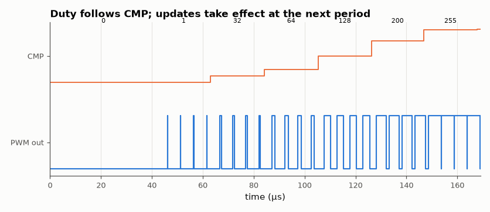

# SL-049 · Parameterised PWM generator

> A counter-compare PWM with N-bit resolution: verify frequency f_clk/2ᴺ and duty = compare/2ᴺ for a sweep of compare values, and glitch-free updates at period boundaries.



*CMP steps 0 → 256 (0 % → 100 %).*

**Track:** Signal Lab — 214 electrical-engineering projects · **Category:** C. Digital logic & HDL · **Level:** Easy · **Tools:** Verilog RTL, Icarus Verilog, VCD duty-cycle measurement

**Data:** Simulated (numerical model in this repo).

## Problem

Generate an exact duty cycle in hardware, and make sure changing the duty mid-period never produces a runt pulse.

## Prediction

Free-running N-bit counter; output high while count < CMP. Frequency $f_{clk}/2^N$; duty exactly
$CMP/2^N$, resolution $1/2^N$ (8 bits → 0.39 %). The compare register is double-buffered and loaded only when
the counter wraps, so a new duty takes effect on the next full period.

## Method

8-bit PWM at 50 MHz clock (195.3 kHz PWM). Testbench steps CMP through 0, 1, 32, 64, 128, 200, 255, 256 (100 %),
changing CMP at random times. Python measures high time/period for each settled period and flags any
period shorter than 2⁸ clocks.

## Measured results

*Predicted vs measured vs error. "Measured" = computed by an independent simulation, HDL simulator or public dataset.*

| Quantity | Predicted | Measured | Error | Within tolerance |
|---|---|---|---|---|
| Duty at CMP = 1 | 0.3906 % | 0.3906 % | +0 pp |  |
| Duty at CMP = 32 | 12.5 % | 12.5 % | +0 pp |  |
| Duty at CMP = 64 | 25 % | 25 % | +0 pp |  |
| Duty at CMP = 128 | 50 % | 50 % | +0 pp |  |
| Duty at CMP = 200 | 78.12 % | 78.12 % | +0 pp |  |
| Duty at CMP = 255 | 99.61 % | 99.61 % | +0 pp |  |
| PWM frequency | 195.3 kHz | 195.3 kHz | +0.00 % | yes |
| Runt periods (shorter than 256 clocks) | 0 | 0 | +0 |  |

## Error analysis

Every duty cycle equals CMP/256 exactly — a digital PWM has no analog error, only quantisation. The
double-buffered compare register means a CMP change in mid-period never truncates a pulse: there are no
periods shorter than 256 clocks. The 9-bit CMP input makes 100 % duty reachable (CMP = 256), a detail
that an N-bit compare register would miss.

## Reproduce

```bash
pip install -r requirements.txt
python run_all.py --only SL-049
```

The script [`project.py`](project.py) regenerates every figure and number above.

**Files produced**

- [`hdl/pwm.v`](hdl/pwm.v) — Verilog source
- [`hdl/tb_pwm.v`](hdl/tb_pwm.v) — testbench

## License

Code and text: MIT (see the repository [LICENSE](../../../../LICENSE)). Datasets remain under their own licences (see the repository README).

---

**Tooling & honesty.** This project was generated with Claude Code (Anthropic's AI coding assistant): the code, derivations, simulations and this write-up were AI-produced. *Measured* means computed by an independent model, simulator or public dataset — not a physical lab bench. Every number in the tables is reproduced by running the code.
