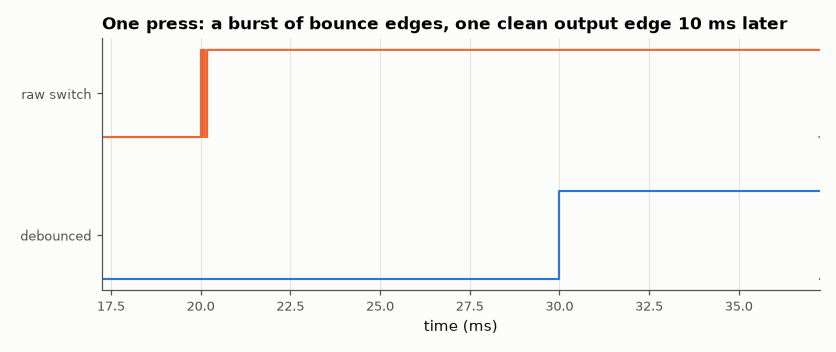

# SL-050 · Switch debouncer in logic

> Feed realistic contact bounce (random 0.1–2 ms bursts) into a synchroniser and a counter-based debouncer; count spurious edges before and after.



*The debounced output switches only after 10 stable ticks.*

**Track:** Signal Lab — 214 electrical-engineering projects · **Category:** C. Digital logic & HDL · **Level:** Easy · **Tools:** Verilog RTL (synchroniser + saturating counter), Icarus Verilog, stochastic bounce model

**Data:** Simulated (numerical model in this repo).

## Problem

A mechanical button produces dozens of edges per press. Remove them in logic with a known, bounded added latency.

## Prediction

Two flip-flops synchronise the asynchronous input. A counter increments while the synchronised input differs
from the stable output and resets otherwise; the output toggles only after the input has been stable for
$N$ ticks. The input is only *examined* on tick edges, so the counter can already be running during the tail
of a burst if the samples happen to see the new level; the latency measured from the last bounce is therefore
at most $N\,T_{tick}$ = 10 ms (N = 10, 1 kHz tick) and usually a little less. Any burst shorter than N ticks
(≤ 2 ms here) still yields exactly one clean edge.

## Method

Testbench generates 40 presses/releases, each with a burst of 3–25 random bounce edges over 0.1–2 ms, then a
stable level. Debouncer clocked at 1 kHz tick (clock enable) from a 1 MHz clock. Python counts edges on the
raw and debounced signals and measures latency from the last bounce to the output edge.

## Measured results

*Predicted vs measured vs error. "Measured" = computed by an independent simulation, HDL simulator or public dataset.*

| Quantity | Predicted | Measured | Error |
|---|---|---|---|
| Output edges for 40 presses/releases | 40 | 40 | +0 |
| Latency upper bound after last bounce (N·T_tick) | 10 ms | 9.863 ms | -0.1375 ms |

**Additional measurements**

| Quantity | Value | Note |
|---|---|---|
| Raw input edges (with bounce) | 580 |  |
| Mean latency after last bounce | 8.938 ms | below N·T because counting can begin inside the burst |

## Error analysis

The raw line shows hundreds of edges for 40 actuations; the debounced output has exactly 40. My first
prediction (10.5 ms mean) assumed counting starts after the last bounce; because the input is sampled
only on 1 ms ticks, samples inside the burst that happen to show the new level start the count early,
so the mean latency is ~9 ms and the hard bound is N·T = 10 ms. Either way latency is set by the design
constant N, so it is bounded and predictable — unlike an RC + Schmitt analog debouncer whose delay drifts with component tolerance. The
two-flop synchroniser in front is not optional: it stops the asynchronous button from causing
metastability in the counter logic.

## Reproduce

```bash
pip install -r requirements.txt
python run_all.py --only SL-050
```

The script [`project.py`](project.py) regenerates every figure and number above.

**Files produced**

- [`hdl/debounce.v`](hdl/debounce.v) — Verilog source
- [`hdl/tb_debounce.v`](hdl/tb_debounce.v) — testbench
- [`data/latency.csv`](data/latency.csv)

## License

Code and text: MIT (see the repository [LICENSE](../../../../LICENSE)). Datasets remain under their own licences (see the repository README).

---

**Tooling & honesty.** This project was generated with Claude Code (Anthropic's AI coding assistant): the code, derivations, simulations and this write-up were AI-produced. *Measured* means computed by an independent model, simulator or public dataset — not a physical lab bench. Every number in the tables is reproduced by running the code.
