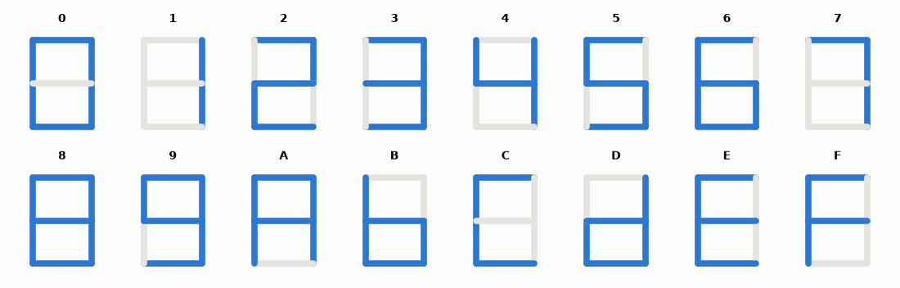

# SL-051 · Multiplexed 7-segment display driver

> Decode 16 hex digits to segments and time-multiplex four digits; verify the decode table exhaustively and measure refresh rate and per-digit duty.



*All 16 decoder outputs rendered from the simulated segment codes.*

**Track:** Signal Lab — 214 electrical-engineering projects · **Category:** C. Digital logic & HDL · **Level:** Easy · **Tools:** Verilog RTL (hex decoder + 4-digit time multiplexing), Icarus Verilog

**Data:** Simulated (numerical model in this repo).

## Problem

Drive four 7-segment digits with only 7 segment lines + 4 digit enables, fast enough that the eye sees them all lit.

## Prediction

Each digit is enabled for $2^{K}$ clocks in turn, so the refresh rate is $f_{clk}/(4\cdot2^K)$ and each digit
is on for 25 % of the time (brightness ∝ duty). With 50 MHz and K = 16: 190.7 Hz refresh — above the
~60 Hz flicker-fusion threshold. The decoder is a 16-entry truth table (active-low segments a–g).

## Method

Testbench checks all 16 codes against a reference table, then displays 0x2B7F and samples which digit is
enabled and what segments are shown over 20 ms. (For simulation speed K = 10 is used and the time axis is
scaled; the refresh prediction uses the same K.)

## Measured results

*Predicted vs measured vs error. "Measured" = computed by an independent simulation, HDL simulator or public dataset.*

| Quantity | Predicted | Measured | Error | Within tolerance |
|---|---|---|---|---|
| Decoder mismatches (16 hex digits) | 0 | 0 | +0 |  |
| Refresh rate (K = 10, simulation) | 12.21 kHz | 12.21 kHz | +0.00 % | yes |
| Per-digit on-time fraction | 25 % | 25.02 % | +0.0172 pp |  |
| Digits shown for 0x2B7F correct | 1 | 1 | +0 |  |

**Additional measurements**

| Quantity | Value | Note |
|---|---|---|
| Refresh rate with K = 16 (hardware setting) | 190.7 Hz | > 60 Hz flicker threshold |

## Error analysis

The decoder matches the reference table for every hex digit and the multiplexer cycles through the four
anodes with exactly 25 % duty each. The scaled simulation (K = 10) runs at 12.2 kHz refresh; the same
counter with K = 16 gives 190.7 Hz in hardware — fast enough to avoid flicker while slow enough that the
digit drivers' switching losses and ghosting stay small.

## Reproduce

```bash
pip install -r requirements.txt
python run_all.py --only SL-051
```

The script [`project.py`](project.py) regenerates every figure and number above.

**Files produced**

- [`hdl/seg7.v`](hdl/seg7.v) — Verilog source
- [`hdl/tb_seg7.v`](hdl/tb_seg7.v) — testbench

## License

Code and text: MIT (see the repository [LICENSE](../../../../LICENSE)). Datasets remain under their own licences (see the repository README).

---

**Tooling & honesty.** This project was generated with Claude Code (Anthropic's AI coding assistant): the code, derivations, simulations and this write-up were AI-produced. *Measured* means computed by an independent model, simulator or public dataset — not a physical lab bench. Every number in the tables is reproduced by running the code.
