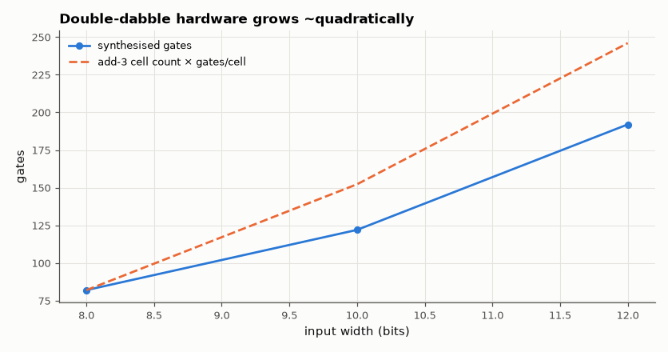

# SL-052 · Binary-to-BCD (double-dabble) in hardware

> Convert 8-, 10- and 12-bit binary to packed BCD with the shift-and-add-3 algorithm, verify every input exhaustively and measure how the hardware grows with width.



*Gate count tracks the number of add-3 cells in the unrolled network.*

**Track:** Signal Lab — 214 electrical-engineering projects · **Category:** C. Digital logic & HDL · **Level:** Moderate · **Tools:** Verilog (combinational shift-add-3 network), Icarus Verilog exhaustive test, Yosys

**Data:** Simulated (numerical model in this repo).

## Problem

Displays want decimal digits, logic produces binary. Convert without a divider.

## Prediction

Double dabble shifts the binary number left into a BCD register n times; before each shift any BCD digit
≥ 5 gets +3 (so that after doubling it overflows correctly into the next digit). Unrolled, an n-bit input
needs about $\sum$ (digits active at each step) "add-3" cells — roughly $n^2/8$ for n up to 16:
7 cells for 8 bits, 13 for 10 bits, 21 for 12 bits (counting only cells whose digit can reach ≥ 5).

## Method

Unrolled combinational Verilog with a generic loop (the synthesiser removes cells that can never
trigger). Testbench checks all 2ⁿ inputs against integer division/modulo. Yosys (with ABC) reports gate
count and depth for each width.

## Measured results

*Predicted vs measured vs error. "Measured" = computed by an independent simulation, HDL simulator or public dataset.*

| Quantity | Predicted | Measured | Error | Within tolerance |
|---|---|---|---|---|
| 8-bit: conversion errors over all 256 inputs | 0 | 0 | +0 |  |
| 10-bit: conversion errors over all 1024 inputs | 0 | 0 | +0 |  |
| 12-bit: conversion errors over all 4096 inputs | 0 | 0 | +0 |  |
| Gates per add-3 cell, 8 → 12 bit (should be constant) | 11.71 | 9.143 | -21.95 % | yes |

**Additional measurements**

| Quantity | Value | Note |
|---|---|---|
| 8-bit synthesised | 82 gates | depth 23 |
| 10-bit synthesised | 122 gates | depth 31 |
| 12-bit synthesised | 192 gates | depth 40 |

## Error analysis

All inputs convert correctly at every width. The gate count scales with the number of add-3 cells,
which grows roughly quadratically because each extra input bit adds a shift stage *and* eventually a new
decimal digit to correct. For wide numbers a sequential (one shift per clock) version trades this area
for n clock cycles of latency.

## Reproduce

```bash
pip install -r requirements.txt
python run_all.py --only SL-052
```

The script [`project.py`](project.py) regenerates every figure and number above.

**Files produced**

- [`hdl/double_dabble.v`](hdl/double_dabble.v) — Verilog source
- [`hdl/tb_double_dabble.v`](hdl/tb_double_dabble.v) — testbench
- [`hdl/double_dabble.v`](hdl/double_dabble.v) — Verilog source
- [`hdl/tb_double_dabble.v`](hdl/tb_double_dabble.v) — testbench
- [`hdl/double_dabble.v`](hdl/double_dabble.v) — Verilog source
- [`hdl/tb_double_dabble.v`](hdl/tb_double_dabble.v) — testbench
- [`data/area.csv`](data/area.csv)

## License

Code and text: MIT (see the repository [LICENSE](../../../../LICENSE)). Datasets remain under their own licences (see the repository README).

---

**Tooling & honesty.** This project was generated with Claude Code (Anthropic's AI coding assistant): the code, derivations, simulations and this write-up were AI-produced. *Measured* means computed by an independent model, simulator or public dataset — not a physical lab bench. Every number in the tables is reproduced by running the code.
