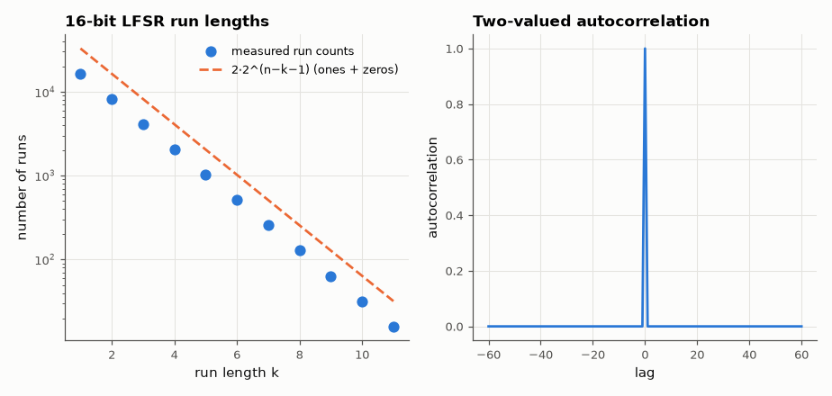

# SL-053 · LFSR pseudorandom generator and its statistics

> Build 8-, 12- and 16-bit maximal-length LFSRs, measure their periods (2ⁿ−1), and test the output bitstream for balance, run lengths and autocorrelation.



*Run lengths halve with each extra bit; autocorrelation is 1 at lag 0 and −1/(2ⁿ−1) elsewhere.*

**Track:** Signal Lab — 214 electrical-engineering projects · **Category:** C. Digital logic & HDL · **Level:** Moderate · **Tools:** Verilog Fibonacci LFSRs, Icarus Verilog, NumPy statistics

**Data:** Simulated (numerical model in this repo).

## Problem

An LFSR is a few flip-flops and XORs, yet its output looks random. Which properties are guaranteed, and where does the illusion break?

## Prediction

With a primitive feedback polynomial the state visits every non-zero n-bit value: period $2^n-1$.
Over one period the output has exactly $2^{n-1}$ ones and $2^{n-1}-1$ zeros; runs of length k occur
$2^{n-k-1}$ times (for k < n−1); the periodic autocorrelation is 1 at lag 0 and exactly $-1/(2^n-1)$ at
every other lag — ideal for spread spectrum. But it is linear: 2n consecutive bits reveal the whole
sequence (Berlekamp–Massey), so it is useless for cryptography.

## Method

Taps: x⁸+x⁶+x⁵+x⁴+1, x¹²+x¹¹+x¹⁰+x⁴+1, x¹⁶+x¹⁵+x¹³+x⁴+1. Testbench runs each until the seed state repeats and
dumps the full output sequence; Python checks balance, run-length distribution and autocorrelation, and
runs Berlekamp–Massey to recover the polynomial from 32 bits.

## Measured results

*Predicted vs measured vs error. "Measured" = computed by an independent simulation, HDL simulator or public dataset.*

| Quantity | Predicted | Measured | Error |
|---|---|---|---|
| 8-bit period | 255 | 255 | +0 |
| 8-bit ones per period | 128 | 128 | +0 |
| 8-bit off-peak autocorrelation | -0.003922 | -0.003922 | -3.0358e-17 |
| 8-bit linear complexity (Berlekamp–Massey) | 8 | 8 | +0 |
| 12-bit period | 4095 | 4095 | +0 |
| 12-bit ones per period | 2048 | 2048 | +0 |
| 12-bit off-peak autocorrelation | -2.4420e-04 | -2.4420e-04 | -5.5565e-17 |
| 12-bit linear complexity (Berlekamp–Massey) | 12 | 12 | +0 |
| 16-bit period | 6.554e+04 | 6.554e+04 | +0 |
| 16-bit ones per period | 3.277e+04 | 3.277e+04 | +0 |
| 16-bit off-peak autocorrelation | -1.5259e-05 | -1.5259e-05 | -5.2940e-17 |
| 16-bit linear complexity (Berlekamp–Massey) | 16 | 16 | +0 |

## Error analysis

Every statistical property that follows from the primitive polynomial is reproduced exactly: full
period, one more 1 than 0, run counts halving per length, and the two-valued autocorrelation. The last
row is the catch: Berlekamp–Massey needs only ~2n output bits to recover an equivalent n-stage LFSR, so
predicting the entire 65,535-bit sequence from 40 bits is trivial. LFSRs are excellent for
spreading codes, scramblers and BIST — never for secrets.

## Reproduce

```bash
pip install -r requirements.txt
python run_all.py --only SL-053
```

The script [`project.py`](project.py) regenerates every figure and number above.

**Files produced**

- [`hdl/lfsr.v`](hdl/lfsr.v) — Verilog source
- [`hdl/tb_lfsr.v`](hdl/tb_lfsr.v) — testbench
- [`hdl/lfsr.v`](hdl/lfsr.v) — Verilog source
- [`hdl/tb_lfsr.v`](hdl/tb_lfsr.v) — testbench
- [`hdl/lfsr.v`](hdl/lfsr.v) — Verilog source
- [`hdl/tb_lfsr.v`](hdl/tb_lfsr.v) — testbench
- [`hdl/README_taps.md`](hdl/README_taps.md)
- [`data/runs_16bit.csv`](data/runs_16bit.csv)

## License

Code and text: MIT (see the repository [LICENSE](../../../../LICENSE)). Datasets remain under their own licences (see the repository README).

---

**Tooling & honesty.** This project was generated with Claude Code (Anthropic's AI coding assistant): the code, derivations, simulations and this write-up were AI-produced. *Measured* means computed by an independent model, simulator or public dataset — not a physical lab bench. Every number in the tables is reproduced by running the code.
