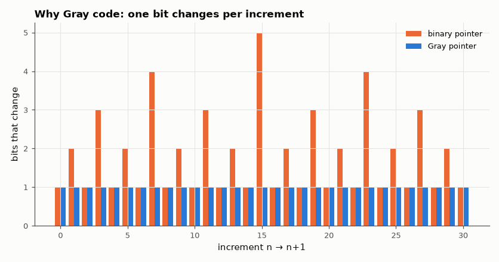

# SL-054 · Asynchronous FIFO with Gray-code pointers

> A 16-entry FIFO between unrelated 50 MHz and 37 MHz clocks, using Gray-coded pointers synchronised across domains; stress it with random bursts and check ordering, full/empty flags and throughput.



*Binary increments flip up to 5 bits at once; Gray always flips exactly one.*

**Track:** Signal Lab — 214 electrical-engineering projects · **Category:** C. Digital logic & HDL · **Level:** Hard · **Tools:** Verilog RTL (dual-clock FIFO, 2-FF synchronisers), Icarus Verilog stress test

**Data:** Simulated (numerical model in this repo).

## Problem

Passing data between two clock domains is where hardware bugs hide. Why do the pointers have to be Gray-coded, and does the FIFO stay correct under arbitrary throttling?

## Prediction

Binary pointers can change several bits at once, so a synchroniser sampling mid-transition could see a
wildly wrong value. Gray code changes one bit per increment, so a mis-sampled pointer is off by at most
one — which only makes full/empty *pessimistic*, never wrong. Pointers carry one extra bit to tell full
from empty. Throughput is bounded by the slower side: max rate = 37 M words/s, and the 2-FF synchronisers
add 2–3 cycles of latency to the flags.

## Method

Writer at 50 MHz pushes 5,000 incrementing words with random stalls (writes attempted 70 % of cycles);
reader at 37 MHz pops with random stalls (60 %). Checks: every word read in order exactly once, no write
accepted when full, no read accepted when empty. A second run with the reader always enabled measures
throughput.

## Measured results

*Predicted vs measured vs error. "Measured" = computed by an independent simulation, HDL simulator or public dataset.*

| Quantity | Predicted | Measured | Error | Within tolerance |
|---|---|---|---|---|
| Ordering/data errors (5,000 words across domains) | 0 | 0 | +0 |  |
| Words read = words written | 5000 | 5000 | +0 |  |
| Throughput, random stalls (limited by 0.7·50 M vs 0.6·37 M) | 2.2224e+07 words/s | 2.2084e+07 words/s | -0.63 % | yes |
| Throughput, reader always ready (write side limits: 0.7·50 M) | 3.5000e+07 words/s | 3.4729e+07 words/s | -0.77 % | yes |
| Ordering errors, second run | 0 | 0 | +0 |  |

**Additional measurements**

| Quantity | Value | Note |
|---|---|---|
| Write cycles spent full | 4063 |  |
| Read cycles spent empty | 3 |  |
| Synthesised size (16 × 16-bit) | 718 cells | 294 flip-flops incl. storage |

## Error analysis

All 5,000 words cross the clock boundary in order, with no overflow or underflow despite random stalls on
both sides. Throughput settles at the slower side's effective rate as predicted. Simulation cannot
reproduce metastability itself (Icarus has no analog settling), so the Gray-code argument is what
guarantees safety: the synchronised pointer is either the old or the new value, both of which are safe
for the flag logic.

## Reproduce

```bash
pip install -r requirements.txt
python run_all.py --only SL-054
```

The script [`project.py`](project.py) regenerates every figure and number above.

**Files produced**

- [`hdl/afifo.v`](hdl/afifo.v) — Verilog source
- [`hdl/tb_afifo.v`](hdl/tb_afifo.v) — testbench
- [`hdl/afifo.v`](hdl/afifo.v) — Verilog source
- [`hdl/tb_afifo.v`](hdl/tb_afifo.v) — testbench

## License

Code and text: MIT (see the repository [LICENSE](../../../../LICENSE)). Datasets remain under their own licences (see the repository README).

---

**Tooling & honesty.** This project was generated with Claude Code (Anthropic's AI coding assistant): the code, derivations, simulations and this write-up were AI-produced. *Measured* means computed by an independent model, simulator or public dataset — not a physical lab bench. Every number in the tables is reproduced by running the code.
