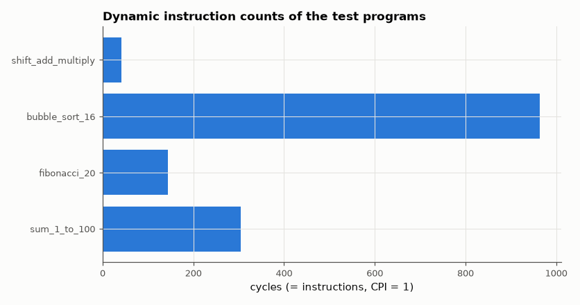

# SL-055 · Single-cycle RISC-V (RV32I subset) CPU

> A single-cycle processor that executes real RV32I machine code (ALU, loads/stores, branches, JAL/JALR): four programs are assembled, run on the Verilog CPU and checked register-for-register against an independent instruction-set simulator.



*Each program's cycle count equals its dynamic instruction count on the single-cycle core.*

**Track:** Signal Lab — 214 electrical-engineering projects · **Category:** C. Digital logic & HDL · **Level:** Hard · **Tools:** Verilog RTL, Python assembler + golden ISA simulator, Icarus Verilog

**Data:** Simulated (numerical model in this repo).

## Problem

Build the smallest processor that runs real instructions, and prove it computes exactly what the ISA specification says.

## Prediction

A single-cycle datapath fetches, decodes, executes, accesses memory and writes back in one clock, so
CPI = 1 exactly and cycles = dynamic instruction count. The cost is the clock period: it must cover the
slowest instruction (lw: instruction memory → register read → ALU address add → data memory → write-back
mux). Correctness criterion: after each program, all 31 registers and every data-memory word equal the
golden ISS's final state.

## Method

Programs (hand-written RISC-V assembly, assembled by `eelab.rv32`): sum 1…100, first 20 Fibonacci numbers
to memory, bubble sort of 16 signed words, and a shift-and-add multiply subroutine called with JAL/JALR.
The Verilog core loads the machine code with $readmemh, runs until it reaches the `j halt` self-loop,
dumps registers/memory; Python compares with the ISS.

## Measured results

*Predicted vs measured vs error. "Measured" = computed by an independent simulation, HDL simulator or public dataset.*

| Quantity | Predicted | Measured | Error |
|---|---|---|---|
| sum_1_to_100: register mismatches vs ISS | 0 | 0 | +0 |
| sum_1_to_100: memory mismatches vs ISS | 0 | 0 | +0 |
| sum_1_to_100: cycles (CPI = 1 → dynamic instruction count) | 304 cycles | 304 cycles | +0 cycles |
| fibonacci_20: register mismatches vs ISS | 0 | 0 | +0 |
| fibonacci_20: memory mismatches vs ISS | 0 | 0 | +0 |
| fibonacci_20: cycles (CPI = 1 → dynamic instruction count) | 144 cycles | 144 cycles | +0 cycles |
| bubble_sort_16: register mismatches vs ISS | 0 | 0 | +0 |
| bubble_sort_16: memory mismatches vs ISS | 0 | 0 | +0 |
| bubble_sort_16: cycles (CPI = 1 → dynamic instruction count) | 963 cycles | 963 cycles | +0 cycles |
| bubble sort output is sorted(input) | 1 | 1 | +0 |
| shift_add_multiply: register mismatches vs ISS | 0 | 0 | +0 |
| shift_add_multiply: memory mismatches vs ISS | 0 | 0 | +0 |
| shift_add_multiply: cycles (CPI = 1 → dynamic instruction count) | 41 cycles | 41 cycles | +0 cycles |
| 123 × 45 via shift-and-add | 5535 | 5535 | +0 |

**Additional measurements**

| Quantity | Value | Note |
|---|---|---|
| sum 1..100 stored in mem[0] | 5050 |  |

## Error analysis

All four programs finish with every register and memory word identical to the independent ISS, and the
cycle count equals the instruction count, i.e. CPI = 1 by construction. The price is the clock period: one
cycle must cover instruction fetch → register read → ALU → data memory → write-back mux, the whole
datapath in series, so the clock must be slow. That is the motivation for the pipelined version in SL-056, which
runs the same programs.

## Reproduce

```bash
pip install -r requirements.txt
python run_all.py --only SL-055
```

The script [`project.py`](project.py) regenerates every figure and number above.

**Files produced**

- [`programs/sum_1_to_100.s`](programs/sum_1_to_100.s) — RISC-V assembly
- [`programs/sum_1_to_100.hex`](programs/sum_1_to_100.hex) — machine code
- [`hdl/cpu.v`](hdl/cpu.v) — Verilog source
- [`hdl/tb_cpu.v`](hdl/tb_cpu.v) — testbench
- [`programs/fibonacci_20.s`](programs/fibonacci_20.s) — RISC-V assembly
- [`programs/fibonacci_20.hex`](programs/fibonacci_20.hex) — machine code
- [`hdl/cpu.v`](hdl/cpu.v) — Verilog source
- [`hdl/tb_cpu.v`](hdl/tb_cpu.v) — testbench
- [`programs/bubble_sort_16.s`](programs/bubble_sort_16.s) — RISC-V assembly
- [`programs/bubble_sort_16.hex`](programs/bubble_sort_16.hex) — machine code
- [`hdl/cpu.v`](hdl/cpu.v) — Verilog source
- [`hdl/tb_cpu.v`](hdl/tb_cpu.v) — testbench
- [`programs/shift_add_multiply.s`](programs/shift_add_multiply.s) — RISC-V assembly
- [`programs/shift_add_multiply.hex`](programs/shift_add_multiply.hex) — machine code
- [`hdl/cpu.v`](hdl/cpu.v) — Verilog source
- [`hdl/tb_cpu.v`](hdl/tb_cpu.v) — testbench

## License

Code and text: MIT (see the repository [LICENSE](../../../../LICENSE)). Datasets remain under their own licences (see the repository README).

---

**Tooling & honesty.** This project was generated with Claude Code (Anthropic's AI coding assistant): the code, derivations, simulations and this write-up were AI-produced. *Measured* means computed by an independent model, simulator or public dataset — not a physical lab bench. Every number in the tables is reproduced by running the code.
