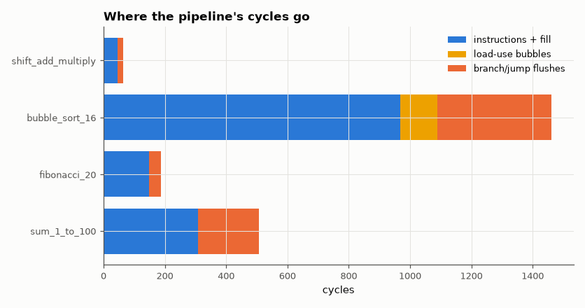

# SL-056 · 5-stage pipelined RISC-V with forwarding and hazards

> Pipeline the SL-055 core into IF/ID/EX/MEM/WB with full forwarding, a load-use interlock and branch flushing; predict each program's cycle count from its instruction trace and compare with the RTL.



*Taken branches dominate the overhead in these loop-heavy programs.*

**Track:** Signal Lab — 214 electrical-engineering projects · **Category:** C. Digital logic & HDL · **Level:** Hard · **Tools:** Verilog RTL, Python ISS + hazard-counting cycle model, Icarus Verilog

**Data:** Simulated (numerical model in this repo).

## Problem

Pipelining overlaps five instructions at once. Where does that break (data and control hazards), and can the exact cycle count be predicted from the program alone?

## Prediction

Ideal pipeline: $N + 4$ cycles for N instructions (fill). Forwarding from EX/MEM and MEM/WB removes all
ALU→ALU stalls; a *load* followed immediately by a use still costs 1 bubble. Branches and jumps are
resolved in EX, so a taken one flushes the 2 younger instructions:
$$\text{cycles}=N+4+\#\text{load-use}+2\cdot\#\text{taken}$$
CPI $=\text{cycles}/N$. The ISS trace gives N, load-use pairs and taken branches exactly.

## Method

Same four programs as SL-055. The testbench counts cycles until the halt instruction reaches write-back and
dumps the architectural state; Python compares the state with the ISS and the cycle count with the formula
above evaluated on the ISS trace.

## Measured results

*Predicted vs measured vs error. "Measured" = computed by an independent simulation, HDL simulator or public dataset.*

| Quantity | Predicted | Measured | Error |
|---|---|---|---|
| sum_1_to_100: architectural-state mismatches vs ISS | 0 | 0 | +0 |
| sum_1_to_100: cycles (N+4+load-use+2·taken) | 507 cycles | 507 cycles | +0 cycles |
| fibonacci_20: architectural-state mismatches vs ISS | 0 | 0 | +0 |
| fibonacci_20: cycles (N+4+load-use+2·taken) | 187 cycles | 187 cycles | +0 cycles |
| bubble_sort_16: architectural-state mismatches vs ISS | 0 | 0 | +0 |
| bubble_sort_16: cycles (N+4+load-use+2·taken) | 1460 cycles | 1460 cycles | +0 cycles |
| shift_add_multiply: architectural-state mismatches vs ISS | 0 | 0 | +0 |
| shift_add_multiply: cycles (N+4+load-use+2·taken) | 64 cycles | 64 cycles | +0 cycles |

**Additional measurements**

| Quantity | Value | Note |
|---|---|---|
| sum_1_to_100: CPI | 1.662 | N=305, load-use=0, flush slots=198 |
| fibonacci_20: CPI | 1.29 | N=145, load-use=0, flush slots=38 |
| bubble_sort_16: CPI | 1.515 | N=964, load-use=120, flush slots=372 |
| shift_add_multiply: CPI | 1.524 | N=42, load-use=0, flush slots=18 |

## Error analysis

The pipelined core reaches exactly the same architectural state as the ISS for every program, and the
cycle count matches the hazard formula *exactly* — every bubble is accounted for by a load-use pair or a
taken branch in the trace. The breakdown shows why real cores invest in branch prediction: in these
loops, 2-cycle flushes on taken branches cost far more than load-use stalls. With a clock period
roughly 1/4–1/5 of the single-cycle core's, a CPI of ~1.3–1.5 is still a 3× speed-up.

## Reproduce

```bash
pip install -r requirements.txt
python run_all.py --only SL-056
```

The script [`project.py`](project.py) regenerates every figure and number above.

**Files produced**

- [`programs/sum_1_to_100.s`](programs/sum_1_to_100.s) — RISC-V assembly
- [`programs/sum_1_to_100.hex`](programs/sum_1_to_100.hex) — machine code
- [`hdl/cpu.v`](hdl/cpu.v) — Verilog source
- [`hdl/tb_cpu.v`](hdl/tb_cpu.v) — testbench
- [`programs/fibonacci_20.s`](programs/fibonacci_20.s) — RISC-V assembly
- [`programs/fibonacci_20.hex`](programs/fibonacci_20.hex) — machine code
- [`hdl/cpu.v`](hdl/cpu.v) — Verilog source
- [`hdl/tb_cpu.v`](hdl/tb_cpu.v) — testbench
- [`programs/bubble_sort_16.s`](programs/bubble_sort_16.s) — RISC-V assembly
- [`programs/bubble_sort_16.hex`](programs/bubble_sort_16.hex) — machine code
- [`hdl/cpu.v`](hdl/cpu.v) — Verilog source
- [`hdl/tb_cpu.v`](hdl/tb_cpu.v) — testbench
- [`programs/shift_add_multiply.s`](programs/shift_add_multiply.s) — RISC-V assembly
- [`programs/shift_add_multiply.hex`](programs/shift_add_multiply.hex) — machine code
- [`hdl/cpu.v`](hdl/cpu.v) — Verilog source
- [`hdl/tb_cpu.v`](hdl/tb_cpu.v) — testbench
- [`data/cycles.csv`](data/cycles.csv)

## License

Code and text: MIT (see the repository [LICENSE](../../../../LICENSE)). Datasets remain under their own licences (see the repository README).

---

**Tooling & honesty.** This project was generated with Claude Code (Anthropic's AI coding assistant): the code, derivations, simulations and this write-up were AI-produced. *Measured* means computed by an independent model, simulator or public dataset — not a physical lab bench. Every number in the tables is reproduced by running the code.
