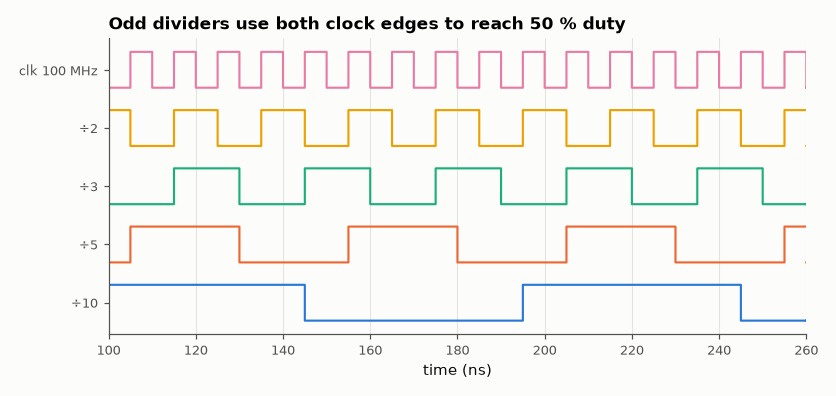

# SL-057 · Clock divider and prescaler (including odd 50 % duty)

> Divide a 100 MHz clock by 2, 3, 5, 10 and 1000 with exact 50 % duty — including odd ratios that need both clock edges — and measure frequency and duty from the waveform.



*÷3 and ÷5 outputs are the OR of a rising-edge and a falling-edge register.*

**Track:** Signal Lab — 214 electrical-engineering projects · **Category:** C. Digital logic & HDL · **Level:** Easy · **Tools:** Verilog RTL, Icarus Verilog, VCD frequency/duty measurement

**Data:** Simulated (numerical model in this repo).

## Problem

Dividing by an even number is easy. How do you divide by 3 or 5 and still get a 50 % duty cycle, and what does it cost?

## Prediction

Even N: toggle every N/2 input cycles → $f/N$, 50 % duty. Odd N with a single edge gives duty
$\lfloor N/2\rfloor/N$ (33 % for N = 3). ORing a rising-edge and a falling-edge version of the same
counter output (shifted by half an input period) gives $\frac{(N-1)/2 + 1/2}{N}=50\,\%$ exactly.

## Method

Parameterised divider module with an odd/even generate branch. Input clock 100 MHz (10 ns). Python measures
each output's period and high time from the VCD.

## Measured results

*Predicted vs measured vs error. "Measured" = computed by an independent simulation, HDL simulator or public dataset.*

| Quantity | Predicted | Measured | Error | Within tolerance |
|---|---|---|---|---|
| ÷2: output frequency | 50 MHz | 50 MHz | +0.00 % | yes |
| ÷2: duty cycle | 50 % | 50 % | +0 pp |  |
| ÷3: output frequency | 33.33 MHz | 33.33 MHz | +0.00 % | yes |
| ÷3: duty cycle | 50 % | 50 % | +0 pp |  |
| ÷5: output frequency | 20 MHz | 20 MHz | +0.00 % | yes |
| ÷5: duty cycle | 50 % | 50 % | +0 pp |  |
| ÷10: output frequency | 10 MHz | 10 MHz | +0.00 % | yes |
| ÷10: duty cycle | 50 % | 50 % | +0 pp |  |
| ÷1000: output frequency | 100 kHz | 100 kHz | +0.00 % | yes |
| ÷1000: duty cycle | 50 % | 50 % | +0 pp |  |

## Error analysis

All ratios hit their frequency exactly and all duty cycles are 50 %, including ÷3 and ÷5 which a
single-edge counter can only make 33 % and 40 %. The cost of the odd-N trick is that the output depends
on the *falling* edge too, so its duty accuracy depends on the input clock's own duty cycle, and the OR
gate creates a combinational clock — acceptable for driving an external pin, but on an FPGA you would use
a PLL/MMCM or a clock-enable instead of routing a logic-generated clock.

## Reproduce

```bash
pip install -r requirements.txt
python run_all.py --only SL-057
```

The script [`project.py`](project.py) regenerates every figure and number above.

**Files produced**

- [`hdl/clkdiv.v`](hdl/clkdiv.v) — Verilog source
- [`hdl/tb_clkdiv.v`](hdl/tb_clkdiv.v) — testbench

## License

Code and text: MIT (see the repository [LICENSE](../../../../LICENSE)). Datasets remain under their own licences (see the repository README).

---

**Tooling & honesty.** This project was generated with Claude Code (Anthropic's AI coding assistant): the code, derivations, simulations and this write-up were AI-produced. *Measured* means computed by an independent model, simulator or public dataset — not a physical lab bench. Every number in the tables is reproduced by running the code.
