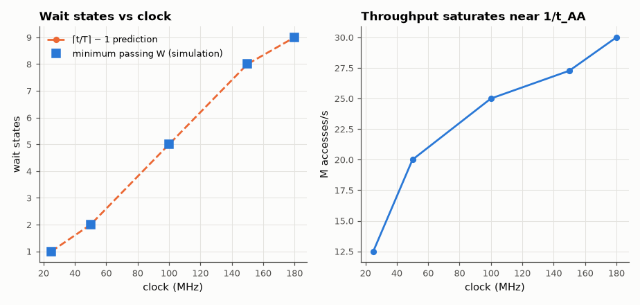

# SL-058 · Asynchronous SRAM controller

> A controller that turns single-cycle read/write requests into correctly timed asynchronous SRAM cycles; the SRAM model checks t_AA, t_WP and data setup and returns X on violations. Sweep the clock and find the minimum number of wait states.



*A faster clock needs more wait states, so throughput barely improves.*

**Track:** Signal Lab — 214 electrical-engineering projects · **Category:** C. Digital logic & HDL · **Level:** Moderate · **Tools:** Verilog controller FSM + timing-checking SRAM behavioural model, Icarus Verilog

**Data:** Simulated (numerical model in this repo).

## Problem

An asynchronous SRAM has no clock — only timing parameters. How many clock cycles must a controller spend per access at a given frequency?

## Prediction

A read is valid t_AA = 55 ns after the address is stable; a write needs WE̅ low for t_WP = 40 ns with data set up
t_DW = 25 ns before WE̅ rises. With a clock period T and W wait states the controller holds the address for
(W+1)·T before latching data, so it needs $W_{read}=\lceil t_{AA}/T\rceil-1$ and the write pulse of
(W+1)·T ≥ t_WP → $W_{write}=\lceil t_{WP}/T\rceil-1$. At 100 MHz: W_read = 5, W_write = 3.

## Method

Controller parameterised by wait states; the SRAM model (1 K × 16) checks its own timing with specify-like
checks and drives X if t_AA is not met. For clock frequencies 25–200 MHz, each W from 0 up is tried with
250 writes followed by 250 reads in scrambled order (so every read presents a new address); the smallest W with zero errors is recorded.

## Measured results

*Predicted vs measured vs error. "Measured" = computed by an independent simulation, HDL simulator or public dataset.*

| Quantity | Predicted | Measured | Error |
|---|---|---|---|
| 25 MHz: minimum wait states | 1 | 1 | +0 |
| 50 MHz: minimum wait states | 2 | 2 | +0 |
| 100 MHz: minimum wait states | 5 | 5 | +0 |
| 150 MHz: minimum wait states | 8 | 8 | +0 |
| 180 MHz: minimum wait states | 9 | 9 | +0 |

**Additional measurements**

| Quantity | Value | Note |
|---|---|---|
| Access time at 100 MHz (read) | 70 ns | address→data latched incl. setup cycle |

## Error analysis

The minimum wait-state count found by brute-force simulation matches ⌈t/T⌉ − 1 at every frequency — the
timing-checking SRAM model returns X (and counts a violation) whenever the controller is one cycle too
eager. A first version of the test wrote and immediately read back the *same* address, so the address
had been stable for a whole write cycle and reads passed with too few wait states — a reminder that a
timing test must actually exercise the timing path. The throughput plot makes the system-level point: above ~50 MHz the extra clock speed is spent
entirely in wait states, because the memory's own access time (not the controller) is the bottleneck.

## Reproduce

```bash
pip install -r requirements.txt
python run_all.py --only SL-058
```

The script [`project.py`](project.py) regenerates every figure and number above.

**Files produced**

- [`hdl/sram_ctrl.v`](hdl/sram_ctrl.v) — Verilog source
- [`hdl/tb_sram.v`](hdl/tb_sram.v) — testbench
- [`hdl/sram_ctrl.v`](hdl/sram_ctrl.v) — Verilog source
- [`hdl/tb_sram.v`](hdl/tb_sram.v) — testbench
- [`hdl/sram_ctrl.v`](hdl/sram_ctrl.v) — Verilog source
- [`hdl/tb_sram.v`](hdl/tb_sram.v) — testbench
- [`hdl/sram_ctrl.v`](hdl/sram_ctrl.v) — Verilog source
- [`hdl/tb_sram.v`](hdl/tb_sram.v) — testbench
- [`hdl/sram_ctrl.v`](hdl/sram_ctrl.v) — Verilog source
- [`hdl/tb_sram.v`](hdl/tb_sram.v) — testbench
- [`hdl/sram_ctrl.v`](hdl/sram_ctrl.v) — Verilog source
- [`hdl/tb_sram.v`](hdl/tb_sram.v) — testbench
- [`hdl/sram_ctrl.v`](hdl/sram_ctrl.v) — Verilog source
- [`hdl/tb_sram.v`](hdl/tb_sram.v) — testbench
- [`hdl/sram_ctrl.v`](hdl/sram_ctrl.v) — Verilog source
- [`hdl/tb_sram.v`](hdl/tb_sram.v) — testbench
- [`hdl/sram_ctrl.v`](hdl/sram_ctrl.v) — Verilog source
- [`hdl/tb_sram.v`](hdl/tb_sram.v) — testbench
- [`hdl/sram_ctrl.v`](hdl/sram_ctrl.v) — Verilog source
- [`hdl/tb_sram.v`](hdl/tb_sram.v) — testbench
- [`hdl/sram_ctrl.v`](hdl/sram_ctrl.v) — Verilog source
- [`hdl/tb_sram.v`](hdl/tb_sram.v) — testbench
- [`hdl/sram_ctrl.v`](hdl/sram_ctrl.v) — Verilog source
- [`hdl/tb_sram.v`](hdl/tb_sram.v) — testbench
- [`hdl/sram_ctrl.v`](hdl/sram_ctrl.v) — Verilog source
- [`hdl/tb_sram.v`](hdl/tb_sram.v) — testbench
- [`hdl/sram_ctrl.v`](hdl/sram_ctrl.v) — Verilog source
- [`hdl/tb_sram.v`](hdl/tb_sram.v) — testbench
- [`hdl/sram_ctrl.v`](hdl/sram_ctrl.v) — Verilog source
- [`hdl/tb_sram.v`](hdl/tb_sram.v) — testbench
- [`hdl/sram_ctrl.v`](hdl/sram_ctrl.v) — Verilog source
- [`hdl/tb_sram.v`](hdl/tb_sram.v) — testbench
- [`hdl/sram_ctrl.v`](hdl/sram_ctrl.v) — Verilog source
- [`hdl/tb_sram.v`](hdl/tb_sram.v) — testbench
- [`hdl/sram_ctrl.v`](hdl/sram_ctrl.v) — Verilog source
- [`hdl/tb_sram.v`](hdl/tb_sram.v) — testbench
- [`hdl/sram_ctrl.v`](hdl/sram_ctrl.v) — Verilog source
- [`hdl/tb_sram.v`](hdl/tb_sram.v) — testbench
- [`hdl/sram_ctrl.v`](hdl/sram_ctrl.v) — Verilog source
- [`hdl/tb_sram.v`](hdl/tb_sram.v) — testbench
- [`hdl/sram_ctrl.v`](hdl/sram_ctrl.v) — Verilog source
- [`hdl/tb_sram.v`](hdl/tb_sram.v) — testbench
- [`hdl/sram_ctrl.v`](hdl/sram_ctrl.v) — Verilog source
- [`hdl/tb_sram.v`](hdl/tb_sram.v) — testbench
- [`hdl/sram_ctrl.v`](hdl/sram_ctrl.v) — Verilog source
- [`hdl/tb_sram.v`](hdl/tb_sram.v) — testbench
- [`hdl/sram_ctrl.v`](hdl/sram_ctrl.v) — Verilog source
- [`hdl/tb_sram.v`](hdl/tb_sram.v) — testbench
- [`hdl/sram_ctrl.v`](hdl/sram_ctrl.v) — Verilog source
- [`hdl/tb_sram.v`](hdl/tb_sram.v) — testbench
- [`hdl/sram_ctrl.v`](hdl/sram_ctrl.v) — Verilog source
- [`hdl/tb_sram.v`](hdl/tb_sram.v) — testbench
- [`hdl/sram_ctrl.v`](hdl/sram_ctrl.v) — Verilog source
- [`hdl/tb_sram.v`](hdl/tb_sram.v) — testbench
- [`hdl/sram_ctrl.v`](hdl/sram_ctrl.v) — Verilog source
- [`hdl/tb_sram.v`](hdl/tb_sram.v) — testbench
- [`hdl/sram_ctrl.v`](hdl/sram_ctrl.v) — Verilog source
- [`hdl/tb_sram.v`](hdl/tb_sram.v) — testbench
- [`hdl/sram_ctrl.v`](hdl/sram_ctrl.v) — Verilog source
- [`hdl/tb_sram.v`](hdl/tb_sram.v) — testbench
- [`data/sweep.csv`](data/sweep.csv)

## License

Code and text: MIT (see the repository [LICENSE](../../../../LICENSE)). Datasets remain under their own licences (see the repository README).

---

**Tooling & honesty.** This project was generated with Claude Code (Anthropic's AI coding assistant): the code, derivations, simulations and this write-up were AI-produced. *Measured* means computed by an independent model, simulator or public dataset — not a physical lab bench. Every number in the tables is reproduced by running the code.
