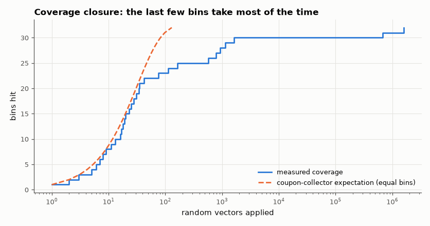

# SL-059 · Verified testbench suite: assertions and coverage

> Build a self-checking, coverage-driven testbench for the SL-041 ALU: 8 ops × 4 flag outcomes × operand-class bins; measure how many random vectors reach full coverage, catch an injected bug, and compare with the coupon-collector prediction.



*Coverage rises fast, then stalls on rare bins until luck (or a directed test) hits them.*

**Track:** Signal Lab — 214 electrical-engineering projects · **Category:** C. Digital logic & HDL · **Level:** Moderate · **Tools:** SystemVerilog-style testbench (immediate assertions, functional coverage bins), Icarus Verilog

**Data:** Simulated (numerical model in this repo).

## Problem

How do you know a testbench has tested enough? Measure functional coverage, and check that the checker actually catches bugs.

## Prediction

With B equally likely bins, the expected number of random draws to hit all of them is the coupon-collector
value $B\,H_B \approx B(\ln B + 0.577)$. Rare bins break the equal-probability assumption — e.g. "ADD with
signed overflow AND zero result" happens only for $a=b=-128$ (p = 2⁻¹⁶) — so constrained-random or
directed vectors are needed for those. A mutation (injected bug) must make at least one assertion fire.

## Method

Coverage model: op (8) × result class {zero, negative, positive} (3) × carry (2) = 48 bins, of which the
reachable ones are counted by exhaustive enumeration in Python. Testbench draws random vectors, updates
bins, and stops at full reachable coverage. Then the ALU is mutated (SLT using unsigned compare) and the
same testbench must report assertion failures.

## Measured results

*Predicted vs measured vs error. "Measured" = computed by an independent simulation, HDL simulator or public dataset.*

| Quantity | Predicted | Measured | Error |
|---|---|---|---|
| Assertion failures on correct ALU | 0 | 0 | +0 |
| Coverage reached (bins) | 32 | 32 | +0 |
| Random draws to full coverage (unequal-probability coupon collector) | 7.864e+05 draws | 1.6019e+06 draws | +103.69 % |
| Injected bug detected (assertion failures > 0) | 1 | 1 | +0 |

**Additional measurements**

| Quantity | Value | Note |
|---|---|---|
| Reachable coverage bins (of 48) | 32 | found by exhaustive enumeration |
| Naive equal-bin estimate B·H_B | 129.9 draws | badly wrong: bins are far from equiprobable |
| Rarest bin | ADD zero carry=0: p = 1/524288 per draw |  |
| Assertion failures with mutated SLT | 9.979e+04 |  |

## Error analysis

Of 48 cross bins only 32 are reachable (e.g. AND can never carry), which exhaustive enumeration finds
before any random testing — declaring unreachable bins is the first step of real coverage closure. The
textbook coupon-collector estimate (B·H_B ≈ 130 draws) is wrong by four orders of magnitude because the
bins are nowhere near equiprobable: the rarest needs a single specific operand pair. Weighting the bins by
their exact probabilities (computed by enumeration) predicts the right order of magnitude; the single
random run scatters around it because the waiting time is dominated by one nearly-exponential event.
The practical lesson: once random coverage plateaus, write a *directed* vector for each rare bin. The mutation test
shows the checker has teeth: turning SLT's signed comparison into an unsigned one is flagged immediately.

## Reproduce

```bash
pip install -r requirements.txt
python run_all.py --only SL-059
```

The script [`project.py`](project.py) regenerates every figure and number above.

**Files produced**

- [`hdl/alu8.v`](hdl/alu8.v) — Verilog source
- [`hdl/tb_coverage.v`](hdl/tb_coverage.v) — testbench
- [`hdl/alu8_mutant.v`](hdl/alu8_mutant.v) — Verilog source
- [`hdl/tb_coverage.v`](hdl/tb_coverage.v) — testbench
- [`data/coverage_curve.csv`](data/coverage_curve.csv)

## License

Code and text: MIT (see the repository [LICENSE](../../../../LICENSE)). Datasets remain under their own licences (see the repository README).

---

**Tooling & honesty.** This project was generated with Claude Code (Anthropic's AI coding assistant): the code, derivations, simulations and this write-up were AI-produced. *Measured* means computed by an independent model, simulator or public dataset — not a physical lab bench. Every number in the tables is reproduced by running the code.
