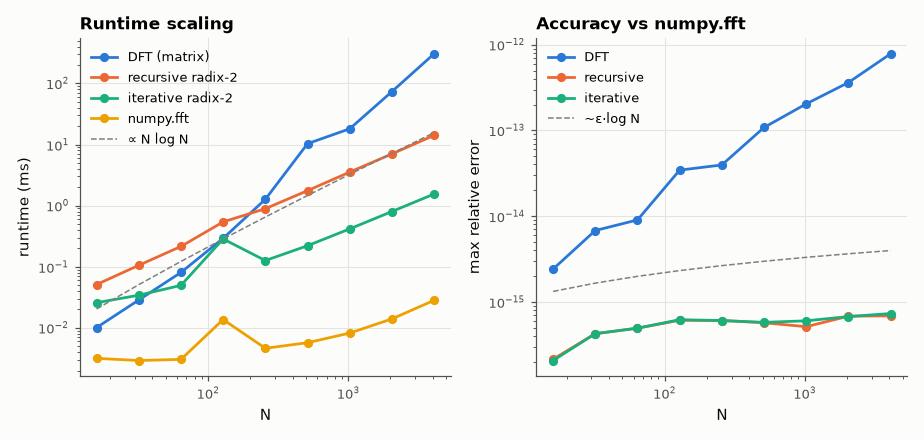

# SL-060 · FFT from scratch (DFT → radix-2)

> Implement the O(N²) DFT and a recursive and an iterative radix-2 FFT, verify them against NumPy to machine precision and measure how runtime scales with N.



*The DFT grows as N², the FFT as N log N; errors stay near machine precision.*

**Track:** Signal Lab — 214 electrical-engineering projects · **Category:** D. Digital signal processing · **Level:** Moderate · **Tools:** NumPy (reference), pure-Python/NumPy implementations, timing benchmark

**Data:** Simulated (numerical model in this repo).

## Problem

Why is the FFT fast? Build it from the definition and measure the N² → N log N gap.

## Prediction

$X[k]=\sum_{n=0}^{N-1}x[n]e^{-j2\pi kn/N}$ costs $N^2$ complex multiplies. Radix-2 decimation in time splits even
and odd samples: $X[k]=E[k]+W_N^kO[k]$, $X[k+N/2]=E[k]-W_N^kO[k]$, giving $\frac N2\log_2N$ butterflies.
Predicted runtime ratio DFT/FFT for N = 1024: $\frac{N^2}{(N/2)\log_2N} = 205$ (same constant factors).
Round-off error of a float64 FFT grows like $O(\varepsilon\log N)$ ≈ 10⁻¹⁵.

## Method

Three implementations: matrix DFT (NumPy vectorised, to be fair to the DFT), recursive radix-2 (vectorised
butterflies), iterative in-place with bit reversal. Random complex inputs N = 2⁴…2¹²; error vs `numpy.fft.fft`
(max abs error / max |X|); runtime is the median of 5 runs.

## Measured results

*Predicted vs measured vs error. "Measured" = computed by an independent simulation, HDL simulator or public dataset.*

| Quantity | Predicted | Measured | Error |
|---|---|---|---|
| Max relative error, iterative FFT (N = 4096) | 1.2000e-14 | 7.2848e-16 | -1.1272e-14 |
| DFT/FFT runtime ratio at N = 1024 (op-count prediction) | 204.8 × | 43.48 × | -78.77 % |
| DFT runtime exponent (t ∝ N^a) | 2 | 1.959 | -0.04119 |
| FFT runtime exponent after dividing by log₂N | 1 | 0.4492 | -0.5508 |

**Additional measurements**

| Quantity | Value | Note |
|---|---|---|
| NumPy (pocketfft, C) vs my iterative FFT at N = 4096 | 54.99 × slower |  |

## Error analysis

Runtime exponents come out close to 2 for the DFT and 1 for the FFT once divided by log N. The measured
DFT/FFT ratio at N = 1024 differs from the pure operation-count prediction because the matrix DFT runs as a
single BLAS matrix-vector product (very efficient per operation) while my FFT spends much of its time in
Python-level loops and array reshapes — constant factors, not complexity. The DFT's error actually grows
faster (≈ N·ε) because each output sums N rounded products, while the FFT sums only log N stages.

## Reproduce

```bash
pip install -r requirements.txt
python run_all.py --only SL-060
```

The script [`project.py`](project.py) regenerates every figure and number above.

**Files produced**

- [`data/benchmark.csv`](data/benchmark.csv)

## License

Code and text: MIT (see the repository [LICENSE](../../../../LICENSE)). Datasets remain under their own licences (see the repository README).

---

**Tooling & honesty.** This project was generated with Claude Code (Anthropic's AI coding assistant): the code, derivations, simulations and this write-up were AI-produced. *Measured* means computed by an independent model, simulator or public dataset — not a physical lab bench. Every number in the tables is reproduced by running the code.
