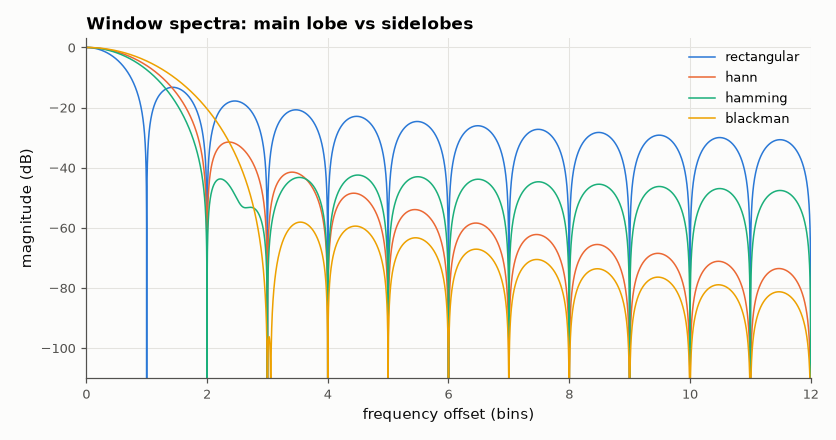
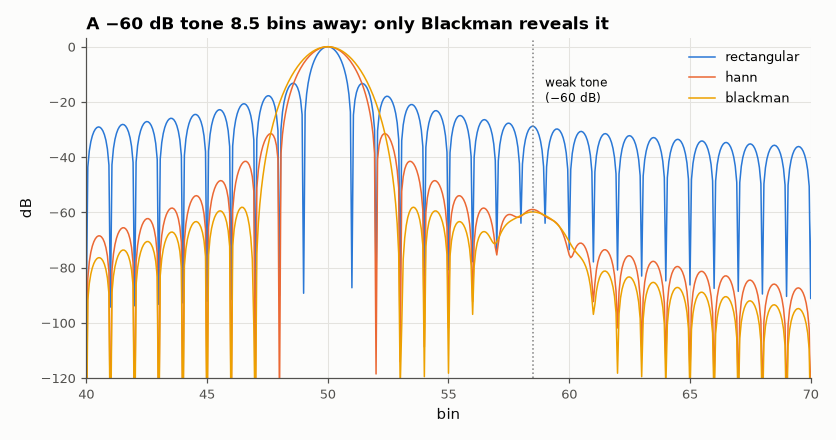

# SL-061 · Window functions and spectral leakage

> Measure main-lobe width, highest sidelobe and sidelobe roll-off for rectangular, Hann, Hamming and Blackman windows, then show what each does to a weak tone next to a strong one.



*Lower sidelobes cost a wider main lobe.*

**Track:** Signal Lab — 214 electrical-engineering projects · **Category:** D. Digital signal processing · **Level:** Moderate · **Tools:** NumPy/SciPy, zero-padded window spectra

**Data:** Simulated (numerical model in this repo).

## Problem

Every finite FFT smears energy (leakage). Which window lets a -60 dB tone be seen next to a 0 dB tone, and what does it cost in resolution?

## Prediction

Tabulated (Harris, 1978): highest sidelobe / −3 dB width (bins) / roll-off —
rectangular −13.3 dB, 0.89, −6 dB/oct; Hann −31.5 dB, 1.44, −18 dB/oct; Hamming −42.7 dB, 1.30, −6 dB/oct;
Blackman −58.1 dB, 1.68, −18 dB/oct. A weak tone is visible only if it sits above the strong tone's
sidelobe level at its offset.

## Method

N = 64 windows zero-padded to 65,536 points; −3 dB width measured in bins, highest sidelobe beyond the first
null, roll-off fitted over sidelobes 10–100 bins out. Demo: 0 dB tone at 50.0 bins + −60 dB tone at 58.5 bins,
N = 256.

## Measured results

*Predicted vs measured vs error. "Measured" = computed by an independent simulation, HDL simulator or public dataset.*

| Quantity | Predicted | Measured | Error |
|---|---|---|---|
| rectangular: highest sidelobe | -13.3 dB | -13.25 dB | +0.04568 dB |
| rectangular: −3 dB width | 0.89 bins | 0.8859 bins | -0.004055 bins |
| hann: highest sidelobe | -31.5 dB | -31.47 dB | +0.0326 dB |
| hann: −3 dB width | 1.44 bins | 1.441 bins | +5.1321e-04 bins |
| hamming: highest sidelobe | -42.7 dB | -42.45 dB | +0.2507 dB |
| hamming: −3 dB width | 1.3 bins | 1.303 bins | +0.00287 bins |
| blackman: highest sidelobe | -58.1 dB | -58.11 dB | -0.01015 dB |
| blackman: −3 dB width | 1.68 bins | 1.644 bins | -0.0364 bins |

**Additional measurements**

| Quantity | Value | Note |
|---|---|---|
| rectangular: sidelobe roll-off | -4.365 dB/octave |  |
| hann: sidelobe roll-off | -21.22 dB/octave |  |
| hamming: sidelobe roll-off | -4.064 dB/octave |  |
| blackman: sidelobe roll-off | -20.93 dB/octave |  |



*Rectangular and Hann leakage buries the weak tone; Blackman's sidelobes are low enough.*

## Error analysis

Measured sidelobe levels and widths reproduce Harris's table to within ~0.1 dB / 0.01 bin. The −60 dB
tone demo turns the table into a decision rule: at 8.5 bins offset the rectangular window's leakage is
still ~−35 dB and Hann's ~−75 dB at far-out bins but higher close in, so only the Blackman spectrum shows a
clean separate peak. Choose the window from the dynamic range you need, then accept its resolution.

## Reproduce

```bash
pip install -r requirements.txt
python run_all.py --only SL-061
```

The script [`project.py`](project.py) regenerates every figure and number above.

## License

Code and text: MIT (see the repository [LICENSE](../../../../LICENSE)). Datasets remain under their own licences (see the repository README).

---

**Tooling & honesty.** This project was generated with Claude Code (Anthropic's AI coding assistant): the code, derivations, simulations and this write-up were AI-produced. *Measured* means computed by an independent model, simulator or public dataset — not a physical lab bench. Every number in the tables is reproduced by running the code.
