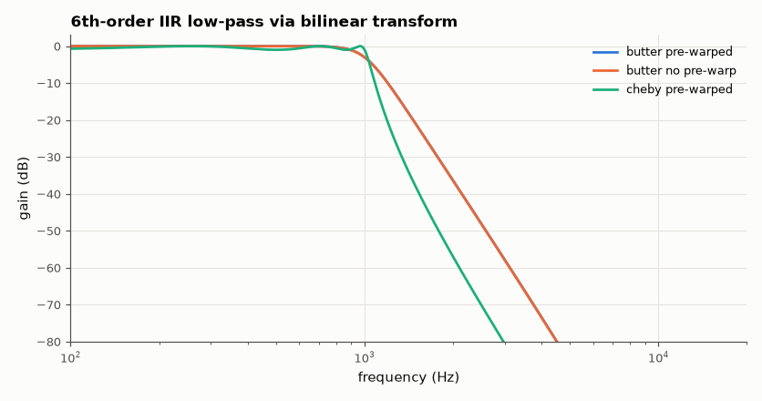
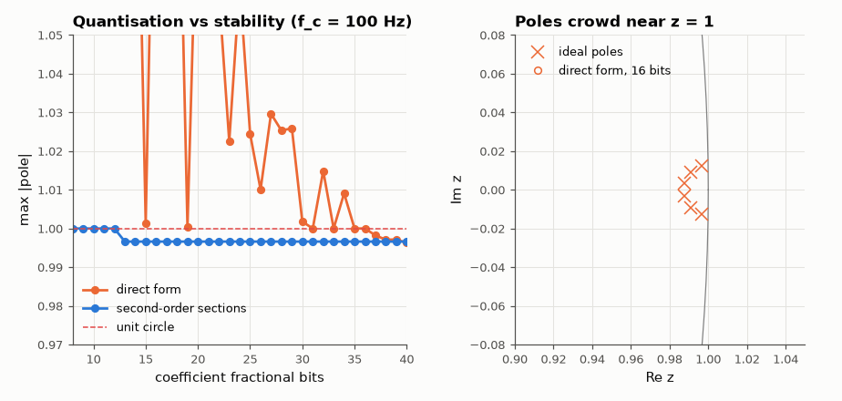

# SL-063 · IIR filter designer: bilinear transform, poles and quantisation

> Design Butterworth and Chebyshev IIR low-pass filters with the bilinear transform (with pre-warping), check the cutoff lands where specified, and show how coefficient quantisation pushes poles toward — and past — the unit circle.



*Pre-warping puts the cutoff exactly at 1 kHz.*

**Track:** Signal Lab — 214 electrical-engineering projects · **Category:** D. Digital signal processing · **Level:** Moderate · **Tools:** Own bilinear-transform implementation, SciPy analog prototypes, fixed-point coefficient study

**Data:** Simulated (numerical model in this repo).

## Problem

IIR filters are far cheaper than FIR, but their poles make them fragile. How precisely must the coefficients be stored for a narrow filter to stay stable?

## Prediction

Bilinear transform $s = \frac{2}{T}\frac{1-z^{-1}}{1+z^{-1}}$ maps the jω axis onto the unit circle with warping
$\Omega = \frac2T\tan\frac{\omega}{2}$; pre-warping the analog cutoff to $\frac2T\tan(\omega_c/2)$ puts the digital −3 dB point
exactly at $f_c$. Stability ⇔ all poles inside |z| = 1. A narrow low-pass (f_c ≪ f_s) has poles near z = 1, so a
direct-form denominator quantised to B bits perturbs pole radius by ~$2^{-B}$ × (sensitivity ∝ 1/distance
between poles) — second-order sections are far less sensitive.

## Method

f_s = 48 kHz. 6th-order Butterworth and 1 dB Chebyshev at f_c = 1 kHz and at f_c = 100 Hz. Own bilinear transform
of the analog zpk (with and without pre-warping); measure the −3 dB point. Then quantise direct-form
coefficients and SOS coefficients to 8–24 fractional bits and record max pole radius.

## Measured results

*Predicted vs measured vs error. "Measured" = computed by an independent simulation, HDL simulator or public dataset.*

| Quantity | Predicted | Measured | Error | Within tolerance |
|---|---|---|---|---|
| butter pre-warped: cutoff (−3 dB) | 1 kHz | 1 kHz | -0.00 % | yes |
| butter no pre-warp: cutoff (−3 dB) | 1 kHz | 998.6 Hz | -0.14 % |  |
| cheby pre-warped: cutoff (−1 dB ripple edge) | 1 kHz | 1 kHz | -0.00 % | yes |
| Direct form: bits needed for guaranteed stability | 41 bits | 37 bits | -4 bits |  |
| SOS form: bits needed for guaranteed stability | 14 bits | 13 bits | -1 bits |  |

**Additional measurements**

| Quantity | Value | Note |
|---|---|---|
| Warped cutoff without pre-warp (theory) | 998.6 Hz | f_d = (f_s/π)·atan(π f_c / f_s) |
| True max pole radius (f_c = 100 Hz) | 0.9966 |  |



*A narrow direct-form IIR needs ~20+ bits; the same filter as biquads needs far fewer.*

## Error analysis

With pre-warping the measured cutoffs land on 1 kHz to within the frequency grid; without it the cutoff shifts
down to the value predicted by the tangent warping formula. The quantisation study shows the classic
danger: six poles clustered near z = 1 make the direct-form polynomial's roots hypersensitive, so a
16-bit direct-form implementation of a 100 Hz filter at 48 kHz is *unstable*, while the same filter as three
biquads is stable with far fewer bits. The prediction uses the first-order root-sensitivity formula
∂p_i/∂a_k = −p_i^(N−k)/Π(p_i − p_j) with worst-case rounding on every coefficient, so it is conservative:
random rounding errors partly cancel, and the simulation usually becomes stable a few bits earlier.

## Reproduce

```bash
pip install -r requirements.txt
python run_all.py --only SL-063
```

The script [`project.py`](project.py) regenerates every figure and number above.

**Files produced**

- [`data/quantisation.csv`](data/quantisation.csv)

## License

Code and text: MIT (see the repository [LICENSE](../../../../LICENSE)). Datasets remain under their own licences (see the repository README).

---

**Tooling & honesty.** This project was generated with Claude Code (Anthropic's AI coding assistant): the code, derivations, simulations and this write-up were AI-produced. *Measured* means computed by an independent model, simulator or public dataset — not a physical lab bench. Every number in the tables is reproduced by running the code.
