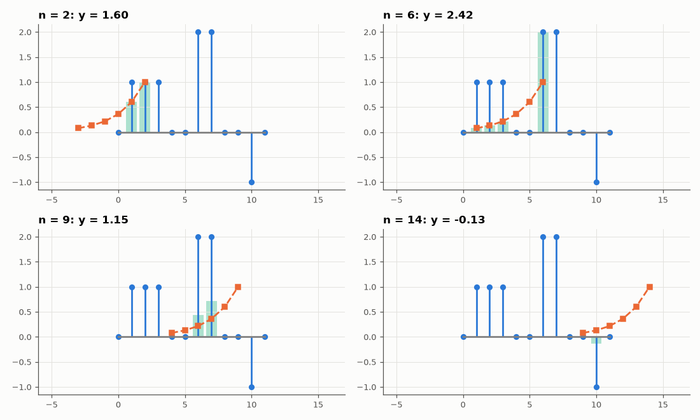
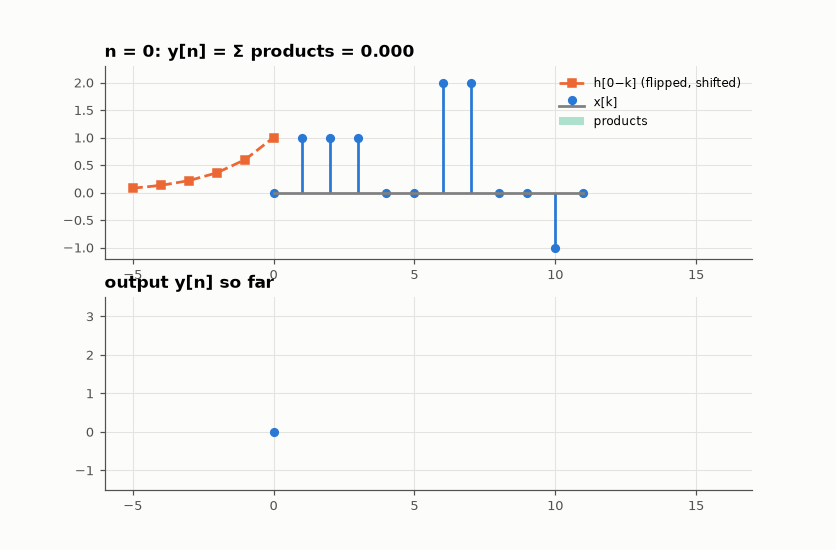

# SL-064 · Convolution visualiser

> Animate the flip-slide-multiply-sum picture of discrete convolution, verify it equals numpy.convolve and FFT multiplication, and export the animation.



*Flip h, slide it to n, multiply the overlap and sum — four snapshots.*

**Track:** Signal Lab — 214 electrical-engineering projects · **Category:** D. Digital signal processing · **Level:** Easy · **Tools:** NumPy, Matplotlib frame sequence + animated GIF

**Data:** Simulated (numerical model in this repo).

## Problem

Convolution is the operation behind every filter, yet its formula hides a simple picture. Make the picture and prove it computes the same thing.

## Prediction

$y[n]=\sum_k x[k]\,h[n-k]$: flip h, slide it to offset n, multiply overlapping samples, sum. Output length
$N_x+N_h-1$. Convolution theorem: $Y = X\cdot H$ with FFTs of length ≥ $N_x+N_h-1$ (otherwise circular wraparound).

## Method

x = a 12-sample pulse train, h = a 6-tap decaying exponential. Frame-by-frame sliding computation
(explicit Python loop), numpy.convolve, and zero-padded FFT product; max differences reported. 18 frames
exported as an animated GIF; four key frames shown as a figure.

## Measured results

*Predicted vs measured vs error. "Measured" = computed by an independent simulation, HDL simulator or public dataset.*

| Quantity | Predicted | Measured | Error |
|---|---|---|---|
| Output length | 17 | 17 | +0 |
| Sliding sum vs numpy.convolve (max |Δ|) | 0 | 4.4409e-16 | +4.4409e-16 |
| Sliding sum vs FFT product, zero-padded (max |Δ|) | 0 | 4.1797e-16 | +4.1797e-16 |
| Unpadded result = linear result + wrapped tail (max |Δ|) | 0 | 4.4409e-16 | +4.4409e-16 |

**Additional measurements**

| Quantity | Value | Note |
|---|---|---|
| FFT product WITHOUT padding: error vs true convolution | 0.216 | the tail wraps onto the start |

## Animation



## Error analysis

The three methods agree to machine precision, confirming the picture is the definition. Dropping the
zero-padding shows the classic FFT pitfall: an N-point FFT computes *circular* convolution, so the tail
of the output wraps around onto its start — which is exactly what overlap-add/overlap-save (AM-027) are
designed to avoid.

## Reproduce

```bash
pip install -r requirements.txt
python run_all.py --only SL-064
```

The script [`project.py`](project.py) regenerates every figure and number above.

**Files produced**

- [`figures/convolution.gif`](figures/convolution.gif) — animated flip-slide-sum
- [`data/convolution.csv`](data/convolution.csv)

## License

Code and text: MIT (see the repository [LICENSE](../../../../LICENSE)). Datasets remain under their own licences (see the repository README).

---

**Tooling & honesty.** This project was generated with Claude Code (Anthropic's AI coding assistant): the code, derivations, simulations and this write-up were AI-produced. *Measured* means computed by an independent model, simulator or public dataset — not a physical lab bench. Every number in the tables is reproduced by running the code.
