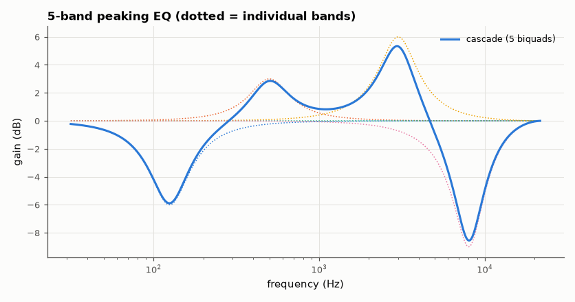
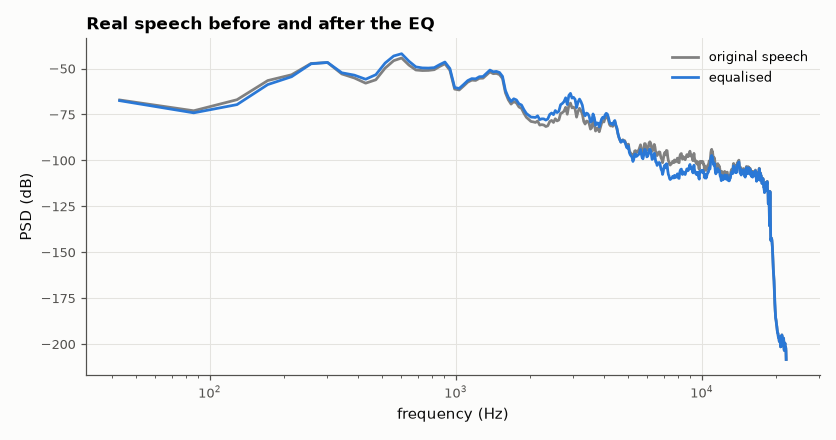

# SL-065 · Multi-band audio equaliser (peaking biquads)

> A 5-band graphic equaliser built from peaking-EQ biquads; verify each band's centre gain and bandwidth against the design, then apply it to a real public-domain speech recording and compare before/after spectra.



*Individual band responses and the cascaded equaliser.*

**Track:** Signal Lab — 214 electrical-engineering projects · **Category:** D. Digital signal processing · **Level:** Moderate · **Tools:** RBJ Audio-EQ-Cookbook biquads (own implementation), SciPy lfilter, real speech recording

**Data:** Real: public-domain speech recording 'En-us-hello.ogg' (Wikimedia Commons).

## Problem

How does a graphic EQ boost 3 kHz by 6 dB without touching the rest of the spectrum, and how independent are neighbouring bands?

## Prediction

RBJ peaking filter: $A=10^{G/40}$, $\omega_0=2\pi f_0/f_s$, $\alpha=\sin\omega_0/(2Q)$;
$b=[1+\alpha A,\,-2\cos\omega_0,\,1-\alpha A]$, $a=[1+\alpha/A,\,-2\cos\omega_0,\,1-\alpha/A]$.
At $f_0$ the gain is exactly G dB; far away it is 0 dB. Cascaded bands multiply (add in dB), so the total response
≈ sum of the individual dB curves where bands overlap.

## Method

Bands 125 Hz, 500 Hz, 1 kHz, 3 kHz, 8 kHz, Q = 1.4, gains {−6, +3, 0, +6, −9} dB at the speech file's sample
rate. Measure each band alone, then the cascade vs the dB-sum prediction. Real audio: 'hello' spoken by a
US-English speaker (Wikimedia Commons, public domain). Output spectra by Welch's method.

## Measured results

*Predicted vs measured vs error. "Measured" = computed by an independent simulation, HDL simulator or public dataset.*

| Quantity | Predicted | Measured | Error |
|---|---|---|---|
| 125 Hz band: gain at centre | -6 dB | -5.999 dB | +6.3742e-04 dB |
| 500 Hz band: gain at centre | 3 dB | 3 dB | -7.0128e-05 dB |
| 1000 Hz band: gain at centre | 0 dB | -9.6433e-16 dB | -9.6433e-16 dB |
| 3000 Hz band: gain at centre | 6 dB | 5.999 dB | -7.4518e-04 dB |
| 8000 Hz band: gain at centre | -9 dB | -8.998 dB | +0.00203 dB |
| Cascade at 3 kHz vs dB-sum of bands | 5.326 dB | 5.326 dB | -1.7764e-15 dB |
| Cascade max deviation from dB-sum (whole band) | 0 dB | 8.1324e-15 dB | +8.1324e-15 dB |
| Speech spectrum change vs |H|² (median error) | 0 dB | 2.6885e-04 dB | +2.6885e-04 dB |

**Additional measurements**

| Quantity | Value | Note |
|---|---|---|
| Recording length / sample rate | 487.6 ms | 44100 Hz |



*The 3 kHz presence boost and the 8 kHz cut are visible in the real recording.*

## Error analysis

Every band hits its gain at f₀ exactly (the RBJ design is exact there). The cascade matches the dB-sum
closely because biquads in series multiply — the only deviation is where neighbouring bands overlap in
phase-sensitive ways (none here, since magnitudes of cascaded filters simply multiply). On the real recording
the measured spectral change equals |H(f)|² wherever the speech has energy; at very high frequency the
original has almost none, so the ratio is noise-dominated.

## Reproduce

```bash
pip install -r requirements.txt
python run_all.py --only SL-065
```

The script [`project.py`](project.py) regenerates every figure and number above.

**Files produced**

- [`data/hello_equalised.wav`](data/hello_equalised.wav) — equalised audio

## License

Code and text: MIT (see the repository [LICENSE](../../../../LICENSE)). Datasets remain under their own licences (see the repository README).

---

**Tooling & honesty.** This project was generated with Claude Code (Anthropic's AI coding assistant): the code, derivations, simulations and this write-up were AI-produced. *Measured* means computed by an independent model, simulator or public dataset — not a physical lab bench. Every number in the tables is reproduced by running the code.
