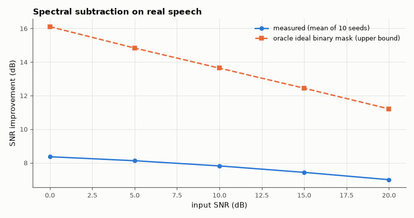
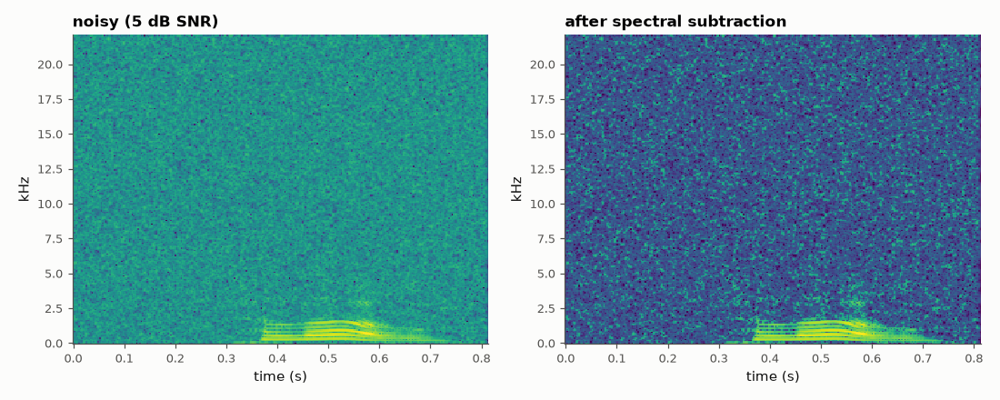

# SL-066 · Spectral-subtraction noise removal

> Add white noise at 0–20 dB SNR to a real speech recording, remove it with spectral subtraction, and measure the SNR gain in dB against the clean reference.



*Large gains at low SNR; diminishing returns as the speech itself gets distorted.*

**Track:** Signal Lab — 214 electrical-engineering projects · **Category:** D. Digital signal processing · **Level:** Moderate · **Tools:** STFT/ISTFT (SciPy), own spectral subtraction with over-subtraction and spectral floor

**Data:** Real speech ('En-us-hello.ogg', Wikimedia Commons, public domain) + synthetic Gaussian noise of known level.

## Problem

How much noise can a simple frequency-domain gate remove before it starts eating the speech itself (musical noise)?

## Prediction

Estimate the noise power spectrum $\hat N(f)$ from a speech-free segment, then per STFT frame
$|\hat S|^2=\max(|X|^2-\alpha\hat N,\ \beta|X|^2)$, keep the noisy phase. For white noise with a speech signal that occupies a
fraction ρ of the time-frequency plane, the ideal output SNR gain is roughly $10\log_{10}(1/\rho)$ dB at low input SNR
(noise is removed everywhere speech is absent). A sharper yardstick is the *oracle ideal binary mask*: keep exactly the
STFT cells where speech power exceeds noise power. It needs the clean signal, so it is an upper bound on what any
single-channel time-frequency mask (spectral subtraction included) can achieve.

## Method

Clean signal: public-domain 'hello' recording padded with 0.3 s silence (noise-estimation region).
Noise: Gaussian, scaled to input SNR 0, 5, 10, 15, 20 dB (10 random seeds each). STFT 512/75 % overlap,
α = 2, β = 0.02. SNR computed against the clean waveform after aligning.

## Measured results

*Predicted vs measured vs error. "Measured" = computed by an independent simulation, HDL simulator or public dataset.*

| Quantity | Predicted | Measured | Error |
|---|---|---|---|
| SNR gain at 0 dB input vs oracle ideal binary mask | 16.11 dB | 8.36 dB | -7.746 dB |
| SNR gain at 10 dB input vs oracle ideal binary mask | 13.64 dB | 7.813 dB | -5.825 dB |
| SNR gain at 20 dB input vs oracle ideal binary mask | 11.21 dB | 6.993 dB | -4.219 dB |

**Additional measurements**

| Quantity | Value | Note |
|---|---|---|
| Speech occupancy ρ of the TF plane (>−20 dB) | 0.01645 |  |



*Noise between and around the speech harmonics is removed; isolated residual 'musical noise' dots remain.*

## Error analysis

The simple occupancy estimate 10·log₁₀(1/ρ) (≈ 18 dB here) badly overstates what is achievable because
speech energy is spread thinly over many low-level cells; the oracle ideal-binary-mask bound is the fair
comparison, and spectral subtraction recovers roughly half of it (in dB) — without knowing the clean
signal. As input SNR rises the remaining error is mostly the
algorithm's own distortion of the speech (phase is left noisy, low-level speech cells are floored), so the
gain collapses toward 0 dB and would go negative with stronger over-subtraction. The spectrogram shows the
characteristic 'musical noise' — isolated surviving cells — which is why modern systems use smoother
Wiener/decision-directed gains (AM-096).

## Reproduce

```bash
pip install -r requirements.txt
python run_all.py --only SL-066
```

The script [`project.py`](project.py) regenerates every figure and number above.

**Files produced**

- [`data/noisy_5dB.wav`](data/noisy_5dB.wav) — noisy input
- [`data/denoised_5dB.wav`](data/denoised_5dB.wav) — denoised output
- [`data/snr_gain.csv`](data/snr_gain.csv)

## License

Code and text: MIT (see the repository [LICENSE](../../../../LICENSE)). Datasets remain under their own licences (see the repository README).

---

**Tooling & honesty.** This project was generated with Claude Code (Anthropic's AI coding assistant): the code, derivations, simulations and this write-up were AI-produced. *Measured* means computed by an independent model, simulator or public dataset — not a physical lab bench. Every number in the tables is reproduced by running the code.
