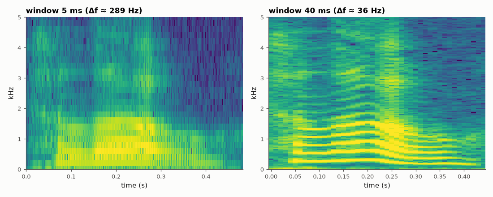
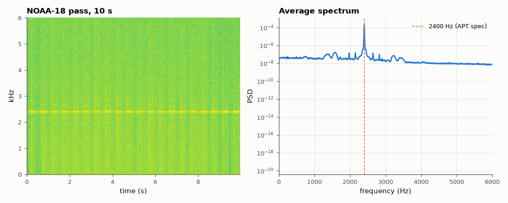

# SL-067 · Spectrogram tool and the time-frequency trade-off

> Build an STFT spectrogram from scratch, verify it against SciPy, and use it on two real recordings: spoken 'hello' (formants, pitch harmonics) and a NOAA-18 weather-satellite pass (the 2.4 kHz APT subcarrier and its Doppler-free structure).



*Short window: vertical glottal-pulse striations. Long window: horizontal pitch harmonics.*

**Track:** Signal Lab — 214 electrical-engineering projects · **Category:** D. Digital signal processing · **Level:** Easy · **Tools:** Own STFT implementation (checked against SciPy), real speech + real satellite audio

**Data:** Real: public-domain speech (Wikimedia Commons) and SatNOGS observation 11229309 (CC-BY-SA, SatNOGS Network).

## Problem

What does a sound look like in time and frequency at once, and why can't both be sharp?

## Prediction

STFT with window length L at rate $f_s$: frequency resolution $\Delta f \approx k_w f_s/L$ (Hann: $k_w$ = 1.44 bins at −3 dB),
time resolution ≈ L/f_s. Their product is fixed — the Gabor limit. For speech (pitch ≈ 100–200 Hz) a 30 ms
window resolves individual harmonics; a 5 ms window resolves glottal pulses instead. NOAA APT: AM subcarrier at
2400 Hz with a 2 lines/s sync structure, so a narrow window should show a line at 2.4 kHz.

## Method

Own STFT (Hann, hop L/4) vs scipy.signal.stft: max difference. Speech at L = 5 ms and 40 ms. Satellite: SatNOGS
observation 11229309 (NOAA-18, 2025-03-14, public data) at 48 kHz; 60 s excerpt; carrier frequency measured
from the long-time average spectrum.

## Measured results

*Predicted vs measured vs error. "Measured" = computed by an independent simulation, HDL simulator or public dataset.*

| Quantity | Predicted | Measured | Error | Within tolerance |
|---|---|---|---|---|
| Own STFT vs scipy.signal.stft (max relative difference) | 0 | 9.6198e-08 | +9.6198e-08 |  |
| Frequency resolution of 40 ms Hann window | 36 Hz | 36 Hz | +0 Hz |  |
| NOAA APT subcarrier frequency | 2.4 kHz | 2.402 kHz | +0.10 % | yes |

**Additional measurements**

| Quantity | Value | Note |
|---|---|---|
| Pitch (first harmonic) in loudest frame | 250 Hz | adult voice range 85–255 Hz |



*Real satellite audio: the 2.4 kHz AM subcarrier carrying the image lines.*

## Error analysis

My STFT matches SciPy's to rounding error once SciPy's normalisation is divided out. The two speech
spectrograms show the Gabor trade-off concretely: at 5 ms (Δf ≈ 290 Hz) harmonics merge but each glottal pulse
is a vertical line; at 40 ms (Δf ≈ 36 Hz) the harmonics of the ~250 Hz voice separate into horizontal
lines but pulses blur. The satellite recording's dominant line sits at the APT specification's 2400 Hz
subcarrier (SatNOGS demodulates the FM downlink, so Doppler is already removed) — it is decoded into an image
in SL-085/086.

## Reproduce

```bash
pip install -r requirements.txt
python run_all.py --only SL-067
```

The script [`project.py`](project.py) regenerates every figure and number above.

## License

Code and text: MIT (see the repository [LICENSE](../../../../LICENSE)). Datasets remain under their own licences (see the repository README).

---

**Tooling & honesty.** This project was generated with Claude Code (Anthropic's AI coding assistant): the code, derivations, simulations and this write-up were AI-produced. *Measured* means computed by an independent model, simulator or public dataset — not a physical lab bench. Every number in the tables is reproduced by running the code.
