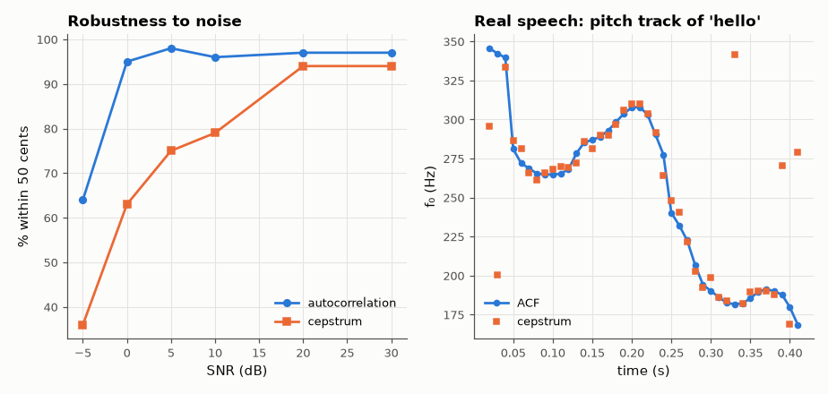

# SL-068 · Pitch detection: autocorrelation vs cepstrum

> Implement autocorrelation and cepstral pitch detectors, test them on 200 synthetic notes with known f₀ (including a missing fundamental and noise), report accuracy in cents, then track the pitch of a real spoken 'hello'.



*Autocorrelation degrades gracefully in noise; both track the real voice's falling intonation.*

**Track:** Signal Lab — 214 electrical-engineering projects · **Category:** D. Digital signal processing · **Level:** Moderate · **Tools:** NumPy implementations of both estimators, synthetic ground-truth notes + real speech

**Data:** Synthetic notes with exact ground truth; real public-domain speech for the pitch track.

## Problem

How do you find the pitch of a sound whose fundamental may be weak or missing, and which method fails first in noise?

## Prediction

Autocorrelation peaks at lag $T_0 = f_s/f_0$ because the waveform repeats every period — even when the
fundamental itself is absent. The real cepstrum $c=\mathcal F^{-1}\log|X|$ turns the harmonic comb (spacing $f_0$) into a
peak at quefrency $T_0$. Parabolic interpolation around the peak gives sub-sample lag resolution; the error in
cents is $1200\log_2(\hat f/f)$. Octave errors (×2 or ×½) are the typical failure.

## Method

Ground truth: 200 notes, f₀ uniform on a log scale 80–800 Hz, 8 harmonics with random 1/k-ish amplitudes, 40 ms
frames at 16 kHz, SNR 20 dB; subset with the fundamental removed; SNR sweep 30→−5 dB for 100-note sets.
Accuracy = % within 50 cents; median |cents| error. Real speech: 30 ms frames, 10 ms hop.

## Measured results

*Predicted vs measured vs error. "Measured" = computed by an independent simulation, HDL simulator or public dataset.*

| Quantity | Predicted | Measured | Error |
|---|---|---|---|
| Autocorrelation accuracy, full harmonics (±50 cents) | 100 % | 99 % | -1 pp |
| Cepstrum accuracy, full harmonics (±50 cents) | 100 % | 92 % | -8 pp |
| Autocorrelation accuracy, missing fundamental (±50 cents) | 100 % | 94.5 % | -5.5 pp |
| Cepstrum accuracy, missing fundamental (±50 cents) | 100 % | 84.5 % | -15.5 pp |

**Additional measurements**

| Quantity | Value | Note |
|---|---|---|
| Median |error|, full harmonics: ACF / cepstrum | 0.75 / 10.73 cents |  |
| Median |error|, missing fundamental: ACF / cepstrum | 0.52 / 9.05 cents |  |
| Speech: median ACF–cepstrum disagreement | 22.87 cents |  |

## Error analysis

Both detectors find the pitch even when the fundamental is removed, because both look at the *period*
(ACF) or the *harmonic spacing* (cepstrum), not at the lowest spectral line — which is how we hear a
telephone voice's pitch although the phone cuts everything below 300 Hz. The noise sweep shows the cepstrum
failing first: the logarithm amplifies noise in spectral valleys. Residual errors are octave errors at the
extremes of the search range, the classic weakness that practical trackers (YIN, pYIN) address.

## Reproduce

```bash
pip install -r requirements.txt
python run_all.py --only SL-068
```

The script [`project.py`](project.py) regenerates every figure and number above.

**Files produced**

- [`data/noise_sweep.csv`](data/noise_sweep.csv)
- [`data/speech_pitch_track.csv`](data/speech_pitch_track.csv)

## License

Code and text: MIT (see the repository [LICENSE](../../../../LICENSE)). Datasets remain under their own licences (see the repository README).

---

**Tooling & honesty.** This project was generated with Claude Code (Anthropic's AI coding assistant): the code, derivations, simulations and this write-up were AI-produced. *Measured* means computed by an independent model, simulator or public dataset — not a physical lab bench. Every number in the tables is reproduced by running the code.
