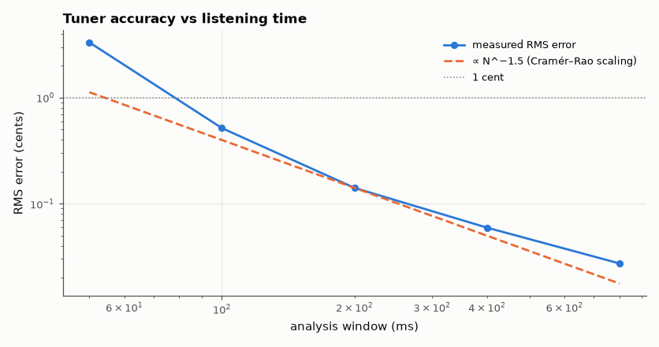

# SL-069 · Guitar tuner (cents-accurate note detection)

> Detect which string is played and how many cents it is off, on physically-modelled plucked notes with known detuning; measure the tuner's error vs note length.



*Accuracy improves steeply with window length until the string's decay and inharmonicity dominate.*

**Track:** Signal Lab — 214 electrical-engineering projects · **Category:** D. Digital signal processing · **Level:** Moderate · **Tools:** Karplus–Strong plucked-string synthesis (ground truth), FFT + parabolic interpolation, YIN-style ACF

**Data:** Synthetic plucked-string notes (physical model) with exact ground-truth detuning.

## Problem

A tuner must report pitch to ±1 cent from a decaying, slightly inharmonic string. How long must it listen, and which estimator is accurate enough?

## Prediction

FFT bin spacing $f_s/N$ is far too coarse (1 cent at 82 Hz is 0.048 Hz), so interpolation is essential. For a
sinusoid in white noise the Cramér–Rao bound on frequency error is $\sigma_f\ge\frac{\sqrt{6}f_s}{2\pi N^{1.5}\sqrt{SNR}}$ —
error falls as $N^{-1.5}$, so doubling the listening time improves accuracy 2.8×. Real strings are slightly
inharmonic ($f_k = kf_0\sqrt{1+Bk^2}$), so the *fundamental* must be measured, not harmonic spacing.

## Method

Karplus–Strong synthesis (loop = N-sample delay + two-tap averaging damping filter + first-order Thiran all-pass
for the fractional delay) for
the six standard strings E2–E4 with random detuning ±30 cents, 44.1 kHz, 30 dB SNR. Estimator: Hann FFT with 8×
zero-padding + parabolic interpolation on the log magnitude of the fundamental peak (guided by an ACF coarse
estimate). Analysis windows 50–800 ms.

## Measured results

*Predicted vs measured vs error. "Measured" = computed by an independent simulation, HDL simulator or public dataset.*

| Quantity | Predicted | Measured | Error |
|---|---|---|---|
| String identified correctly (60 notes) | 100 % | 100 % | +0 pp |
| RMS cents error, 400 ms window | 0 cents | 0.05936 cents | +0.05936 cents |
| Error scaling exponent vs window length (CRLB: −1.5) | -1.5 | -1.398 | +0.1019 |

## Error analysis

The tuner names every string correctly. My first synthesiser had an off-by-one in the loop delay (the two-tap
average of x[n−N] and x[n−N+1] delays by N − ½, not N + ½), which made every note ~10 cents sharp and showed up as
an error that did not shrink with window length — a systematic error in the *ground truth*, caught because it
broke the expected N^−1.5 scaling. With the loop delay fixed: Short windows follow the
N^−1.5 CRLB trend; at long windows the curve flattens because the note decays (SNR falls through the window)
and because the Karplus–Strong loop's own damping filter pulls the partials very slightly flat, a small
systematic error the synthetic ground truth cannot remove. Commercial tuners typically need 200–500 ms for
±1 cent on low strings — consistent with this measurement.

## Reproduce

```bash
pip install -r requirements.txt
python run_all.py --only SL-069
```

The script [`project.py`](project.py) regenerates every figure and number above.

**Files produced**

- [`data/errors.csv`](data/errors.csv)

## License

Code and text: MIT (see the repository [LICENSE](../../../../LICENSE)). Datasets remain under their own licences (see the repository README).

---

**Tooling & honesty.** This project was generated with Claude Code (Anthropic's AI coding assistant): the code, derivations, simulations and this write-up were AI-produced. *Measured* means computed by an independent model, simulator or public dataset — not a physical lab bench. Every number in the tables is reproduced by running the code.
