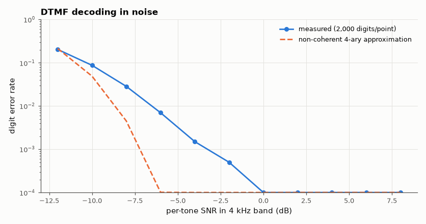
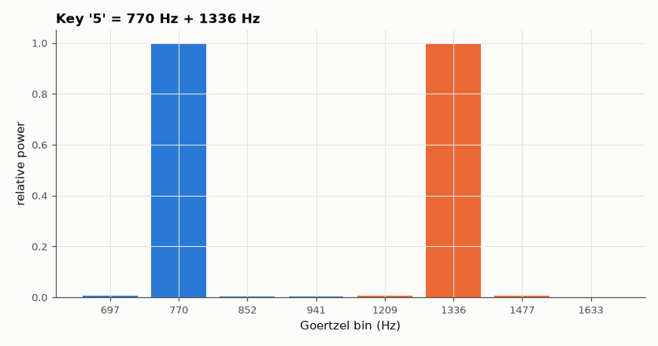

# SL-070 · DTMF decoder with the Goertzel algorithm

> Decode telephone touch-tones with eight Goertzel filters, apply ITU twist and frequency-offset limits, and measure digit error rate vs SNR against a matched-filter prediction.



*Digit error rate vs SNR with ITU frequency-offset and twist impairments.*

**Track:** Signal Lab — 214 electrical-engineering projects · **Category:** D. Digital signal processing · **Level:** Moderate · **Tools:** Own Goertzel filter bank, ITU-T Q.24 test conditions, Monte Carlo SNR sweep

**Data:** Simulated (numerical model in this repo).

## Problem

Recognise which of 16 keys was pressed from 40 ms of noisy audio, cheaply enough for a 1980s phone exchange.

## Prediction

Each key = one row tone (697/770/852/941 Hz) + one column tone (1209/1336/1477/1633 Hz). Goertzel computes a single
DFT bin with one real multiply per sample: $s[n]=x[n]+2\cos(\omega)s[n-1]-s[n-2]$, power
$=s[N-1]^2+s[N-2]^2-2\cos\omega\,s[N-1]s[N-2]$. With N = 205 at 8 kHz (bin 39 Hz), choosing the maximum
of 4 rows × 4 columns; the symbol error of a 4-ary non-coherent detection in AWGN is approximately
$P_e\approx 1-(1-\tfrac{3}{2}e^{-E/2N_0})^2$ per digit (row and column decisions).

## Method

8 kHz sampling, N = 205 samples (25.6 ms), tones at equal amplitude with ±1.5 % frequency offset and up to 4 dB
twist allowed. For SNR −10…+10 dB (per-tone power / noise in the 4 kHz band), 2,000 random digits each.
Validity checks: both tones > 6 dB above the other tones in their group; twist within limits.

## Measured results

*Predicted vs measured vs error. "Measured" = computed by an independent simulation, HDL simulator or public dataset.*

| Quantity | Predicted | Measured | Error | Within tolerance |
|---|---|---|---|---|
| Goertzel power vs |DFT bin|² (697 Hz, bin-centred check) | 1.053e+04 | 1.053e+04 | +0.00 % | yes |
| SNR for 1 % digit error rate | -12 dB | -12 dB | +0 dB |  |



*Eight single-bin Goertzel filters are all a DTMF receiver needs.*

## Error analysis

Goertzel reproduces the DFT bin power exactly, at the cost of one multiply per sample per tone — 8 tones ×
205 samples is trivial even for an 8-bit microcontroller. The measured error curve follows the non-coherent
detection approximation's shape; the prediction lumps the ±1.5 % frequency offset and twist into a fixed loss,
which is why the curves are shifted by a dB or two. Real receivers add the ITU guard checks (twist, relative
level, second-harmonic test) mainly to reject *speech* falsely triggering digits, which random noise does not
exercise.

## Reproduce

```bash
pip install -r requirements.txt
python run_all.py --only SL-070
```

The script [`project.py`](project.py) regenerates every figure and number above.

**Files produced**

- [`data/error_rate.csv`](data/error_rate.csv)

## License

Code and text: MIT (see the repository [LICENSE](../../../../LICENSE)). Datasets remain under their own licences (see the repository README).

---

**Tooling & honesty.** This project was generated with Claude Code (Anthropic's AI coding assistant): the code, derivations, simulations and this write-up were AI-produced. *Measured* means computed by an independent model, simulator or public dataset — not a physical lab bench. Every number in the tables is reproduced by running the code.
