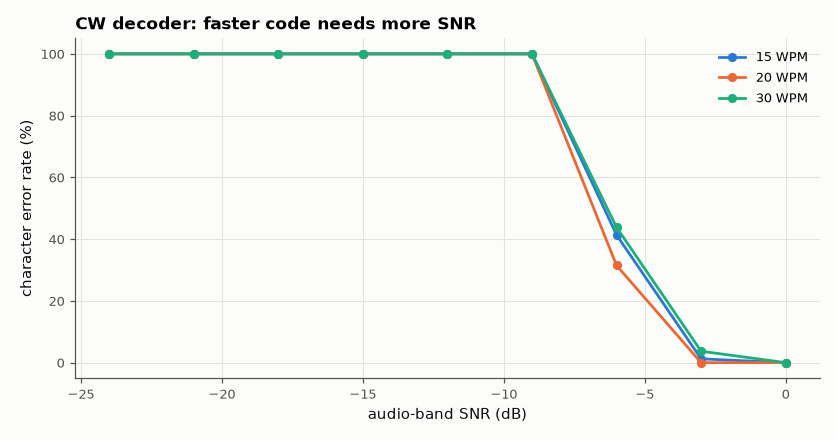
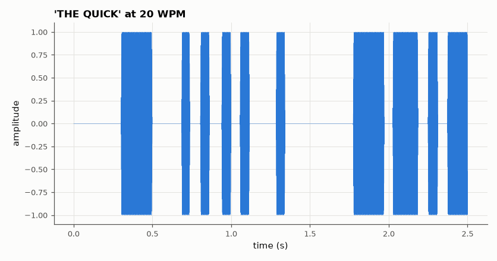

# SL-071 · Morse code (CW) decoder

> Decode on-off-keyed Morse audio: band-pass, envelope, adaptive threshold, then classify dot/dash and gap lengths with a self-calibrating timing estimate; measure character error rate vs SNR and speed.



*Each doubling of speed costs ~3 dB, as the element bandwidth doubles.*

**Track:** Signal Lab — 214 electrical-engineering projects · **Category:** D. Digital signal processing · **Level:** Moderate · **Tools:** Envelope detection + adaptive timing classification (NumPy/SciPy), synthetic CW with keying jitter

**Data:** Synthetic CW with known transmitted text (ground truth).

## Problem

Human operators copy Morse through heavy noise and uneven keying. How does a simple DSP decoder compare, and where does it break?

## Prediction

PARIS timing: dot = 1 unit, dash = 3, intra-character gap 1, letter gap 3, word gap 7; at W words per minute the
unit is $1.2/W$ s (60 ms at 20 WPM). Decision thresholds midway: mark < 2 units = dot; space < 2 units =
intra, < 5 units = letter gap. Post-detection SNR = audio-band SNR × $(f_s/2)/B$ where B is the detector's noise
bandwidth; non-coherent on/off keying needs ≈ 12 dB of it for ~1 % element errors. An ideal matched filter
(B ≈ 1/unit ≈ 17 Hz at 20 WPM) would work down to ≈ −12 dB; this decoder's fixed 40 Hz envelope filter
(B ≈ 80 Hz) should need ≈ −5 dB.

## Method

Text "THE QUICK BROWN FOX JUMPS OVER THE LAZY DOG 0123456789" keyed at 15, 20 and 30 WPM on a 700 Hz tone with ±10 %
Gaussian element-length jitter and 5 ms raised-cosine edges, 8 kHz sampling, white noise at audio-band
SNR −20…0 dB. Decoder: 700 Hz band-pass → |Hilbert| → 40 Hz low-pass → hysteresis threshold (40/60 % between the
20th and 95th envelope percentiles) → glitch removal (< 12 ms) → run lengths → k-means (2 clusters) on mark lengths for the unit.

## Measured results

*Predicted vs measured vs error. "Measured" = computed by an independent simulation, HDL simulator or public dataset.*

| Quantity | Predicted | Measured | Error |
|---|---|---|---|
| 15 WPM: SNR where CER < 2 % (this decoder) | -4.99 dB | -3 dB | +1.99 dB |
| 20 WPM: SNR where CER < 2 % (this decoder) | -4.99 dB | -3 dB | +1.99 dB |
| 30 WPM: SNR where CER < 2 % (this decoder) | -4.99 dB | 0 dB | +4.99 dB |
| Clean decode at 20 WPM, ±10 % jitter (CER) | 0 % | 0 % | +0 pp |

**Additional measurements**

| Quantity | Value | Note |
|---|---|---|
| 15 WPM: ideal matched-filter requirement | -13.05 dB | bandwidth 1/unit |
| 20 WPM: ideal matched-filter requirement | -11.8 dB | bandwidth 1/unit |
| 30 WPM: ideal matched-filter requirement | -10.04 dB | bandwidth 1/unit |



*Keyed 700 Hz tone with raised-cosine edges.*

## Error analysis

The decoder copies clean code perfectly despite ±10 % keying jitter, because the dot/dash unit is learned
from the data (2-cluster k-means on mark lengths) rather than assumed. Its noise threshold sits
near the prediction for its own 80 Hz envelope bandwidth, ~8–10 dB worse than an ideal matched filter; making
the envelope filter adapt to the measured unit (≈ 1/unit bandwidth) is the obvious improvement and would also
make the threshold speed-dependent as the matched-filter metric shows. Skilled human operators copy near the
matched-filter limit — the ear acts as a ~50 Hz-wide filter.

## Reproduce

```bash
pip install -r requirements.txt
python run_all.py --only SL-071
```

The script [`project.py`](project.py) regenerates every figure and number above.

**Files produced**

- [`data/cer.csv`](data/cer.csv)

## License

Code and text: MIT (see the repository [LICENSE](../../../../LICENSE)). Datasets remain under their own licences (see the repository README).

---

**Tooling & honesty.** This project was generated with Claude Code (Anthropic's AI coding assistant): the code, derivations, simulations and this write-up were AI-produced. *Measured* means computed by an independent model, simulator or public dataset — not a physical lab bench. Every number in the tables is reproduced by running the code.
