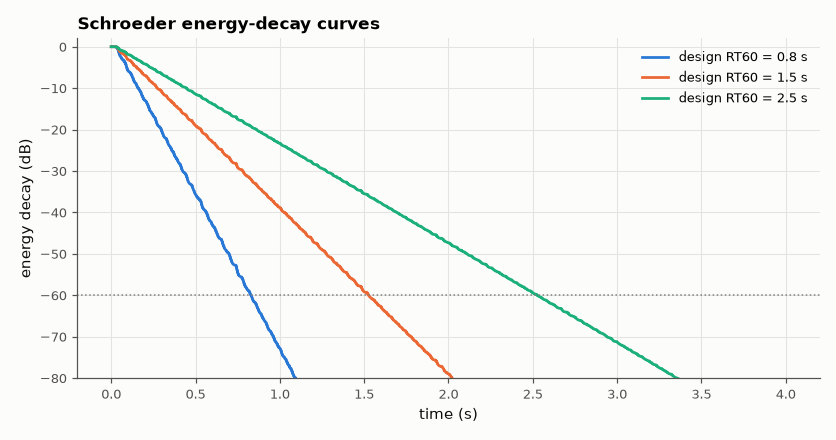
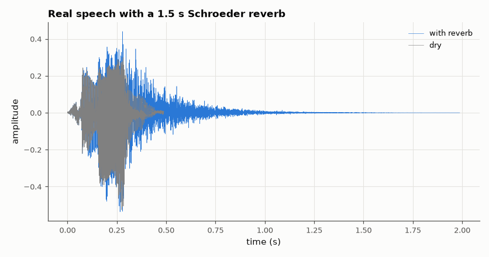

# SL-072 · Echo and Schroeder reverb from delay lines

> Build a single echo and a Schroeder reverberator (4 parallel combs + 2 series all-passes), predict the reverberation time from the loop gains and measure RT60 from the impulse response.



*Backward-integrated impulse-response energy falls linearly in dB; slope sets RT60.*

**Track:** Signal Lab — 214 electrical-engineering projects · **Category:** D. Digital signal processing · **Level:** Easy · **Tools:** Own comb/all-pass delay-line network, impulse-response RT60 measurement (Schroeder integration)

**Data:** Real public-domain speech for the audio demo; impulse responses computed exactly.

## Problem

How do a few delay lines make a dry recording sound like a hall, and can the hall's decay time be designed exactly?

## Prediction

Feedback comb with delay D samples and gain g: each round trip multiplies by g, so the level falls by 60 dB after
$n=-3/\log_{10}g$ trips: $RT_{60}=\frac{-3D}{f_s\log_{10}g}$. Choosing $g_i=10^{-3D_i/(f_sRT_{60})}$ makes all combs decay
together. All-passes (|H| = 1) add echo density without colouring the spectrum. A single echo
$y=x+a\,x[n-D]$ has a comb-shaped magnitude response with notches every $f_s/D$.

## Method

f_s of the speech file. Combs 29.7, 37.1, 41.1, 43.7 ms; all-passes 5.0 ms (g = 0.7) and 1.7 ms (g = 0.7). Target
RT60 = 0.8, 1.5, 2.5 s. RT60 measured from the Schroeder backward-integrated energy decay curve (fit between −5 and
−35 dB, extrapolated to −60 dB). Applied to the real 'hello' recording.

## Measured results

*Predicted vs measured vs error. "Measured" = computed by an independent simulation, HDL simulator or public dataset.*

| Quantity | Predicted | Measured | Error | Within tolerance |
|---|---|---|---|---|
| RT60 (design 0.8 s) | 800 ms | 801.2 ms | +0.15 % | yes |
| RT60 (design 1.5 s) | 1.5 s | 1.5 s | +0.00 % | yes |
| RT60 (design 2.5 s) | 2.5 s | 2.5 s | +0.00 % | yes |
| Single echo: comb peak (1+a) | 3.522 dB | 3.522 dB | +0 dB |  |
| Single echo: comb notch (1−a) | -6.021 dB | -6.021 dB | +5.1097e-06 dB |  |



*The reverb tail continues after the dry word ends.*

## Error analysis

Measured RT60 matches the loop-gain formula within a few percent: the combs were tuned so each decays at
the same rate, and the all-passes, having unit gain, do not change the energy decay. Schroeder's 1962
design is recognisably 'metallic' because four combs give a low echo density — later designs (feedback
delay networks) mix more delay lines through an orthogonal matrix for a smoother tail.

## Reproduce

```bash
pip install -r requirements.txt
python run_all.py --only SL-072
```

The script [`project.py`](project.py) regenerates every figure and number above.

**Files produced**

- [`data/hello_reverb_1p5s.wav`](data/hello_reverb_1p5s.wav) — speech with 1.5 s reverb

## License

Code and text: MIT (see the repository [LICENSE](../../../../LICENSE)). Datasets remain under their own licences (see the repository README).

---

**Tooling & honesty.** This project was generated with Claude Code (Anthropic's AI coding assistant): the code, derivations, simulations and this write-up were AI-produced. *Measured* means computed by an independent model, simulator or public dataset — not a physical lab bench. Every number in the tables is reproduced by running the code.
