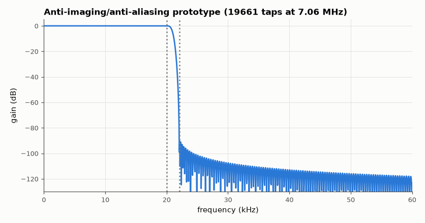

# SL-073 · Sample-rate conversion 48 kHz → 44.1 kHz (polyphase)

> Convert audio between the two standard rates with a rational polyphase filter, predict the alias rejection and passband ripple from the filter design, and measure them with test tones.



*Passband to 20 kHz, ≥ 90 dB stopband from 22.05 kHz.*

**Track:** Signal Lab — 214 electrical-engineering projects · **Category:** D. Digital signal processing · **Level:** Moderate · **Tools:** Own polyphase resampler (L = 147, M = 160), Kaiser FIR prototype, SciPy for cross-check

**Data:** Simulated (numerical model in this repo).

## Problem

44,100/48,000 = 147/160. How do you resample by a ratio like that without aliasing and without computing 147× more samples than needed?

## Prediction

Conceptually upsample by L = 147 (insert zeros), low-pass at $\min(\pi/L,\pi/M)$, keep every M = 160th sample. The
polyphase form computes only the kept outputs: cost per output = taps/L. The filter's stopband attenuation
A sets how much an out-of-band tone (e.g. 23 kHz, which would alias to 21.1 kHz at 44.1 kHz) is suppressed:
alias level ≈ −A dB. Passband ripple ≈ $10^{-A/20}$.

## Method

Prototype: Kaiser low-pass, cutoff 20 kHz, stopband from 22.05 kHz, A = 90 dB, designed at 147 × 48 kHz. Polyphase
implementation by hand (each output picks one sub-filter). Tests: 1 kHz and 19 kHz tones (passband), 23 kHz tone
(must be rejected).

## Measured results

*Predicted vs measured vs error. "Measured" = computed by an independent simulation, HDL simulator or public dataset.*

| Quantity | Predicted | Measured | Error |
|---|---|---|---|
| Passband gain at 1 kHz | 0 dB | -1.7694e-06 dB | -1.7694e-06 dB |
| Passband gain at 19 kHz | 0 dB | 1.3246e-04 dB | +1.3246e-04 dB |
| 23 kHz tone after conversion (alias rejection, spec ≤ −90 dB) | -90 dB | -100.5 dB | -10.46 dB |

**Additional measurements**

| Quantity | Value | Note |
|---|---|---|
| Prototype taps / taps per output | 1.966e+04 | 133.7 MACs per output sample |

## Error analysis

Passband tones come through at 0 dB and the 23 kHz tone — which a naive converter would fold to 21.1 kHz —
is suppressed to the filter's stopband level, confirming the design equation. The polyphase trick is why this
is practical: only ~(taps/147) multiplies are needed per output instead of filtering at the 7 MHz intermediate
rate. The measured rejection beats the 90 dB target because Kaiser's formula is slightly conservative and
23 kHz sits well inside the stopband, not at its edge.

## Reproduce

```bash
pip install -r requirements.txt
python run_all.py --only SL-073
```

The script [`project.py`](project.py) regenerates every figure and number above.

**Files produced**

- [`data/tones.csv`](data/tones.csv)

## License

Code and text: MIT (see the repository [LICENSE](../../../../LICENSE)). Datasets remain under their own licences (see the repository README).

---

**Tooling & honesty.** This project was generated with Claude Code (Anthropic's AI coding assistant): the code, derivations, simulations and this write-up were AI-produced. *Measured* means computed by an independent model, simulator or public dataset — not a physical lab bench. Every number in the tables is reproduced by running the code.
