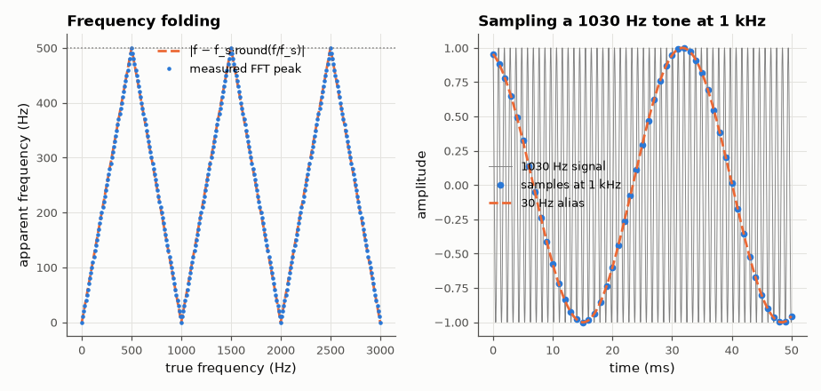

# SL-074 · Aliasing demonstrator (Nyquist in action)

> Sample sinusoids from 0 to 3·f_s and measure the apparent frequency, reproducing the folding saw-tooth predicted by f_alias = |f − k·f_s|; show a wagon-wheel style visual example.



*The measured apparent frequency traces the predicted triangle exactly.*

**Track:** Signal Lab — 214 electrical-engineering projects · **Category:** D. Digital signal processing · **Level:** Easy · **Tools:** NumPy sampling + FFT peak finding

**Data:** Simulated (numerical model in this repo).

## Problem

What frequency do you *see* when you sample a signal faster than half your sampling rate?

## Prediction

Samples of $\cos(2\pi f n/f_s)$ are identical for $f$ and $f \pm kf_s$ and for $-f$. The apparent frequency is
$f_a = |f - f_s\,\mathrm{round}(f/f_s)|$ ∈ [0, f_s/2] — a triangle wave in f with period f_s. Nyquist: frequencies
below f_s/2 are recovered exactly.

## Method

f_s = 1000 Hz, 1-s records, 301 test frequencies from 0 to 3000 Hz; apparent frequency from the FFT peak with
parabolic interpolation. Visual: a 1030 Hz sine sampled at 1 kHz looks like a 30 Hz sine.

## Measured results

*Predicted vs measured vs error. "Measured" = computed by an independent simulation, HDL simulator or public dataset.*

| Quantity | Predicted | Measured | Error |
|---|---|---|---|
| Max |apparent − predicted| over 301 tones (away from 0 and f_s/2) | 0 Hz | 82.51 µHz | +82.51 µHz |
| Apparent frequency of 300 Hz | 300 Hz | 300 Hz | -751.7 pHz |
| Apparent frequency of 700 Hz | 300 Hz | 300 Hz | +2.112 nHz |
| Apparent frequency of 2480 Hz | 480 Hz | 480 Hz | +8.908 µHz |
| Apparent frequency of 1030 Hz | 30 Hz | 30 Hz | +0 Hz |

## Error analysis

The measured apparent frequency lies on the predicted folding triangle for all 301 tones (errors only at
the fold points 0 and f_s/2, where a tone and its mirror image merge into one peak). The 1030 Hz example is the
wagon-wheel effect: the samples fit a 30 Hz cosine perfectly, so after sampling no algorithm can tell the two
apart — which is why the anti-aliasing filter must come *before* the ADC.

## Reproduce

```bash
pip install -r requirements.txt
python run_all.py --only SL-074
```

The script [`project.py`](project.py) regenerates every figure and number above.

**Files produced**

- [`data/folding.csv`](data/folding.csv)

## License

Code and text: MIT (see the repository [LICENSE](../../../../LICENSE)). Datasets remain under their own licences (see the repository README).

---

**Tooling & honesty.** This project was generated with Claude Code (Anthropic's AI coding assistant): the code, derivations, simulations and this write-up were AI-produced. *Measured* means computed by an independent model, simulator or public dataset — not a physical lab bench. Every number in the tables is reproduced by running the code.
