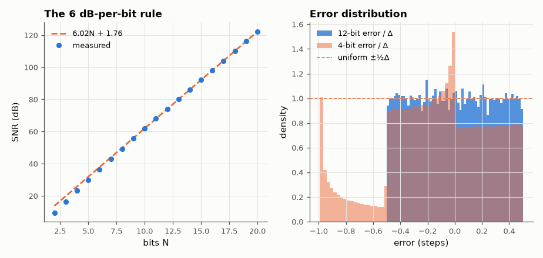
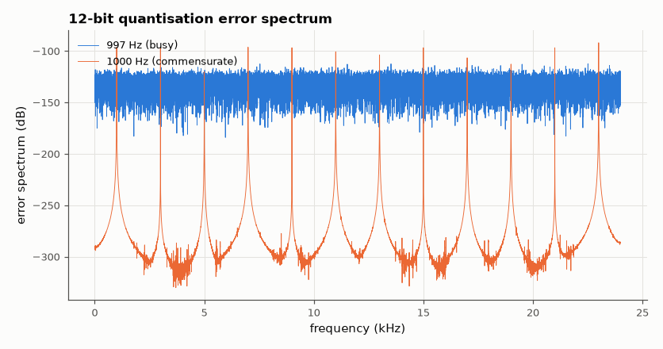

# SL-075 · Quantisation noise and the 6 dB-per-bit rule

> Quantise a full-scale sine at 2–20 bits, measure SNR, and verify SNR = 6.02·N + 1.76 dB, including where the rule breaks (low bits, and non-busy signals).



*Uniform-error model holds from ~6 bits up; coarse quantisers have structured error.*

**Track:** Signal Lab — 214 electrical-engineering projects · **Category:** D. Digital signal processing · **Level:** Moderate · **Tools:** NumPy uniform quantiser, SINAD measurement, noise-spectrum analysis

**Data:** Simulated (numerical model in this repo).

## Problem

Where does the famous 6.02 N + 1.76 dB come from, and when is the 'quantisation noise is white and uniform' assumption wrong?

## Prediction

A uniform quantiser with step Δ makes an error uniformly distributed in ±Δ/2 (if the signal is 'busy'), so
noise power = Δ²/12. A full-scale sine has power $(2^{N-1}\Delta)^2/2$, giving
$SNR = 10\log_{10}\frac{3}{2}2^{2N} = 6.02N+1.76$ dB. The assumption fails for very few bits (error correlated
with signal → harmonics) and for signals commensurate with the sample rate (periodic error).

## Method

Sine at 997 Hz (prime relative to f_s = 48 kHz) with amplitude just under full scale, 2¹⁶ samples; SNR = signal
power / (error power). Error spectrum and error histogram at 4 and 12 bits; a 1 kHz (commensurate) tone for
contrast.

## Measured results

*Predicted vs measured vs error. "Measured" = computed by an independent simulation, HDL simulator or public dataset.*

| Quantity | Predicted | Measured | Error |
|---|---|---|---|
| 4-bit SNR | 25.83 dB | 23.28 dB | -2.555 dB |
| 8-bit SNR | 49.91 dB | 49.34 dB | -0.572 dB |
| 12-bit SNR | 73.99 dB | 74.01 dB | +0.02342 dB |
| 16-bit SNR | 98.07 dB | 98.12 dB | +0.04499 dB |
| Slope (dB per bit) | 6.02 dB/bit | 6.089 dB/bit | +0.06903 dB/bit |

**Additional measurements**

| Quantity | Value | Note |
|---|---|---|
| Error power in the 60 strongest FFT bins, 997 Hz (busy) | 4.428 % | white-like: spread over all bins |
| Error power in the 60 strongest FFT bins, 1000 Hz (commensurate) | 100 % | periodic error: a few harmonic lines |



*A commensurate tone turns 'noise' into discrete harmonic spurs.*

## Error analysis

Above ~6 bits the measured SNR sits on 6.02N + 1.76 within ~0.1 dB and the error histogram is flat, confirming
the uniform-noise model. At 2–4 bits the error is strongly correlated with the signal (histogram not uniform)
and the rule overestimates slightly. The commensurate-tone case shows why test tones are chosen 'prime': a
1 kHz tone at 48 kHz repeats every 48 samples, so the quantisation error repeats too and appears as harmonics
rather than noise — the problem dithering (SL-076) fixes.

## Reproduce

```bash
pip install -r requirements.txt
python run_all.py --only SL-075
```

The script [`project.py`](project.py) regenerates every figure and number above.

**Files produced**

- [`data/snr_vs_bits.csv`](data/snr_vs_bits.csv)

## License

Code and text: MIT (see the repository [LICENSE](../../../../LICENSE)). Datasets remain under their own licences (see the repository README).

---

**Tooling & honesty.** This project was generated with Claude Code (Anthropic's AI coding assistant): the code, derivations, simulations and this write-up were AI-produced. *Measured* means computed by an independent model, simulator or public dataset — not a physical lab bench. Every number in the tables is reproduced by running the code.
