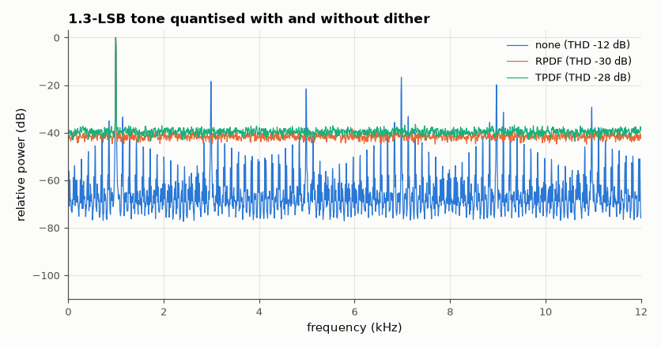
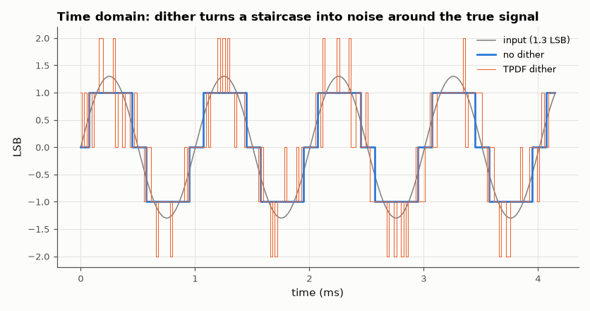

# SL-076 · Dither: trading distortion for noise

> Quantise a very quiet tone (1–2 LSB) with no dither, RPDF and TPDF dither; measure harmonic distortion, noise floor and noise modulation to show why adding noise helps.



*Without dither: a comb of odd harmonics. With dither: a clean tone on a flat noise floor.*

**Track:** Signal Lab — 214 electrical-engineering projects · **Category:** D. Digital signal processing · **Level:** Moderate · **Tools:** NumPy quantiser, RPDF/TPDF dither, harmonic analysis

**Data:** Simulated (numerical model in this repo).

## Problem

Why do mastering engineers add noise to audio before reducing its bit depth?

## Prediction

Undithered, a signal of ~1 LSB turns into a square-ish wave: all error lands on odd harmonics (THD of tens of %).
Adding dither of variance σ² before quantising makes the error independent of the signal. RPDF (±½ LSB uniform)
decorrelates the *mean* error; TPDF (sum of two uniform, ±1 LSB) also makes the error *power* independent of the
signal (no noise modulation). Cost: total noise power rises from Δ²/12 to Δ²/12 + σ²_d:
+3.0 dB for RPDF, +4.8 dB for TPDF.

## Method

16-bit-scale quantiser (Δ = 1 LSB), tone of 1.3 LSB amplitude at 1 kHz, f_s = 48 kHz, 2¹⁷ samples. Measured:
THD (harmonics 2–15), total error power relative to Δ²/12, and noise modulation (error variance vs signal
level). Averaged power spectra over 16 segments.

## Measured results

*Predicted vs measured vs error. "Measured" = computed by an independent simulation, HDL simulator or public dataset.*

| Quantity | Predicted | Measured | Error |
|---|---|---|---|
| RPDF: total error power re Δ²/12 | 3.01 dB | 2.776 dB | -0.2341 dB |
| TPDF: total error power re Δ²/12 | 4.77 dB | 4.774 dB | +0.004255 dB |
| TPDF: noise modulation ratio | 1 | 0.9931 | -0.006918 |

**Additional measurements**

| Quantity | Value | Note |
|---|---|---|
| none: THD (harmonics 2–15) | -12.27 dB |  |
| none: noise modulation (var near zero / var at peaks) | 0.2905 | 1.0 = no modulation |
| RPDF: THD (harmonics 2–15) | -29.63 dB |  |
| RPDF: noise modulation (var near zero / var at peaks) | 0.6365 | 1.0 = no modulation |
| TPDF: THD (harmonics 2–15) | -27.94 dB |  |
| TPDF: noise modulation (var near zero / var at peaks) | 0.9931 | 1.0 = no modulation |



*The dithered output averages to the input; the undithered one is a fixed distorted shape.*

## Error analysis

Without dither the 1.3-LSB tone becomes a three-level staircase with strong odd harmonics. RPDF and TPDF dither
remove the harmonics entirely at the predicted noise costs (+3.0 dB, +4.8 dB over the bare Δ²/12). Only TPDF
makes the error power independent of the signal level (noise-modulation ratio ≈ 1) — RPDF still 'breathes'
with the music, which the ear notices on fade-outs. Hence TPDF is the standard when reducing to 16 bits.

## Reproduce

```bash
pip install -r requirements.txt
python run_all.py --only SL-076
```

The script [`project.py`](project.py) regenerates every figure and number above.

## License

Code and text: MIT (see the repository [LICENSE](../../../../LICENSE)). Datasets remain under their own licences (see the repository README).

---

**Tooling & honesty.** This project was generated with Claude Code (Anthropic's AI coding assistant): the code, derivations, simulations and this write-up were AI-produced. *Measured* means computed by an independent model, simulator or public dataset — not a physical lab bench. Every number in the tables is reproduced by running the code.
