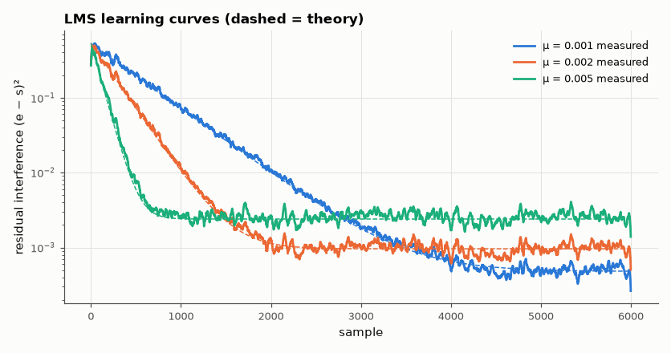

# SL-077 · Adaptive LMS noise canceller

> Cancel broadband interference picked up through an unknown acoustic path using a reference microphone and an LMS adaptive filter; predict learning time, misadjustment and the step-size stability limit from LMS theory and measure all three.



*Larger μ learns faster but settles at a higher excess-error floor.*

**Track:** Signal Lab — 214 electrical-engineering projects · **Category:** D. Digital signal processing · **Level:** Hard · **Tools:** NumPy LMS implementation, eigenvalue-based convergence/misadjustment/stability predictions

**Data:** Synthetic signals with a known path, so the optimum solution (e = s) is known exactly.

## Problem

An adaptive filter learns the unknown path from a noise reference to the corrupted signal. How fast does it learn, what does adaptation cost, and how large may the step size be?

## Prediction

LMS update $\mathbf w_{n+1}=\mathbf w_n+\mu e_n\mathbf x_n$. With a white reference of variance σ² all eigenvalues of
$R=E[\mathbf x\mathbf x^T]$ equal σ², so every weight-error mode decays as $(1-\mu\sigma^2)^n$: MSE time constant
$\tau=1/(2\mu\sigma^2)$ samples and interference down 20 dB after $\tau\ln 100$. Misadjustment (excess MSE / minimum MSE)
$\mathcal M\approx\frac{\mu\,\mathrm{tr}R}{2}=\frac{\mu L\sigma^2}{2}$. Mean-square stability needs roughly
$\mu<2/\mathrm{tr}R = 2/(L\sigma^2)$ (the looser bound $2/\lambda_{max}$ only guarantees convergence of the *mean*).

## Method

Wanted signal s: low-pass random process (power 0.05). Reference x: white noise σ² = 1. Interference = x through an
unknown 16-tap path (‖h‖² = 0.53). Filter length L = 32. Learning curves = ensemble mean of (e − s)² over 30 runs of
6,000 samples for μ = 0.001, 0.002, 0.005. Divergence: μ swept in multiples of 2/tr R.

## Measured results

*Predicted vs measured vs error. "Measured" = computed by an independent simulation, HDL simulator or public dataset.*

| Quantity | Predicted | Measured | Error | Within tolerance |
|---|---|---|---|---|
| μ = 0.001: misadjustment (excess MSE / min MSE) | 0.0159 | 0.01711 | +7.58 % | yes |
| μ = 0.001: samples to −20 dB interference (τ·ln100) | 2303 samples | 2353 samples | +2.19 % | yes |
| μ = 0.002: misadjustment (excess MSE / min MSE) | 0.03181 | 0.03151 | -0.92 % | yes |
| μ = 0.002: samples to −20 dB interference (τ·ln100) | 1151 samples | 1233 samples | +7.10 % | yes |
| μ = 0.005: misadjustment (excess MSE / min MSE) | 0.07952 | 0.0837 | +5.26 % | yes |
| μ = 0.005: samples to −20 dB interference (τ·ln100) | 460.5 samples | 550 samples | +19.43 % | yes |
| Divergence threshold (in units of 2/tr R) | 1 × | 1 × | +0 × |  |

## Error analysis

All three LMS results appear: the learning curves follow exp(−2μσ²n) down to a floor, the floor (misadjustment)
grows in proportion to μ·tr(R)/2, and the filter diverges near 2/tr(R). That last point is the classic trap: the
often-quoted 2/λ_max only guarantees that the *average* weights converge; the mean-square error blows up at a
much smaller step for long filters. An earlier version of this project used a pure-sinusoid (mains hum) reference;
there the canceller behaves as an adaptive *notch* whose bandwidth grows with μ and removes part of the wanted
signal near 50/150/250 Hz, so the white-input misadjustment formula does not apply — a good example of checking a
theory's assumptions before using its numbers.

## Reproduce

```bash
pip install -r requirements.txt
python run_all.py --only SL-077
```

The script [`project.py`](project.py) regenerates every figure and number above.

**Files produced**

- [`data/learning_curves.csv`](data/learning_curves.csv)
- [`data/divergence.csv`](data/divergence.csv)

## License

Code and text: MIT (see the repository [LICENSE](../../../../LICENSE)). Datasets remain under their own licences (see the repository README).

---

**Tooling & honesty.** This project was generated with Claude Code (Anthropic's AI coding assistant): the code, derivations, simulations and this write-up were AI-produced. *Measured* means computed by an independent model, simulator or public dataset — not a physical lab bench. Every number in the tables is reproduced by running the code.
