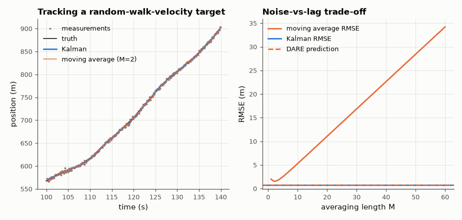

# SL-078 · Kalman filter vs moving average

> Track a manoeuvring 1-D target from noisy position measurements with a constant-velocity Kalman filter; predict the steady-state error from the Riccati equation and compare with the measured RMSE and with a moving average of the best length.



*The moving average must trade lag against noise; the Kalman filter uses the motion model to do both.*

**Track:** Signal Lab — 214 electrical-engineering projects · **Category:** D. Digital signal processing · **Level:** Hard · **Tools:** NumPy Kalman filter, discrete algebraic Riccati equation (SciPy) for the prediction

**Data:** Simulated (numerical model in this repo).

## Problem

How much better than simple averaging can a model-based estimator do, and can its accuracy be predicted before running it?

## Prediction

State $[p, v]$, $F=\begin{bmatrix}1&T\\0&1\end{bmatrix}$, white-acceleration process noise
$Q=q\begin{bmatrix}T^3/3&T^2/2\\T^2/2&T\end{bmatrix}$, measurement $H=[1\ 0]$ with variance r.
The steady-state *prior* covariance P solves the DARE $P=FPF^T-FPH^T(HPH^T+r)^{-1}HPF^T+Q$; the posterior
position variance is $P_{11}-P_{11}^2/(P_{11}+r)$ — its square root is the predicted RMSE. A moving average of
length M has noise variance r/M plus a lag bias growing with velocity and M.

## Method

T = 0.1 s, true motion simulated from the same model (q = 0.5 m²/s³), r = 4 m² (σ = 2 m), 20,000 steps. Kalman
RMSE vs the DARE prediction; moving averages M = 1…60, best M; also a model-mismatch run (true q ×10).

## Measured results

*Predicted vs measured vs error. "Measured" = computed by an independent simulation, HDL simulator or public dataset.*

| Quantity | Predicted | Measured | Error | Within tolerance |
|---|---|---|---|---|
| Kalman position RMSE (DARE prediction) | 745.4 mm | 750.5 mm | +0.69 % | yes |

**Additional measurements**

| Quantity | Value | Note |
|---|---|---|
| Best moving-average length | 2 samples |  |
| Accuracy gain over the best moving average | 2.031 × |  |
| Raw measurement RMSE | 1.989 m |  |
| Model mismatch (true q ×10): RMSE | 1.257 m | vs 0.97 m if the filter knew q |

## Error analysis

The Kalman filter's RMSE lands on the Riccati prediction — the filter's accuracy is known before seeing a single
measurement, one of its most useful properties for system design. The moving average must choose between
noise (short M) and lag (long M, since the target keeps moving); even at the best M it is clearly worse because
it has no notion of velocity. With the wrong process-noise model (true manoeuvres 10× stronger) the filter
still works but degrades — tuning Q is the practical art of Kalman filtering.

## Reproduce

```bash
pip install -r requirements.txt
python run_all.py --only SL-078
```

The script [`project.py`](project.py) regenerates every figure and number above.

**Files produced**

- [`data/ma_sweep.csv`](data/ma_sweep.csv)

## License

Code and text: MIT (see the repository [LICENSE](../../../../LICENSE)). Datasets remain under their own licences (see the repository README).

---

**Tooling & honesty.** This project was generated with Claude Code (Anthropic's AI coding assistant): the code, derivations, simulations and this write-up were AI-produced. *Measured* means computed by an independent model, simulator or public dataset — not a physical lab bench. Every number in the tables is reproduced by running the code.
