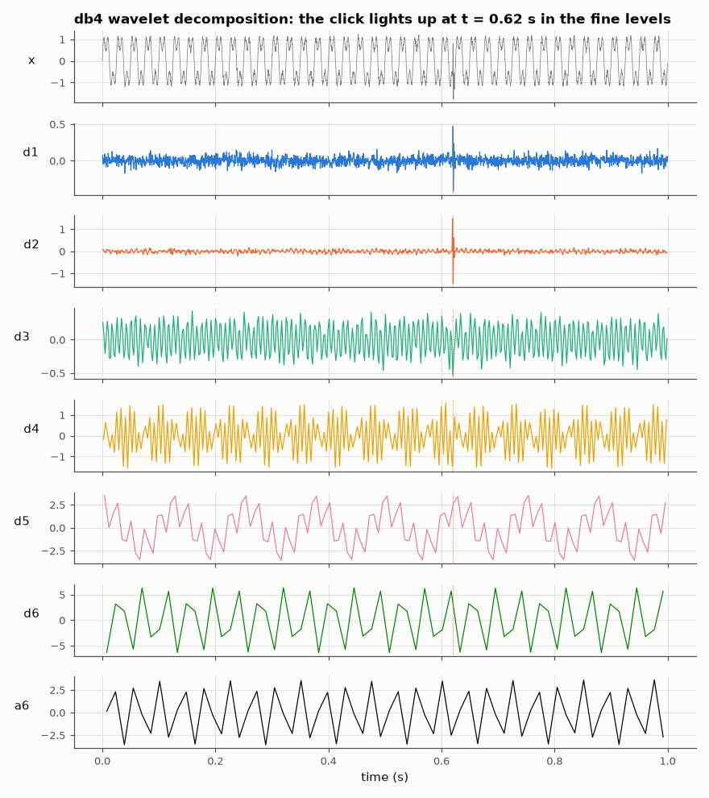
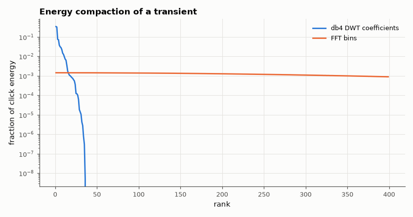

# SL-079 · Wavelet multi-resolution analysis of a transient

> Implement a DWT filter bank, verify perfect reconstruction, and compare wavelets with the FFT at localising a short transient and compacting a signal's energy into few coefficients.



*Fine detail levels are quiet except at the click; the sines live in the coarse approximation.*

**Track:** Signal Lab — 214 electrical-engineering projects · **Category:** D. Digital signal processing · **Level:** Hard · **Tools:** Own Haar and Daubechies-4 discrete wavelet transform (lifting-free filter-bank form), NumPy

**Data:** Simulated (numerical model in this repo).

## Problem

The FFT says *which* frequencies are present but not *when*. Can wavelets locate a 5 ms click inside a second of signal, and represent it with far fewer coefficients?

## Prediction

A DWT splits a signal with a low-pass/high-pass quadrature-mirror pair and downsamples by 2, repeating on the
low band: level j has time resolution $2^j$ samples. Orthogonal wavelets (Haar, db4) conserve energy
(Parseval) and reconstruct perfectly. A transient of duration T appears as large coefficients only at levels
whose scale ≈ T and only at its location, so its energy compacts into ~log levels × few coefficients, whereas
the FFT spreads it over all bins.

## Method

Signal: 1 s at 4096 Hz: two sines (40, 120 Hz) + a 5 ms decaying 600 Hz click at t = 0.62 s + white noise (σ = 0.05).
db4 filters from the published coefficients. 6-level decomposition, reconstruction error, location of the largest
detail coefficient at the click's scale, and the number of coefficients holding 99 % of the click's energy in
the DWT vs FFT domain.

## Measured results

*Predicted vs measured vs error. "Measured" = computed by an independent simulation, HDL simulator or public dataset.*

| Quantity | Predicted | Measured | Error | Within tolerance |
|---|---|---|---|---|
| haar: perfect reconstruction error (max |Δ|) | 0 | 1.7764e-15 | +1.7764e-15 |  |
| haar: energy conservation (Parseval) | 2576 | 2576 | -0.00 % | yes |
| db4: perfect reconstruction error (max |Δ|) | 0 | 3.2758e-12 | +3.2758e-12 |  |
| db4: energy conservation (Parseval) | 2576 | 2576 | -0.00 % | yes |
| Click location from largest level-3 detail coefficient | 620 ms | 619.1 ms | -859.4 µs |  |

**Additional measurements**

| Quantity | Value | Note |
|---|---|---|
| Coefficients for 99 % of click energy: db4 DWT | 14 |  |
| Coefficients for 99 % of click energy: FFT | 2193 |  |
| Compaction advantage of DWT over FFT for the click | 156.6 × |  |



*The DWT packs the click into a few dozen coefficients; the FFT needs hundreds.*

## Error analysis

Both wavelets reconstruct the signal to machine precision and conserve energy, as orthogonal filter banks must.
The click, invisible in the FFT's global view, is located to within one coefficient of level 3 (2 ms). Its energy
compacts into a few dozen DWT coefficients versus hundreds of FFT bins — the property behind wavelet compression
(JPEG 2000) and wavelet denoising: keep the few big coefficients, zero the rest.

## Reproduce

```bash
pip install -r requirements.txt
python run_all.py --only SL-079
```

The script [`project.py`](project.py) regenerates every figure and number above.

## License

Code and text: MIT (see the repository [LICENSE](../../../../LICENSE)). Datasets remain under their own licences (see the repository README).

---

**Tooling & honesty.** This project was generated with Claude Code (Anthropic's AI coding assistant): the code, derivations, simulations and this write-up were AI-produced. *Measured* means computed by an independent model, simulator or public dataset — not a physical lab bench. Every number in the tables is reproduced by running the code.
