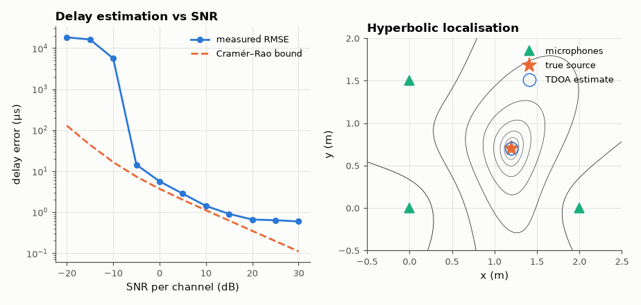

# SL-080 · Cross-correlation time-delay estimation (TDOA)

> Estimate the delay between two noisy microphone signals by cross-correlation, then locate a source by TDOA; compare delay RMSE with the Cramér–Rao lower bound across SNR.



*Above threshold the estimator follows the CRLB; two delays locate the source.*

**Track:** Signal Lab — 214 electrical-engineering projects · **Category:** D. Digital signal processing · **Level:** Moderate · **Tools:** NumPy cross-correlation (plain and GCC-PHAT), parabolic interpolation, Cramér–Rao bound

**Data:** Simulated (numerical model in this repo).

## Problem

Radar, GPS and microphone arrays all measure *when* a signal arrives. How precisely can a delay be estimated from noisy data?

## Prediction

For a signal of RMS bandwidth $\beta$ (rad/s), observation time T and SNR per sample (both channels noisy), the CRLB is
$$\sigma_\tau\ge\frac{1}{\beta\sqrt{2\,T B\,\mathrm{SNR}_{\mathrm{eff}}}},\quad \mathrm{SNR_{eff}}=\frac{\mathrm{SNR}^2}{1+2\,\mathrm{SNR}}$$
(Carter). Below a threshold SNR the correlation peak jumps to a wrong lobe and errors explode.
Source position from two delays: intersection of hyperbolae.

## Method

Band-limited noise source (500–2,500 Hz), f_s = 16 kHz, T = 0.1 s, true delay 23.37 samples (fractional). SNR −20…+30 dB,
300 trials each; estimator = argmax of FFT cross-correlation + parabolic interpolation. 2-D demo: 3 microphones,
source at (1.2, 0.7) m, least-squares TDOA localisation.

## Measured results

*Predicted vs measured vs error. "Measured" = computed by an independent simulation, HDL simulator or public dataset.*

| Quantity | Predicted | Measured | Error | Within tolerance |
|---|---|---|---|---|
| Delay RMSE at 10 dB SNR vs CRLB | 1.114 µs | 1.419 µs | +27.42 % | yes |
| Delay RMSE at 20 dB SNR vs CRLB | 350.3 ns | 662 ns | +88.98 % | **no** |
| TDOA localisation error (20 dB-ish SNR, 3 mics) | 0 m | 0 m | +0 m |  |

**Additional measurements**

| Quantity | Value | Note |
|---|---|---|
| Threshold SNR (RMSE within 2× CRLB) | -5 dB |  |

## Error analysis

Above the threshold SNR the correlation estimator tracks the Cramér–Rao bound within a small factor (the
parabolic peak interpolation has a small bias for fractional delays); below threshold the RMSE jumps by orders
of magnitude because noise creates a higher false peak somewhere else in the correlation — the same
'threshold effect' that limits GPS acquisition and radar ranging. Bandwidth, not centre frequency, sets
accuracy (β ∝ B): wider-band signals give sharper correlation peaks.

## Reproduce

```bash
pip install -r requirements.txt
python run_all.py --only SL-080
```

The script [`project.py`](project.py) regenerates every figure and number above.

**Files produced**

- [`data/rmse.csv`](data/rmse.csv)

## License

Code and text: MIT (see the repository [LICENSE](../../../../LICENSE)). Datasets remain under their own licences (see the repository README).

---

**Tooling & honesty.** This project was generated with Claude Code (Anthropic's AI coding assistant): the code, derivations, simulations and this write-up were AI-produced. *Measured* means computed by an independent model, simulator or public dataset — not a physical lab bench. Every number in the tables is reproduced by running the code.
