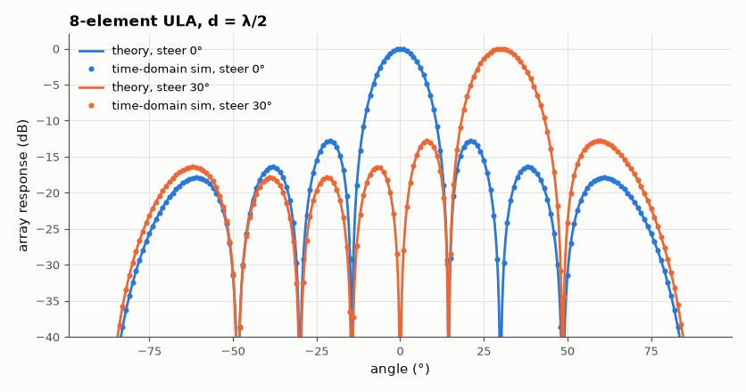
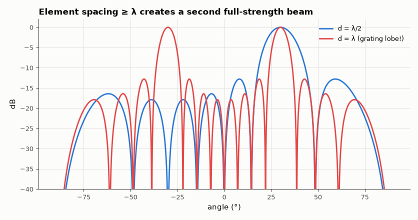

# SL-081 · Delay-and-sum beamforming with a uniform linear array

> Steer an 8-element λ/2 array electronically; measure beamwidth, sidelobe level, steering accuracy and array gain against closed-form array theory, including grating lobes at d = λ.



*Steering off broadside widens the beam by 1/cos θ₀.*

**Track:** Signal Lab — 214 electrical-engineering projects · **Category:** D. Digital signal processing · **Level:** Hard · **Tools:** NumPy array-factor computation + time-domain simulation of plane waves

**Data:** Simulated (numerical model in this repo).

## Problem

How can eight fixed antennas (or microphones) listen in one direction and ignore others, and what limits how sharp that 'beam' can be?

## Prediction

Array factor $AF(\theta)=\frac1N\sum_n e^{jkd n(\sin\theta-\sin\theta_0)}$, $|AF|=\left|\frac{\sin(N\psi/2)}{N\sin(\psi/2)}\right|$ with
$\psi=kd(\sin\theta-\sin\theta_0)$. Half-power beamwidth ≈ $0.886\,\lambda/(Nd\cos\theta_0)$ rad (= 12.8° broadside for N = 8, d = λ/2),
first sidelobe −13.26 dB, array gain for white noise = N (9.03 dB). Grating lobes appear when $d\ge\lambda/(1+|\sin\theta_0|)$.

## Method

N = 8, d = λ/2 at 1 kHz acoustic (λ = 34.3 cm). Pattern computed and also measured by time-domain simulation: plane waves
from −90°…90°, each channel delayed and summed with steering to 0° and 30°; output power vs angle. Array gain
measured with independent noise per element. Grating lobes: d = λ, steer 30°.

## Measured results

*Predicted vs measured vs error. "Measured" = computed by an independent simulation, HDL simulator or public dataset.*

| Quantity | Predicted | Measured | Error | Within tolerance |
|---|---|---|---|---|
| Steer 0°: half-power beamwidth | 12.69 ° | 12.8 ° | +0.88 % | yes |
| Steer 0°: beam direction | 0 ° | 0 ° | +0 ° |  |
| First sidelobe level (broadside) | -13.26 dB | -12.8 dB | +0.4626 dB |  |
| Steer 30°: half-power beamwidth | 14.65 ° | 14.84 ° | +1.24 % | yes |
| Steer 30°: beam direction | 30 ° | 30 ° | -3.5527e-15 ° |  |
| Array gain (independent noise per element) | 9.031 dB | 9.026 dB | -0.004766 dB |  |
| Grating lobe direction (d = λ, steer 30°) | -30 ° | -30 ° | +0 ° |  |



*At d = λ the array cannot distinguish 30° from −30°.*

## Error analysis

Beamwidth, direction, sidelobe level and the 9 dB array gain all match array theory, and the time-domain
delay-and-sum simulation reproduces the analytic pattern point by point. Two design rules fall out: the beam
broadens as 1/cos θ₀ when steered, and spacing must stay below λ/(1 + |sin θ₀|) or a grating lobe appears —
a full-strength copy of the main beam pointing somewhere else, which no amount of signal processing can undo.

## Reproduce

```bash
pip install -r requirements.txt
python run_all.py --only SL-081
```

The script [`project.py`](project.py) regenerates every figure and number above.

## License

Code and text: MIT (see the repository [LICENSE](../../../../LICENSE)). Datasets remain under their own licences (see the repository README).

---

**Tooling & honesty.** This project was generated with Claude Code (Anthropic's AI coding assistant): the code, derivations, simulations and this write-up were AI-produced. *Measured* means computed by an independent model, simulator or public dataset — not a physical lab bench. Every number in the tables is reproduced by running the code.
