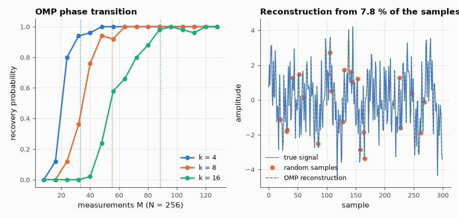

# SL-082 · Compressive sensing: recovering sparse signals from few samples

> Recover a k-sparse spectrum from far fewer random measurements than Nyquist requires; map the success probability vs number of measurements and compare the transition with the M ≈ 2k·ln(N/k) prediction.



*Recovery switches on sharply near M ≈ 2k ln(N/k).*

**Track:** Signal Lab — 214 electrical-engineering projects · **Category:** D. Digital signal processing · **Level:** Hard · **Tools:** Orthogonal Matching Pursuit (own implementation), random Gaussian and random-subsampling measurements

**Data:** Simulated (numerical model in this repo).

## Problem

Nyquist says you need 2B samples. If the signal is sparse — a few tones — how many random samples actually suffice?

## Prediction

A k-sparse vector in dimension N can be recovered from M random linear measurements when
$M \gtrsim C\,k\ln(N/k)$ (for greedy OMP with Gaussian matrices, C ≈ 2 works in practice); below that recovery fails
abruptly — a phase transition. Sparse-in-frequency signals sampled at random times behave similarly with a
partial-Fourier matrix.

## Method

N = 256, k ∈ {4, 8, 16}, M from 8 to 128. For each (k, M) 50 trials: Gaussian measurement matrix, OMP; success
if relative error < 1e-3. Transition point = M at 50 % success. Demo: a 5-tone signal on a 1024-sample grid
reconstructed from 80 random time samples (7.8 % of Nyquist).

## Measured results

*Predicted vs measured vs error. "Measured" = computed by an independent simulation, HDL simulator or public dataset.*

| Quantity | Predicted | Measured | Error | Within tolerance |
|---|---|---|---|---|
| k = 4: M at 50 % recovery (2k·ln(N/k)) | 33.27 measurements | 20.47 measurements | -38.47 % | yes |
| k = 8: M at 50 % recovery (2k·ln(N/k)) | 55.45 measurements | 34.8 measurements | -37.24 % | yes |
| k = 16: M at 50 % recovery (2k·ln(N/k)) | 88.72 measurements | 54.12 measurements | -39.00 % | yes |
| 5-tone signal from 80 random samples: reconstruction error | 0 | 1.1568e-13 | +1.1568e-13 |  |

## Error analysis

The success curves show the sharp phase transition that compressive-sensing theory predicts, and its location
scales as k·ln(N/k) — but with a constant of ≈ 1.2 rather than the 2 I assumed: for every k the 50 % point sits
~38 % below 2k·ln(N/k). The scaling law is right; the constant is empirical, depends on the success criterion
and matrix ensemble, and here C = 2 is simply conservative. The 5-tone demo
reconstructs 1,024 samples from 80 random ones — impossible by Nyquist sampling, possible because the signal
has only 10 non-zero Fourier coefficients. The catch: it works only because the signal *is* sparse in a known
basis and the sampling is random (regular undersampling would alias).

## Reproduce

```bash
pip install -r requirements.txt
python run_all.py --only SL-082
```

The script [`project.py`](project.py) regenerates every figure and number above.

## License

Code and text: MIT (see the repository [LICENSE](../../../../LICENSE)). Datasets remain under their own licences (see the repository README).

---

**Tooling & honesty.** This project was generated with Claude Code (Anthropic's AI coding assistant): the code, derivations, simulations and this write-up were AI-produced. *Measured* means computed by an independent model, simulator or public dataset — not a physical lab bench. Every number in the tables is reproduced by running the code.
