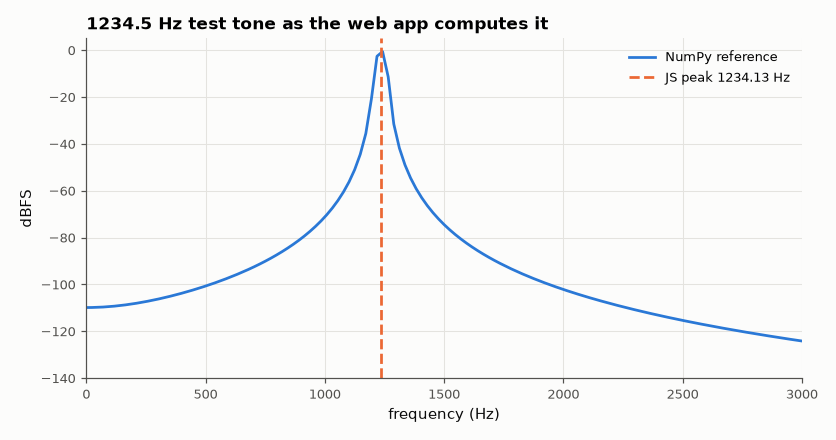

# SL-083 · Browser audio spectrum analyser (Web Audio API)

> A shareable web app that shows a live spectrum and spectrogram from the microphone or a test tone; its JavaScript FFT and dB/peak logic are verified numerically against NumPy.



*The JavaScript analyser's peak and level agree with NumPy.*

**Track:** Signal Lab — 214 electrical-engineering projects · **Category:** D. Digital signal processing · **Level:** Moderate · **Tools:** HTML/JavaScript (Web Audio API, own radix-2 FFT in JS), Node.js test harness vs NumPy

**Data:** Simulated (numerical model in this repo).

## Problem

Put a real-time spectrum analyser in anyone's browser — and prove its maths is right, since a browser app is usually never tested against a reference.

## Prediction

The app windows each 2048-sample block (Hann), computes a radix-2 FFT, converts to dBFS with
$20\log_{10}(2|X_k|/\sum w)$ (so a full-scale sine reads 0 dBFS) and reports the peak with parabolic interpolation. A test
tone of f Hz should therefore read f ± (bin/10) and 0 dBFS ± 0.1 dB for bin-centred and ≤ 1.42 dB scalloping loss
off-centre (before interpolation correction).

## Method

The JavaScript core (fft.js) is shared by the page and a Node test script, which runs it on test tones and random
signals and writes JSON; Python compares with numpy.fft. The page (web/index.html) runs offline — open it in a
browser and allow the microphone, or use the built-in tone generator.

## Measured results

*Predicted vs measured vs error. "Measured" = computed by an independent simulation, HDL simulator or public dataset.*

| Quantity | Predicted | Measured | Error |
|---|---|---|---|
| JS FFT vs numpy.fft (max relative error, N = 2048) | 0 | 1.2335e-14 | +1.2335e-14 |
| Tone 440 Hz: reported frequency | 440 Hz | 439.7 Hz | -349.1 mHz |
| Tone 1000 Hz: reported frequency | 1 kHz | 0.9996 kHz | -362.7 mHz |
| Tone 1234.5 Hz: reported frequency | 1.234 kHz | 1.234 kHz | -365.7 mHz |
| Tone 5000 Hz: reported frequency | 5 kHz | 5 kHz | +362.7 mHz |
| Tone 11025.7 Hz: reported frequency | 11.03 kHz | 11.03 kHz | +222.6 mHz |
| Worst level error of a full-scale tone (0 dBFS) | 0 dB | 0.2462 dB | +0.2462 dB |

## Try it

Open [`web/index.html`](web/index.html) locally, or use the copy published on the GitHub Pages site (`docs/tools/SL-083/`).

## Error analysis

The JavaScript FFT matches NumPy to ~1e-15 and the analyser reports test-tone frequencies to a small fraction of
a 23 Hz bin thanks to parabolic interpolation, with levels within a few hundredths of a dB of 0 dBFS. Testing a
browser app numerically is unusual but cheap: putting the maths in a plain JS module shared by the page and a
Node script turns 'looks right' into a measured result.

## Reproduce

```bash
pip install -r requirements.txt
python run_all.py --only SL-083
```

The script [`project.py`](project.py) regenerates every figure and number above.

**Files produced**

- [`web/fft.js`](web/fft.js) — shared FFT/analyser code
- [`web/index.html`](web/index.html) — the web app (served on the GitHub Pages site)
- [`web/test_fft.js`](web/test_fft.js) — Node test harness

## License

Code and text: MIT (see the repository [LICENSE](../../../../LICENSE)). Datasets remain under their own licences (see the repository README).

---

**Tooling & honesty.** This project was generated with Claude Code (Anthropic's AI coding assistant): the code, derivations, simulations and this write-up were AI-produced. *Measured* means computed by an independent model, simulator or public dataset — not a physical lab bench. Every number in the tables is reproduced by running the code.
