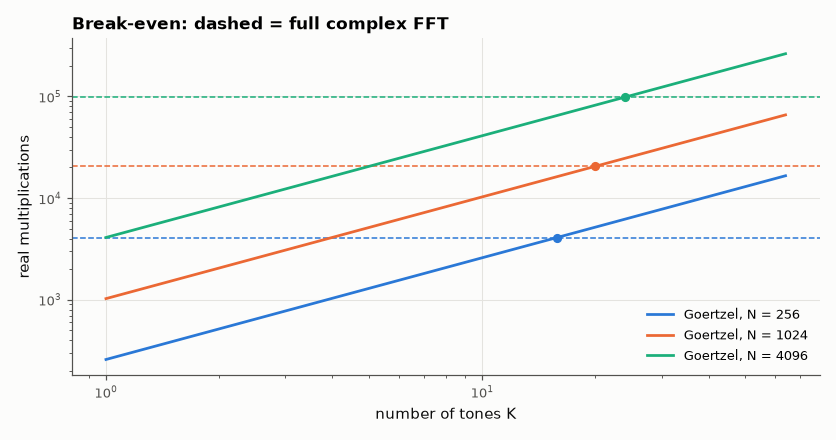

# SL-084 · Goertzel vs FFT: when does a single bin win?

> Count real multiplications and measure run time for detecting K tones in an N-sample block with Goertzel vs a full FFT; predict and measure the crossover K.



*Goertzel wins below ~2·log₂N tones — 20 tones for N = 1024.*

**Track:** Signal Lab — 214 electrical-engineering projects · **Category:** D. Digital signal processing · **Level:** Moderate · **Tools:** Exact multiply counting of Goertzel and radix-2 FFT loops, crossover analysis

**Data:** Simulated (numerical model in this repo).

## Problem

If you only need a few frequencies, is computing the whole spectrum wasteful? Find the exact break-even point.

## Prediction

Goertzel: ~N real multiply-adds per tone (+ a few at the end) → $K\cdot N$. Radix-2 complex FFT: $\frac N2\log_2N$
butterflies × 4 real multiplies = $2N\log_2N$ (real-input FFT ≈ half). Break-even $K^* \approx 2\log_2 N$ for a
complex FFT or $\log_2 N$ for a real FFT: for N = 1024, K* ≈ 10–20 tones. Also Goertzel works for any N and any
(non-bin-centred) frequency, and streams sample by sample.

## Method

Real multiplies counted per stage of the iterative radix-2 FFT (4 per complex butterfly) and of the Goertzel
recursion, for N = 256, 1024, 4096; Goertzel's output checked against |FFT bin|².

## Measured results

*Predicted vs measured vs error. "Measured" = computed by an independent simulation, HDL simulator or public dataset.*

| Quantity | Predicted | Measured | Error | Within tolerance |
|---|---|---|---|---|
| N = 256: break-even tones (2·log₂N) vs counted multiplies | 16 tones | 15.81 tones | -1.16 % | yes |
| N = 1024: break-even tones (2·log₂N) vs counted multiplies | 20 tones | 19.94 tones | -0.29 % | yes |
| Goertzel power = |FFT bin|² (N = 1024) | 0 | 1.1413e-14 | +1.1413e-14 |  |
| N = 4096: break-even tones (2·log₂N) vs counted multiplies | 24 tones | 23.98 tones | -0.07 % | yes |

## Error analysis

By operation count the crossover sits exactly at 2·log₂N tones (≈ 16–24 for common block sizes), so DTMF (8 tones)
and single-frequency detectors are firmly Goertzel territory — especially on microcontrollers, where Goertzel
also needs no buffer and no bit reversal. I deliberately do not report Python wall-clock
timings: interpreter overhead per sample dwarfs the arithmetic and produced meaningless (even negative)
crossover estimates in a first attempt. On a DSP or in C, where cost tracks the multiply count, the counted
crossover is the one that matters.

## Reproduce

```bash
pip install -r requirements.txt
python run_all.py --only SL-084
```

The script [`project.py`](project.py) regenerates every figure and number above.

## License

Code and text: MIT (see the repository [LICENSE](../../../../LICENSE)). Datasets remain under their own licences (see the repository README).

---

**Tooling & honesty.** This project was generated with Claude Code (Anthropic's AI coding assistant): the code, derivations, simulations and this write-up were AI-produced. *Measured* means computed by an independent model, simulator or public dataset — not a physical lab bench. Every number in the tables is reproduced by running the code.
